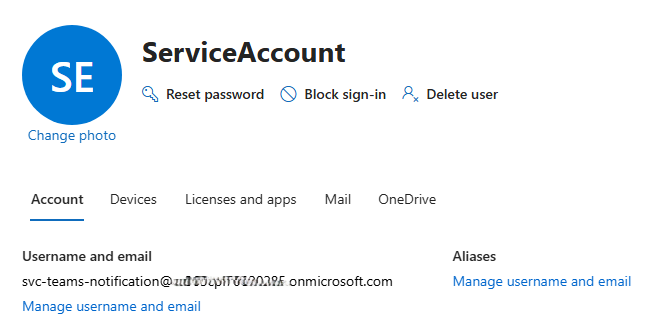
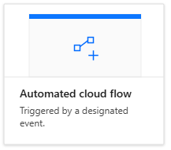
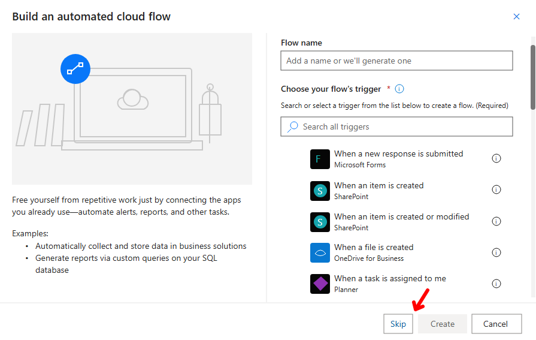
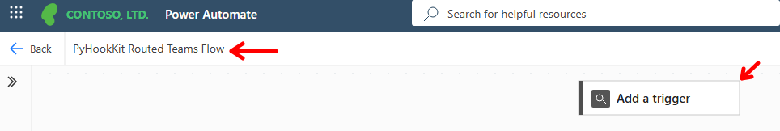
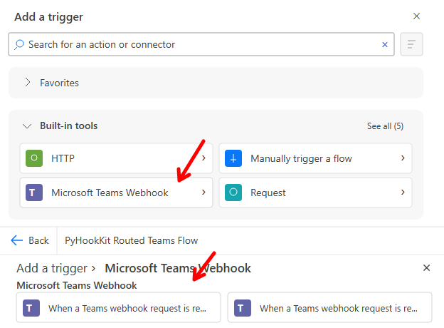
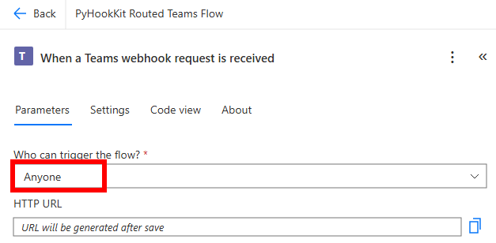
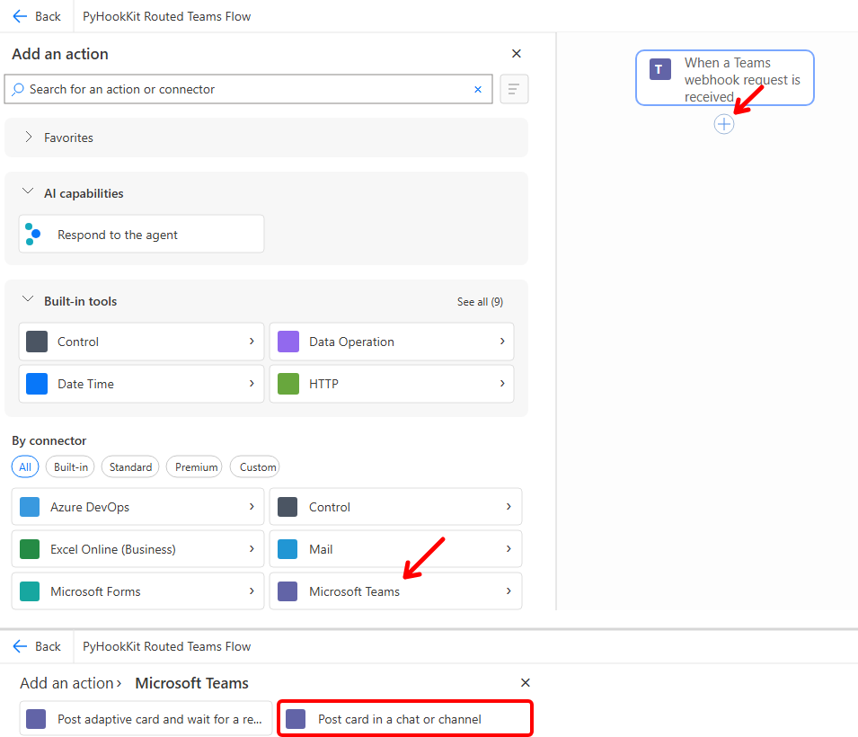
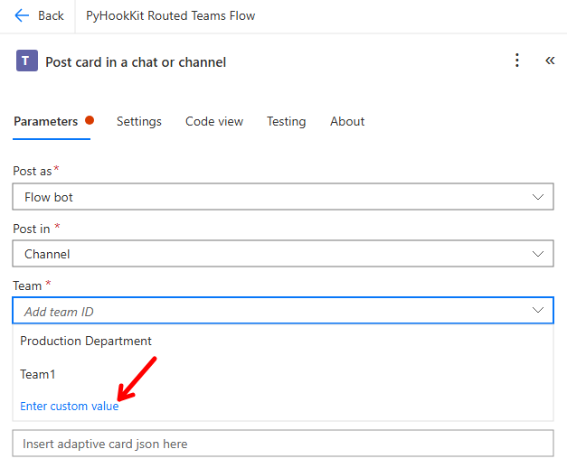
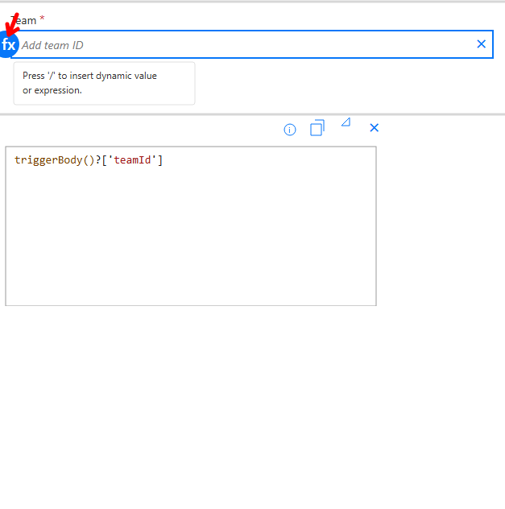
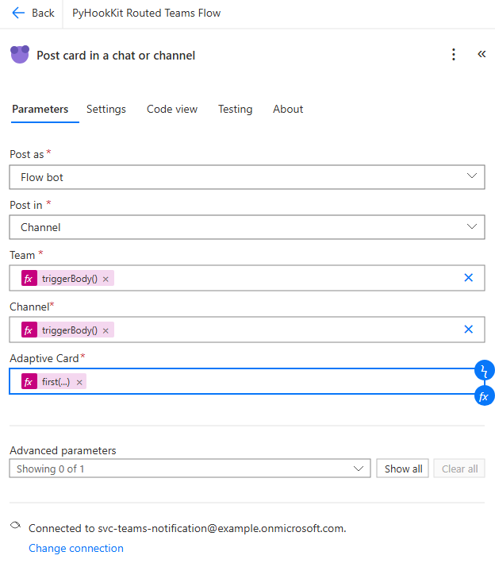

# PyHookKit

[English](README.md)

Slack Incoming Webhook처럼 간단한 HTTP 요청으로 Microsoft Teams 표준
채널에 Adaptive Card 알림을 보내는 방법을 설명하고 검증하는 저장소입니다.

첫 Teams 알림에는 PyHookKit 서버나 Microsoft Graph 앱이 필요하지 않습니다.
[10분 Teams Webhook 빠른 시작](docs/teams-webhook-quickstart.ko.md)에 따라
게시 계정을 Team에 추가하고 공통 Power Automate 흐름 하나를 만든 다음,
Python 표준 라이브러리 예제로 직접 전송하세요.

## PyHookKit을 선택적으로 사용하는 경우

PyHookKit은 직접 Teams Webhook 전송 이후에 추가할 수 있는 선택적 라우팅 및
마이그레이션 도구입니다. 다음 요구사항이 없으면 사용하지 않아도 됩니다.

- 기존 Slack 알림 생산자를 통제된 라우팅 경로로 전환
- 하나의 알림을 Slack과 Teams 또는 여러 Teams 채널로 팬아웃
- 대상별 전송 상태, 멱등적 접수 및 재시도 분류
- 공급자 중립 계약에서 Slack Block Kit과 Teams Adaptive Card 생성

중앙 라우터는 임의의 Slack Webhook 페이로드를 투명하게 프록시하지
않습니다. 기존 생산자는 정규 알림 계약에 맞게 입력을 변환해야 합니다.

## Slack과 Teams 동등성

PyHookKit은 각 공급자의 네이티브 표현 모델을 사용하면서 알림의 의미를
보존합니다. 하나의 정규 알림을 서로 다른 페이로드 형태로 렌더링하며,
시각적 모양이 동일한 것을 동등성으로 정의하지 않습니다.

| 항목 | Slack | Microsoft Teams |
|---|---|---|
| 카드 모델 | Block Kit 블록을 포함하는 Incoming Webhook 첨부 파일 | Adaptive Card 1.4 첨부 파일을 포함하는 워크플로 메시지 |
| 심각도 | 색상이 있는 첨부 파일 표시줄 | 중앙 정렬된 의미 레이블과 색상 |
| 사실 정보 | 2열 `mrkdwn` 필드 | 스타일이 적용된 `ColumnSet` 사실 패널 |
| 사용자 멘션 | 어댑터가 해석한 `<@USER_ID>` | 어댑터가 해석한 `<at>` 텍스트와 멘션 엔터티 |
| 그룹 멘션 | 네이티브 `<!subteam^GROUP_ID>` | 추가 Graph 멤버 확장 설정 필요 |
| 링크 작업 | Block Kit URL 단추 | `Action.OpenUrl` |
| 답글과 수명 주기 | 지원되는 경우 `thread_ts`, `chat.update`, `chat.delete` | 명시적인 워크플로 대체 또는 미지원 카드, 변경 작업에는 봇 또는 Graph 필요 |
| 전달 | Incoming Webhook 또는 Slack Web API | Teams 워크플로 콜백 URL 또는 경로가 지정된 Azure Logic App |

### 권장 Teams 전달 방식

Teams 예제는 빈 상태에서 생성한 Power Automate 흐름을 기준으로 합니다.
흐름은 **When a Teams webhook request is received**에서 Adaptive Card
봉투를 받고, **Post card in a chat or channel**을 통해 설정된 채널에 카드
내용을 게시합니다.

이 방식은 채널 알림의 기본 권장 방식입니다. 중앙 라우터는 승인된 채널 링크와 추출된
메타데이터를 저장하고, `teamId`와 `channelId`를 포함한 Adaptive Card
메시지 봉투를 하나의 공유 흐름 콜백으로 전달합니다.

실제 테스트에서 서식 있는 카드와 네이티브 사용자 멘션이 정상적으로
동작하고, 갤러리 템플릿 워크플로가 추가하는 소유자 정보와 **Get
template** 바닥글이 표시되지 않는 것을 확인했습니다. 갤러리 템플릿은
빠른 개념 검증에 유용합니다. Azure Logic Apps는 Azure 관리형 배포가
필요하거나 호출자가 Team 및 Channel ID를 이미 가지고 있는 경우에 더
적합합니다.

실제 답글, 업데이트, 삭제 또는 통제된 발신자 ID가 필요하면 Teams bot이나
Microsoft Graph 어댑터를 사용해야 합니다.

검증된 트리거, 작업, Adaptive Card 식, 자격 증명 처리 및 스모크 테스트는
[Power Automate Teams 워크플로 설정
가이드](docs/power-automate-teams-workflow.ko.md)를 따르세요. 요청별 Team 및
채널 경로가 필요한 경우 [Azure Logic App Teams 전송
가이드](docs/logic-app-teams-delivery.ko.md)를 사용하세요. 테스트한 대안과
장단점은 [Teams 전송 방식](docs/teams-delivery-options.ko.md)을
참조하세요.

### 통합 전달 시나리오

인프라 예제는 Istio 없이 Bookinfo를 AKS에서 실행하고, 책임을 중복하지
않으면서 세 전송 제어 평면을 연결합니다. GitHub는 스테이징 승인을,
GitLab은 GitOps 리비전 검증 및 승격을, Argo CD는 AKS 조정을 담당합니다.
승인, 배포, 인시던트 및 유지 관리 이벤트는 GitLab 작업이 Power Automate를
통해 렌더링하고 전송하기 전까지 공급자 중립 계약을 유지합니다.

아키텍처와 부트스트랩 순서는 [인프라
가이드](docs/infrastructure.ko.md#aks-bookinfo-알림-환경)를 참조하세요.

[통합 Bookinfo 시나리오](docs/integrated-bookinfo-scenario.ko.md)에는 실제
승인, GitOps 승격, Argo CD 조정, 인시던트, 유지 관리 및 Teams 전송 증거가
포함되어 있습니다.

### 선택적 중앙 라우터

GitLab과 Argo CD는 같은 정규 계약을 작은 SQLite 기반 중앙 라우터에 제출할
수 있습니다. 중앙 라우터는 기존 Slack 및 Teams 어댑터를 재사용하면서
생산자 인증, 하나의 경로에서 여러 대상으로의 팬아웃, 대상별 상태 및
멱등적인 접수를 제공합니다. 직접 전송은 명시적인 마이그레이션 및 대체
경로로 유지합니다.

경로 설정, 로컬 실행 및 생산자 통합은 [중앙 알림 라우터
가이드](docs/central-notification-router.ko.md)를 참조하세요. 포털에서
확인 가능한 앱 등록, 운영자 최소 권한, 자동 환경 설정 및 멤버십 진단은
[TeamsNotifyApp 한국어 부트스트랩
가이드](docs/teams-notify-app-bootstrap.ko.md)를 사용하세요.

## 선택 사항: PyHookKit 라우터 엔드투엔드 설정

이 절차는 선택적 SQLite 중앙 라우터와 자동 Team 멤버십이 필요한 경우에만
사용합니다. 첫 Teams 알림은 [10분 Teams Webhook 빠른
시작](docs/teams-webhook-quickstart.ko.md)을 사용하세요.

다음 절차는 하나의 대상 Microsoft Entra 테넌트에서 시작하여 하나의 정규
알림이 SQLite 중앙 라우터, Power Automate 및 Microsoft Teams를 거쳐
전달되는 단계까지 설명합니다. 별도 안내가 없으면 저장소 루트에서 명령을
실행하세요.

### 테넌트와 사용자 구분

이 절차에서 **Azure 테넌트**, **Microsoft Entra 테넌트** 및 **Microsoft 365
테넌트**는 서로 다른 사용자 저장소를 의미하지 않습니다. Microsoft Entra
테넌트가 ID 디렉터리이고, Microsoft 365와 Teams는 그 디렉터리의 사용자에게
라이선스와 서비스를 제공합니다. 따라서 "Microsoft 365 사용자"는 별도
종류의 계정이 아닙니다. **같은 Entra 테넌트의 사용자에게 Microsoft
365/Teams 라이선스를 할당한 계정**입니다.

Power Platform 환경도 이 대상 Entra 테넌트에 속합니다. 이 PyHookKit
절차에서는 다음 구성 요소를 모두 **채널 링크의 테넌트 ID와 같은 Entra
테넌트**에 두세요.

- 대상 Team과 채널
- Power Platform 환경 및 Power Automate 흐름
- `svc-teams-notification` Teams 연결 사용자
- `TeamsNotifyApp` 앱 등록과 서비스 주체

Azure 구독은 Entra 테넌트와 별개의 Azure 리소스 및 결제 경계입니다.
이 Power Automate 경로에서는 Azure CLI를 Entra ID와 Microsoft Graph 호출에만
사용하므로 **Azure 구독과 Azure RBAC 역할은 필요하지 않습니다**. Azure
구독의 Contributor 또는 Owner 역할도 이 절차의 Entra, Power Platform 및
Teams 권한을 대신하지 않습니다. Azure 구독은 선택적인 [Azure Logic App
Teams 전송](docs/logic-app-teams-delivery.ko.md)을 배포할 때만 필요합니다.

### 사전 요구사항

| 요구사항 | 목적 |
|---|---|
| Python 3.12 및 `uv` | PyHookKit 설치와 실행 |
| Azure CLI | Azure 구독이 아니라 대상 Entra 테넌트에서 `TeamsNotifyApp` 생성 및 검증 |
| Teams가 포함된 Microsoft 365 테넌트 | 대상 Team, 채널 및 모든 사용자 ID 소유 |
| 같은 테넌트의 Power Platform 환경 | Power Automate 흐름과 Teams 연결 소유 |
| `svc-teams-notification` 같은 라이선스가 있는 전용 사용자 | Teams 커넥터 승인 및 알림 게시 |
| Teams 채널 링크 | 테넌트, Team, 채널 및 표시 이름 메타데이터 추출 |

### 단계별로 필요한 ID와 최소 권한

한 사람이 여러 역할을 수행할 수 있지만 권한은 역할 간에 전달되지
않습니다. 예를 들어 Azure 구독의 Owner라도 흐름을 만들 수 없습니다. 흐름
작성자도 Teams 연결 사용자가 대상 Team의 멤버가 아니면 카드를 게시할 수
없습니다.

| ID 또는 실행 주체 | 어떤 계정인가 | 최소 권한 또는 라이선스 | 사용 단계 |
|---|---|---|---|
| 로컬 운영자 | 테넌트 계정일 필요가 없는 개발자 또는 운영자 | 저장소와 로컬 `.env` 접근 | 1, 4, 8~10 |
| 사용자·라이선스 준비 담당자 | 대상 Entra 테넌트의 관리자 | **User Administrator**는 계정 생성과 라이선스 할당을 모두 수행할 수 있습니다. 기존 계정에 라이선스만 할당하려면 **License Administrator** 또는 조직의 기존 프로비저닝 절차를 사용합니다. | 2 |
| Team 소유자 또는 기존 멤버 | 대상 Microsoft 365 테넌트의 사용자 | 최초 채널 접근 및 채널 링크 조회. 멤버를 수동으로 추가하려면 해당 Team의 소유자 권한이 필요합니다. | 2 |
| 흐름 작성자 | 대상 Entra 테넌트에서 Power Platform 환경에 접근하는 사용자 | 대상 환경의 **Environment Maker** 및 테넌트에서 요구하는 Power Automate 사용 권한 | 3 |
| Teams 연결 사용자 | 같은 Entra 테넌트의 일반 사용자 `svc-teams-notification` | Microsoft 365/Teams 및 Power Automate 사용 권한, 모든 대상 Team의 멤버십, 대화형 OAuth 및 MFA 수행 권한. Entra 관리자 역할은 필요하지 않습니다. | 2, 3, 7 |
| 흐름 운영 공동 소유자 | 대상 Power Platform 환경에 접근하는 이름이 명시된 사용자 | 해당 흐름의 공동 소유자 권한. 다른 사용자의 Teams 연결 자격 증명은 관리할 수 없습니다. | 3, 7 |
| 부트스트랩 앱 생성자 | 대상 Entra 테넌트에 로그인하는 사용자 | 사용자 앱 등록이 허용되면 디렉터리 역할이 필요하지 않습니다. 허용되지 않으면 **Application Developer**와 생성된 `TeamsNotifyApp`의 소유권이 필요합니다. | 5, 6 |
| 동의 승인자 | 대상 Entra 테넌트의 관리자 | Microsoft Graph 애플리케이션 권한 `GroupMember.ReadWrite.All`에 관리자 동의를 부여하는 **Privileged Role Administrator**. 가능하면 PIM으로 일시적으로 활성화합니다. | 5, 6 |
| `TeamsNotifyApp` | 사람이 아닌 대상 테넌트의 앱 등록 및 서비스 주체 | 관리자 동의가 부여된 Graph 애플리케이션 권한 `GroupMember.ReadWrite.All`. Microsoft 365 라이선스, Azure RBAC 및 Power Platform 역할은 필요하지 않습니다. | 6, 8, 9 |
| 알림 생산자와 중앙 라우터 | 로컬 프로세스 또는 CI/CD 워크로드 | 생산자는 라우터 전달자 토큰을 사용하고, 라우터는 서명된 워크플로 콜백 비밀을 사용합니다. Microsoft 365 사용자 또는 Entra 관리자일 필요는 없습니다. | 8~10 |

현재 `bootstrap-teams-app` 단일 명령으로 앱 등록 생성과 관리자 동의까지
처리하려면 로그인한 부트스트랩 ID에 **앱 생성자와 동의 승인자 권한이
모두** 있어야 합니다. 역할을 분리하려면 앱 생성자가 앱을 만든 후 동의
승인자가 관리자 동의를 완료해야 합니다. 그런 다음 명령을 다시 실행하여
검증하세요.

반복 Solution 배포에서 사용하는 **Dataverse 애플리케이션 사용자**는
`TeamsNotifyApp`과 다른 ID입니다. 전자는 흐름 소유와 배포를 담당하고,
후자는 Graph로 Team 멤버십만 관리합니다. 최초 수동 엔드투엔드 구성에는
Dataverse 애플리케이션 사용자가 필요하지 않습니다.

### 1단계: 프로젝트 설치

**실행 주체:** 로컬 운영자. Microsoft 클라우드 권한은 필요하지 않습니다.

```shell
cp .env.example .env
chmod 600 .env

cd examples/python
uv sync --extra dev --python 3.12
cd ../..
```

Git에서 제외된 `.env`에는 로컬 자격 증명이 저장됩니다. 이 파일을
커밋하거나 출력하거나 채팅 또는 이슈에 첨부하지 마세요.

### 2단계: Teams 연결 사용자 및 채널 준비

**실행 주체:** 사용자·라이선스 준비 담당자와 Team 소유자. 준비가 끝나면
`svc-teams-notification`은 관리자 역할이 없는 일반 사용자로 동작합니다.

1. [Microsoft 365 관리 센터](https://admin.cloud.microsoft/)에 로그인하고
   **사용자** > **활성 사용자**에서 전용 `svc-teams-notification` 사용자를
   생성하거나 기존 사용자를 지정합니다.

    

2. 테넌트에서 요구하는 Microsoft 365/Teams 및 Power Automate 라이선스를
  할당합니다.
3. 일반 사용자로 유지하고 Entra 관리자 역할을 부여하지 않습니다.
4. Teams에서 최초 표준 채널을 열고 **기타 옵션** > **채널 링크
   가져오기**를 선택한 뒤
  `https://teams.cloud.microsoft/l/channel/...` 전체 링크를 보관합니다.

채널 링크에는 테넌트 ID, Team 기반 그룹 ID, 채널 ID 및 채널 이름이
포함됩니다. PyHookKit은 이 값을 검증하고 SQLite의 별도 열에 저장합니다.

### 3단계: Power Automate 흐름 생성 및 구성

**실행 주체:** 흐름 작성자. 8번의 Teams 연결 로그인과 MFA는
`svc-teams-notification` 자격으로 수행합니다. 두 계정이 동일할 필요는
없습니다.

1. [Power Automate](https://make.powerautomate.com)를 열고 대상 환경을
   선택합니다.
2. **만들기**를 선택하고 빈 상태에서 자동화된 클라우드 흐름을 생성합니다.

   

3. **Build an automated cloud flow** 대화 상자에서 트리거를 선택하지 않고
   **Skip**을 선택합니다.

   

4. 디자이너 상단에서 **Back** 오른쪽의 흐름 이름을 선택하고
   `PyHookKit Routed Teams Flow`처럼 환경 중립적인 이름을 입력합니다. 그런
   다음 **Add a trigger**를 선택합니다.

   

5. **Add a trigger** 창에서 다음과 같이 Teams Webhook 트리거를 추가합니다.

   1. **Built-in tools**에서 **Microsoft Teams Webhook**을 선택합니다.
   2. **When a Teams webhook request is received**를 선택합니다.

      

6. 트리거의 **Parameters** 탭에서 **Who can trigger the flow?** 값을
   **Anyone**으로 설정합니다.

   **HTTP URL**은 직접 입력하지 않습니다. 흐름을 저장하면 Power Automate가
   서명된 HTTP URL을 자동으로 생성합니다. 저장 전에는 **URL will be
   generated after save**가 표시되는 것이 정상입니다.

   

7. 트리거 바로 아래에서 더하기 단추(**+**)를 선택하고 다음과 같이 Teams
   카드 게시 작업을 추가합니다.

   1. **Add an action** 창의 **By connector**에서 **Microsoft Teams**를
      선택합니다.
   2. **Post card in a chat or channel**을 선택합니다.

      

8. **Change connection**에서 `svc-teams-notification`으로 로그인합니다.
   작업은 **Connected to**에 표시되는 계정의 Team 접근 권한으로
   실행됩니다.

9. 작업을 다음과 같이 설정합니다.

   1. **Post as**에서 `Flow bot`을 선택합니다.
   2. **Post in**에서 `Channel`을 선택합니다.
   3. **Team** 목록에서 **Enter custom value**를 선택합니다.

      

   4. **Team** 입력란을 선택하고 `/`를 눌러 동적 값 또는 식 메뉴를 연 다음
      `triggerBody()?['teamId']`를 입력합니다.

      

   5. 같은 방법으로 **Channel**에는 `triggerBody()?['channelId']`를
      입력합니다.
   6. **Adaptive Card**에는
      `first(triggerBody()?['attachments'])?['content']`를 입력합니다.

   | 필드 | 값 |
   |---|---|
   | **Post as** | `Flow bot` |
   | **Post in** | `Channel` |
   | **Team** | 사용자 지정 식 `triggerBody()?['teamId']` |
   | **Channel** | 사용자 지정 식 `triggerBody()?['channelId']` |
   | **Adaptive Card** | 식 `first(triggerBody()?['attachments'])?['content']` |

10. **Team**, **Channel** 및 **Adaptive Card**에 식이 입력되어 있는지
    확인합니다. 작업 하단의 **Connected to**가
    `svc-teams-notification`인지 확인한 다음 흐름을 저장합니다. 다른 계정이
    표시되면 **Change connection**을 선택하여 연결 사용자를 변경합니다.

    

11. 트리거를 다시 열고 모든 쿼리 매개 변수와 서명을 포함한 **HTTP
    URL** 전체를 복사합니다.
12. 복구를 위해 이름이 명시된 흐름 공동 소유자를 최소 두 명 추가합니다.
    공동 소유권은 Teams 연결 실행 ID를 변경하지 않습니다.

Adaptive Card 값으로 `triggerBody()`를 사용하지 마세요. 트리거 본문은
Teams 메시지 봉투이며 첫 번째 첨부 파일의 `content`만 카드입니다.

### 4단계: 워크플로 콜백 저장

**실행 주체:** 콜백 비밀 저장소에 쓸 수 있는 로컬 운영자입니다.

콜백 URL 전체를 저장소 루트 `.env`에 추가합니다.

```dotenv
TEAMS_WORKFLOW_URL="<서명된 Power Automate HTTP URL 전체>"
```

이 URL은 자격 증명으로 취급합니다. 중앙 라우터 SQLite 데이터베이스에는
콜백 값이 아니라 환경 변수 이름만 저장합니다.

### 5단계: TeamsNotifyApp 생성 방법 선택

**실행 주체:** 부트스트랩 앱 생성자와 동의 승인자입니다. 여기서 Azure
Portal은 Entra 관리 UI로만 사용하며 Azure 구독 역할은 사용하지 않습니다.

다음 방법 중 하나를 선택하세요.

- **방법 A — 포털에서 직접 생성:** 앱 등록, 권한 및 소유자를 화면에서
  검토하려는 경우에 사용합니다. 완료한 후 6단계의 명령으로 자격 증명,
  Team 멤버십 및 최초 경로를 구성합니다.
- **방법 B — 명령으로 한 번에 생성:** 앱 등록부터 최초 경로 구성까지
  자동화하려는 경우에 사용합니다. 완료한 후 6단계를 건너뛰고 7단계에서
  결과를 확인합니다.

#### 방법 A: Azure Portal에서 직접 생성

포털에서 소유권과 권한을 명시적으로 검토하려면 다음과 같이 생성하세요.

1. **Microsoft Entra ID** > **App registrations** > **New registration**을
  엽니다.
2. 이름을 `TeamsNotifyApp`으로 설정합니다.
3. **Accounts in this organizational directory only**를 선택합니다.
4. Redirect URI는 비워 두고 **Register**를 선택합니다.
5. **API permissions** > **Add a permission** > **Microsoft Graph** >
  **Application permissions**를 엽니다.
6. `GroupMember.ReadWrite.All`을 검색하여 선택합니다.
7. **Add permissions**를 선택합니다.
8. **Privileged Role Administrator** 사용자가 **Grant admin consent for
  \<tenant\>**를 선택하고 승인합니다.
9. **Owners**에 이름이 명시된 운영 소유자를 최소 두 명 추가합니다.

필요한 멤버십 권한보다 범위가 큰 `Group.ReadWrite.All`은 추가하지 마세요.
외부 비밀 저장소에서 자격 증명을 관리하는 경우가 아니면 클라이언트 암호를
수동으로 생성하지 마세요. 부트스트랩 명령은 로컬 예제 자격 증명을 생성하고
검증한 후 보호합니다.

#### 방법 B: 명령으로 한 번에 생성

이 방법을 사용하려면 다음 조건을 충족해야 합니다.

- 4단계에서 서명된 `TEAMS_WORKFLOW_URL`을 저장소 루트 `.env`에 저장했습니다.
- 최초 Teams 채널 링크와 `svc-teams-notification` 사용자 이름을 알고
  있습니다.
- 로그인하는 ID에 앱 등록 권한과 활성화된 **Privileged Role
  Administrator** 역할이 모두 있습니다.

Teams 채널 링크의 쿼리 문자열에서 `tenantId=<GUID>` 값을 찾습니다. 이 값이
`TeamsNotifyApp`을 생성해야 하는 대상 Entra 테넌트 ID입니다. 저장소
루트에서 대상 테넌트에 로그인한 다음 현재 Azure CLI 계정을 확인합니다.
Azure 구독은 필요하지 않습니다.

```shell
az login \
  --tenant "<채널 링크의 테넌트 ID>" \
  --use-device-code \
  --allow-no-subscriptions

az account show \
  --query "{signedInUser:user.name, tenantId:tenantId}" \
  --output table
```

`signedInUser`가 앱 생성 및 동의를 수행할 부트스트랩 관리자 계정인지
확인합니다. 출력된 `tenantId`가 채널 링크의 `tenantId`와 정확히 일치하는지도
확인합니다. 계정이나 테넌트가 다르면 계속 진행하지 말고 올바른 `--tenant`
값과 계정으로 다시 로그인하세요.

예상 출력은 다음과 같습니다.

```text
SignedInUser                         TenantId
-----------------------------------  ------------------------------------
bootstrap-admin@example.com          00000000-0000-0000-0000-000000000000
```

> [!IMPORTANT]
> `az account show`는 현재 Azure CLI 사용자와 테넌트만 확인합니다. 앱 등록
> 권한 또는 활성화된 **Privileged Role Administrator** 역할은 확인하지
> 않습니다. 조직에서 사용하는 일반적인 "Microsoft 365 관리자" 명칭만
> 신뢰하지 말고, 5단계의 두 권한을 Entra 또는 PIM에서 별도로 확인하세요.

계정과 테넌트가 모두 올바르면 다음 명령을 실행합니다.

```shell
cd examples/python
uv run python -m pyhookkit.entrypoints.notification_router \
  --database .local/router.sqlite3 \
  bootstrap-teams-app \
  --channel-link "<최초 Teams 채널 링크>" \
  --connection-user "svc-teams-notification@example.com" \
  --route release-notifications
cd ../..
```

이 명령은 `TeamsNotifyApp`과 서비스 주체를 생성하고,
`GroupMember.ReadWrite.All` 애플리케이션 권한을 구성하며, 관리자 동의를
저장합니다. 또한 클라이언트 자격 증명을 생성 및 검증하고, 연결 사용자를
Team에 추가하며, 최초 대상 경로를 SQLite에 등록합니다. 생성된 비밀 값은
출력하지 않고 권한 `0600`의 `.env`에 기록합니다.

명령이 `.env`에 기록하는 값은 `TEAMS_NOTIFY_TENANT_ID`,
`TEAMS_NOTIFY_CLIENT_ID`, `TEAMS_NOTIFY_CLIENT_SECRET` 및
`TEAMS_CONNECTION_USER_ID`입니다.

> [!IMPORTANT]
> 이 명령은 Power Automate의 사용자 Teams 연결에 대한 대화형 OAuth 또는
> MFA를 대신하지 않으며 운영 공동 소유자를 추가하지 않습니다. Teams 연결은
> 3단계에서 승인하고, 이름이 명시된 운영 소유자 두 명 이상은 7단계에서
> 추가하거나 확인하세요.

### 6단계: 방법 A의 앱과 최초 경로 부트스트랩

**실행 주체:** 앱 생성자와 동의 승인자 권한을 모두 가진 부트스트랩
ID입니다. Azure 구독은 필요하지 않습니다.

5단계에서 **방법 A**를 사용한 경우에만 이 단계를 실행합니다. **방법 B**를
사용한 경우에는 이미 같은 작업이 완료되었으므로 7단계로 이동하세요.

```shell
az login \
  --tenant "<채널 링크의 tenant ID>" \
  --use-device-code \
  --allow-no-subscriptions

az account show \
  --query "{signedInUser:user.name, tenantId:tenantId}" \
  --output table
```

`signedInUser`가 부트스트랩 관리자 계정이고 `tenantId`가 채널 링크의
`tenantId`와 같은지 확인한 후에만 계속 진행합니다. 이 명령은 Entra 역할의
할당 또는 PIM 활성화 상태를 확인하지 않습니다.

`examples/python`에서 실행합니다.

```shell
uv run python -m pyhookkit.entrypoints.notification_router \
  --database .local/router.sqlite3 \
  bootstrap-teams-app \
  --channel-link "<최초 Teams 채널 링크>" \
  --connection-user "svc-teams-notification@example.com" \
  --route release-notifications
```

이 명령은 `TeamsNotifyApp`과 서비스 주체를 생성하거나 재사용하고, Graph
앱 역할 할당을 검증하며, 클라이언트 자격 증명을 생성하고 검증합니다. 그런
다음 연결 사용자 개체 ID를 조회하고 생성된 값을 권한 `0600`의 `.env`에
기록합니다. 사용자가 Team에 없으면 추가하고 SQLite에 경로를 저장합니다.
비밀 값은 출력하지 않습니다.

자동 생성되는 값:

```dotenv
TEAMS_NOTIFY_TENANT_ID="<tenant GUID>"
TEAMS_NOTIFY_CLIENT_ID="<TeamsNotifyApp client GUID>"
TEAMS_NOTIFY_CLIENT_SECRET="<생성된 secret>"
TEAMS_CONNECTION_USER_ID="<연결 사용자 object GUID>"
```

### 7단계: Azure Portal 및 Power Automate 확인

**실행 주체:** `TeamsNotifyApp` 소유자와 흐름 운영 공동 소유자입니다. 서로
다른 사용자여도 됩니다.

**App registrations** > `TeamsNotifyApp`에서 다음을 확인합니다.

- **API permissions**에 Microsoft Graph `GroupMember.ReadWrite.All`이
  **Application** 권한으로 존재합니다.
- 상태가 **Granted for \<tenant\>**입니다.
- 예상한 소유자와 자격 증명만 존재합니다. 이름이 명시된 운영 소유자가 두
  명보다 적으면 이 단계에서 추가합니다.

**Enterprise applications** > `TeamsNotifyApp`에서 다음을 확인합니다.

- 서비스 주체가 표시됩니다.
- 같은 애플리케이션 권한이 승인되어 있습니다.

Power Automate에서 다음을 확인합니다.

- 흐름이 활성화되어 있습니다.
- Teams 작업의 **Connected to**가 `svc-teams-notification`입니다.
- Team, Channel 및 Adaptive Card 식이 3단계의 값과 정확히 일치합니다.

### 8단계: 추가 채널 등록

**실행 주체:** 중앙 라우터 운영자입니다. 사람의 Azure 또는 Microsoft 365
권한 대신 `.env`의 `TeamsNotifyApp` 자격 증명과 콜백 비밀을 사용합니다.

명령은 `.env`를 불러오고 새 앱 전용 Graph 토큰을 발급합니다. 또한 Team
멤버십을 보장하고 채널 메타데이터를 저장합니다.

```shell
cd examples/python

uv run python -m pyhookkit.entrypoints.notification_router \
  --database .local/router.sqlite3 \
  add-destination \
  --target-id teams-example-channel \
  --route release-notifications \
  --provider teams-workflow \
  --endpoint-env TEAMS_WORKFLOW_URL \
  --channel-link "<추가 Teams 채널 링크>" \
  --ensure-team-membership
```

채널마다 고유한 대상 ID를 사용하여 반복합니다. 동일한 경로를 사용하는
대상은 같은 알림을 서로 독립적으로 수신합니다.

### 9단계: 진단 실행

**실행 주체:** 중앙 라우터 운영자입니다.

```shell
uv run python -m pyhookkit.entrypoints.notification_router \
  --database .local/router.sqlite3 \
  doctor
```

정상 결과 예시:

```json
{
  "state": "healthy",
  "workflowUrl": "valid",
  "graphAppToken": "valid",
  "teamsDestinations": 2,
  "memberships": "verified",
  "databaseMode": "0600"
}
```

`doctor`는 콜백 형식, 앱 전용 토큰, 토큰의 테넌트·클라이언트·역할,
활성화된 모든 Team의 멤버십 및 SQLite 권한을 검증합니다. 알림은 전송하지
않습니다.

### 10단계: 엔드투엔드 테스트 전송

**실행 주체:** 로컬 알림 생산자와 중앙 라우터 운영자. 두 프로세스 모두
Microsoft 365 사용자로 로그인하지 않습니다.

터미널 1에서 `examples/python`으로 이동한 후 실행합니다.

```shell
export PYHOOKKIT_LOCAL_ROUTER_TOKEN="$(
  python -c 'import secrets; print(secrets.token_urlsafe(32))'
)"

uv run python -m pyhookkit.entrypoints.notification_router \
  --database .local/router.sqlite3 \
  serve \
  --producer local=PYHOOKKIT_LOCAL_ROUTER_TOKEN
```

터미널 2에서 같은 토큰을 사용합니다.

```shell
cd examples/python
export NOTIFICATION_ROUTER_URL="http://127.0.0.1:8080"
export NOTIFICATION_ROUTER_TOKEN="<동일한 로컬 라우터 token>"

uv run python -m pyhookkit.entrypoints.notification_router_client \
  --producer local \
  --input ../../contracts/test-vectors/scenarios/deployment-result/notification.json
```

제출 명령은 `202`에 해당하는 `queued` 상태와 알림 ID를 반환합니다. 최종
상태를 조회합니다.

```shell
curl --fail --silent \
  -H "X-PyHookKit-Producer: local" \
  -H "Authorization: Bearer $NOTIFICATION_ROUTER_TOKEN" \
  "$NOTIFICATION_ROUTER_URL/v1/notifications/<notification ID>"
```

`delivered`와 대상마다 하나의 `succeeded` 항목이 있는지 확인합니다. Power
Automate에서는 대상별로 하나의 실행이 성공했는지 확인합니다. Teams에서는
설정된 모든 채널에 카드가 정확히 한 번 표시되는지 확인합니다.

비밀 회전, 장애 복구 및 제거 방법은 [TeamsNotifyApp 한국어 부트스트랩
가이드](docs/teams-notify-app-bootstrap.ko.md)를 참조하세요.

### 예제 범위

| 예제 | Slack | Microsoft Teams |
|---|---|---|
| [F00 Raw HTTP request](examples/python/fundamentals/00_http_request) | 표준 라이브러리 Webhook POST | 표준 라이브러리 워크플로 POST |
| [F01 Hello World](examples/python/fundamentals/01_hello_world) | 최소 텍스트 페이로드 | 최소 Adaptive Card |
| [F02 Basic notification](examples/python/fundamentals/02_basic_notification) | 제목, 본문, 심각도, timestamp | Adaptive Card 제목, 본문, 심각도, timestamp |
| [F03 Rich card](examples/python/fundamentals/03_rich_card) | Block Kit 사실과 컨텍스트 | Adaptive Card 사실 패널과 컨텍스트 |
| [F04 Mention](examples/python/fundamentals/04_mention) | 네이티브 사용자 및 사용자 그룹 멘션 | 네이티브 사용자 멘션, 그룹 확장에는 Graph 설정 필요 |
| [F05 Link and action](examples/python/fundamentals/05_link_and_action) | Block Kit URL 단추 | `Action.OpenUrl` |
| [F06 Image](examples/python/fundamentals/06_image) | 대체 텍스트가 있는 외부 이미지 블록 | 대체 텍스트가 있는 Adaptive Card 이미지 |
| [F07 Routing](examples/python/fundamentals/07_routing) | 논리적 경로를 Webhook으로 해석 | 논리적 경로를 워크플로로 해석 |
| [F08 Thread or reply](examples/python/fundamentals/08_thread_or_reply) | 알려진 부모 `thread_ts` | 명시적인 새 메시지 대체 동작, 답글에는 봇 또는 Graph 필요 |
| [F09 Update and delete](examples/python/fundamentals/09_update_and_delete) | Web API 변경 페이로드 | 명시적인 미지원 안내, 봇 또는 Graph 필요 |
| [F10 Error and retry](examples/python/fundamentals/10_error_and_retry) | 삭제된 민감 정보와 제한된 재시도 | 삭제된 민감 정보와 제한된 재시도 |
| [Deployment result](examples/python/scenarios/deployment_result) | 쌍을 이루는 Block Kit 시나리오 | 쌍을 이루는 Adaptive Card 시나리오 |
| [Incident alert and acknowledgment](examples/python/scenarios/incident_alert_acknowledgment) | 네이티브 사용자 그룹 멘션과 링크 2개 | 그룹 설정 안내와 `Action.OpenUrl` 작업 2개 |
| [Approval request](examples/python/scenarios/approval_request) | 네이티브 사용자 멘션과 검토 링크 | 네이티브 사용자 멘션 엔터티와 검토 작업 |
| [Maintenance notice](examples/python/scenarios/maintenance_notice) | 네이티브 사용자 그룹 멘션과 상태 링크 | 그룹 설정 안내와 상태 작업 |

## 클라이언트 스크린샷

`examples/python/teams_adaptive_cards/assets/`의 PNG 파일은 카드 콘텐츠이며
클라이언트 캡처가 아닙니다. 실제 Slack 또는 Teams 클라이언트 캡처만
[`docs/assets/card-previews/`](docs/assets/card-previews/README.ko.md)에
추가하세요. 이 갤러리를 합성 HTML이나 렌더러 미리 보기로 채우지 마세요.

| 예제 | Slack | Microsoft Teams |
|---|---|---|
| [F01 Hello World](examples/python/fundamentals/01_hello_world) |  |  |
| [F02 Basic notification](examples/python/fundamentals/02_basic_notification) |  |  |
| [F03 Rich card](examples/python/fundamentals/03_rich_card) |  |  |
| [F04 Mention](examples/python/fundamentals/04_mention) |  | <ul><li><sub>그룹 알림에는 추가 Microsoft Graph 멤버 확장 설정이 필요합니다.</sub></li><li><sub>논리적 별칭을 대입하면 멘션 대상을 잘못 표시할 수 있으므로 Teams는 설정된 사용자 이름을 표시합니다.</sub></li></ul> |
| [F05 Link and action](examples/python/fundamentals/05_link_and_action) |  |  |
| [F06 Image](examples/python/fundamentals/06_image) |  |  |
| [F07 Routing](examples/python/fundamentals/07_routing) |  |  |
| [Deployment result](examples/python/scenarios/deployment_result) | _스크린샷 준비 중: `deployment-result-slack.png`_ |  |
| [Incident alert and acknowledgment](examples/python/scenarios/incident_alert_acknowledgment) | _스크린샷 준비 중: `incident-alert-acknowledgment-slack.png`_ |  |
| [Approval request](examples/python/scenarios/approval_request) | _스크린샷 준비 중: `approval-request-slack.png`_ |  |
| [Maintenance notice](examples/python/scenarios/maintenance_notice) | _스크린샷 준비 중: `maintenance-notice-slack.png`_ |  |

## 저장소 구조

- [`contracts/`](contracts/README.md): 언어 중립 스키마와 공급자 쌍 테스트 벡터
- [`docs/`](docs/README.md): 공개 사용법, 아키텍처, 보안 및 마이그레이션
  가이드
- [`examples/`](examples/README.md): 참조 구현과 예제
- [`infra/`](infra/README.md): 공급자 설정, 런타임 인프라, 통합 및 정책 검사

예제는 기능 또는 시나리오별로 구성합니다. 동등성이 완성되면 Slack과 Teams
진입점은 형제 파일이며 동일한 정규 알림을 사용합니다.

사용자 대상 문서, 인프라, 테스트 및 실행 가능한 예제 디렉터리는 모두
README 진입점을 갖습니다. 원본 패키지 디렉터리, 고정된 픽스처 리프
디렉터리, 생성된 캐시 및 중첩된 이미지 전용 자산 디렉터리는 로컬 파일을
중복 생성하지 않고 가장 가까운 상위 README에서 설명합니다.

## 로컬 설정

`.env.example`을 Git에서 제외된 `.env`로 복사한 후 합성 테스트 destination을
위한 Slack Incoming Webhook URL과 Teams 워크플로 콜백 URL을 추가합니다.
정확한 값과 설정 단계는 [공급자 설정](docs/configuration.ko.md)을, F01-F10
목록은 [Slack 예제](docs/slack-examples.ko.md)를 참조하세요.

## 상태

Python 배포 이름과 import namespace는 모두 `pyhookkit`입니다. 아직 PyPI에
배포되지 않았습니다.

Slack과 Teams의 기본 기능 및 시나리오 예제가 완성되어 있습니다. Teams
워크플로에 동등한 기능이 없으면 공급자 차이를 명시합니다. 커밋된 모든 값은
합성 값이며, 런타임 자격 증명과 실제 대상 설정은 저장소 외부에 둡니다.

서드파티 예제 자산과 라이선스는
[`THIRD_PARTY_NOTICES.md`](THIRD_PARTY_NOTICES.md)에 정리되어 있습니다.
