# PyHookKit

Typed Slack and Microsoft Teams notification delivery with semantic parity,
followed by a controlled migration path.

## Slack and Teams parity

PyHookKit preserves the notification's meaning while allowing each provider to
use its native presentation model. One canonical notification is rendered into
different payload shapes; visual identity is not treated as parity.

| Concern | Slack | Microsoft Teams |
|---|---|---|
| Card model | Incoming Webhook attachment with Block Kit blocks | Workflow message with an Adaptive Card 1.4 attachment |
| Severity | Colored attachment rail | Centered semantic label and color |
| Facts | Two-column `mrkdwn` fields | Styled `ColumnSet` fact panel |
| User mention | Adapter-resolved `<@USER_ID>` | Adapter-resolved `<at>` text plus mention entity |
| Group mention | Native `<!subteam^GROUP_ID>` | Additional Graph member-expansion configuration required |
| Link action | Block Kit URL button | `Action.OpenUrl` |
| Reply and lifecycle | `thread_ts`, `chat.update`, and `chat.delete` where supported | Explicit Workflow fallback/unsupported cards; bot or Graph required for mutation |
| Delivery | Incoming Webhook or Slack Web API | Teams Workflow callback URL or routed Azure Logic App |

### Recommended Teams delivery

The Teams examples are implemented against a Power Automate Workflow created
from blank. The flow receives the Adaptive Card envelope through **When a Teams
webhook request is received** and posts its card content to the configured
channel with **Post card in a chat or channel**.

This is the recommended default for channel notifications. Live testing
confirmed rich cards and native user mentions without the owner attribution and
**Get template** footer added by gallery-template Workflows. A gallery template
remains useful for a quick proof of concept, while Azure Logic Apps are better
suited to Azure-managed deployments or per-request Team and Channel routing.
Features such as true replies, updates, deletion, or controlled sender identity
require a Teams bot or Microsoft Graph adapter.

Follow the [Power Automate Teams Workflow setup
guide](docs/power-automate-teams-workflow.md) for the verified trigger, action,
Adaptive Card expression, credential handling, screenshots, and smoke-test
steps. Use the [Azure Logic App Teams delivery
guide](docs/logic-app-teams-delivery.md) when per-request Team and channel
routing is required. See [Teams delivery
options](docs/teams-delivery-options.md) for the tested alternatives and their
trade-offs.

### Integrated delivery scenario

The infrastructure example runs Istio-free Bookinfo on AKS and connects all
three delivery control planes without duplicating their responsibilities:
GitHub provides the staging approval, GitLab validates and promotes the GitOps
revision, and Argo CD reconciles it to AKS. Approval, deployment, incident, and
maintenance events retain the provider-neutral contract until a GitLab job
renders and sends them through Power Automate.

See the [infrastructure guide](docs/infrastructure.md#aks-bookinfo-notification-environment)
for the architecture and bootstrap order.

The [integrated Bookinfo scenario](docs/integrated-bookinfo-scenario.md)
includes the live approval, GitOps promotion, Argo CD reconciliation, incident,
maintenance, and Teams delivery evidence.

### Example coverage

| Example | Slack | Microsoft Teams |
|---|---|---|
| [F00 Raw HTTP request](examples/python/fundamentals/00_http_request) | Standard-library webhook POST | Standard-library Workflow POST |
| [F01 Hello World](examples/python/fundamentals/01_hello_world) | Minimal text payload | Minimal Adaptive Card |
| [F02 Basic notification](examples/python/fundamentals/02_basic_notification) | Title, body, severity, and timestamp | Adaptive Card title, body, severity, and timestamp |
| [F03 Rich card](examples/python/fundamentals/03_rich_card) | Block Kit facts and context | Adaptive Card fact panel and context |
| [F04 Mention](examples/python/fundamentals/04_mention) | Native user and user-group mentions | Native user mention; group expansion requires Graph configuration |
| [F05 Link and action](examples/python/fundamentals/05_link_and_action) | Block Kit URL button | `Action.OpenUrl` |
| [F06 Image](examples/python/fundamentals/06_image) | External image block with alt text | Adaptive Card image with alt text |
| [F07 Routing](examples/python/fundamentals/07_routing) | Logical route resolved to a webhook | Logical route resolved to a Workflow |
| [F08 Thread or reply](examples/python/fundamentals/08_thread_or_reply) | Known parent `thread_ts` | Explicit new-message fallback; bot or Graph required for replies |
| [F09 Update and delete](examples/python/fundamentals/09_update_and_delete) | Web API mutation payloads | Explicit unsupported notice; bot or Graph required |
| [F10 Error and retry](examples/python/fundamentals/10_error_and_retry) | Redacted result and bounded retry | Redacted result and bounded retry |
| [Deployment result](examples/python/scenarios/deployment_result) | Paired Block Kit scenario | Paired Adaptive Card scenario |
| [Incident alert and acknowledgment](examples/python/scenarios/incident_alert_acknowledgment) | Native user-group mention and two links | Group configuration notice and two `Action.OpenUrl` actions |
| [Approval request](examples/python/scenarios/approval_request) | Native user mention and review link | Native user mention entity and review action |
| [Maintenance notice](examples/python/scenarios/maintenance_notice) | Native user-group mention and status link | Group configuration notice and status action |

## Client screenshots

The PNG files under `examples/python/teams_adaptive_cards/assets/` are card
content, not client captures. Add only actual Slack or Teams client captures
under [`docs/assets/card-previews/`](docs/assets/card-previews/README.md); do not
use synthetic HTML or renderer previews to fill this gallery.

| Example | Slack | Microsoft Teams |
|---|---|---|
| [F01 Hello World](examples/python/fundamentals/01_hello_world) | 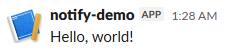 | 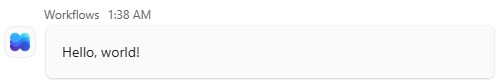 |
| [F02 Basic notification](examples/python/fundamentals/02_basic_notification) | 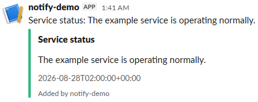 | 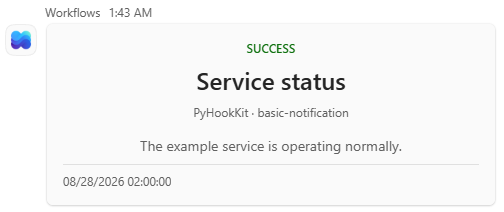 |
| [F03 Rich card](examples/python/fundamentals/03_rich_card) | 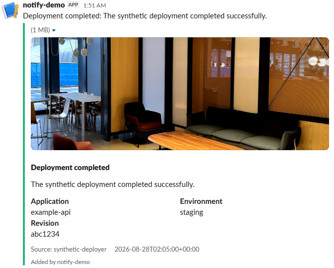 | 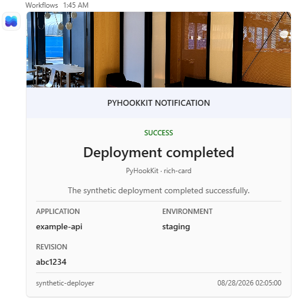 |
| [F04 Mention](examples/python/fundamentals/04_mention) | 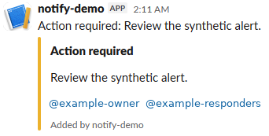 | 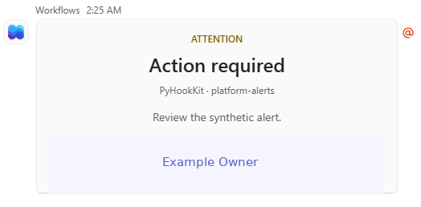<ul><li>Group notification requires additional Microsoft Graph member-expansion configuration.</li><li>Teams displays the configured user name because substituting a logical alias can misidentify the mentioned person.</li></ul> |
| [F05 Link and action](examples/python/fundamentals/05_link_and_action) | 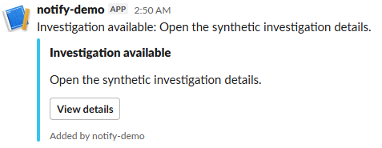 | 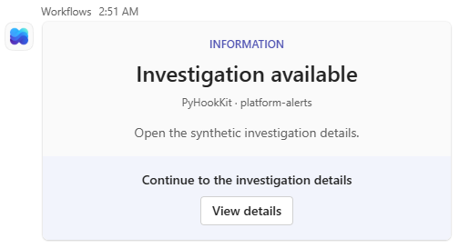 |
| [F06 Image](examples/python/fundamentals/06_image) | 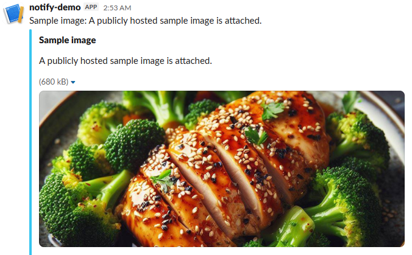 | 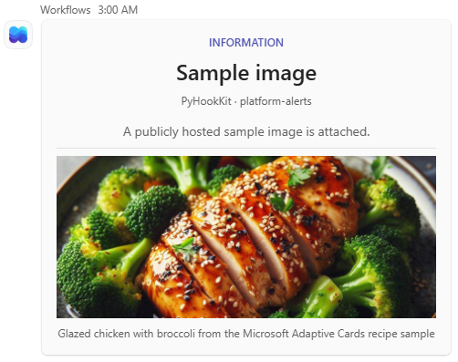 |
| [F07 Routing](examples/python/fundamentals/07_routing) | 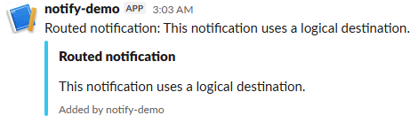 | 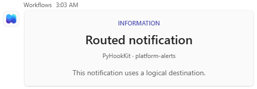 |
| [Deployment result](examples/python/scenarios/deployment_result) | _Screenshot pending: `deployment-result-slack.png`_ |  |
| [Incident alert and acknowledgment](examples/python/scenarios/incident_alert_acknowledgment) | _Screenshot pending: `incident-alert-acknowledgment-slack.png`_ |  |
| [Approval request](examples/python/scenarios/approval_request) | _Screenshot pending: `approval-request-slack.png`_ |  |
| [Maintenance notice](examples/python/scenarios/maintenance_notice) | _Screenshot pending: `maintenance-notice-slack.png`_ |  |

## Repository layout

- [`contracts/`](contracts/README.md): language-neutral schemas and paired test
  vectors
- [`docs/`](docs/README.md): public usage, architecture, security, and
  migration guidance
- [`examples/`](examples/README.md): reference implementations and examples
- [`infra/`](infra/README.md): provider configuration, runtime infrastructure,
  integrations, and policy checks

Examples are organized by capability or scenario. Where parity is complete,
Slack and Teams entrypoints are siblings and consume the same canonical
notification.

Every user-facing documentation, infrastructure, test, and executable-example
directory has a README entrypoint. Source-package directories, frozen fixture
leaf directories, generated caches, and nested image-only asset directories are
documented by their nearest parent README instead of duplicating local files.

## Local configuration

Copy `.env.example` to the ignored `.env`, then add the Slack Incoming Webhook
URL and Teams Workflow callback URL for synthetic test destinations. See
[Provider configuration](docs/configuration.md) for the exact values and setup
steps and [Slack examples](docs/slack-examples.md) for the F01-F10 catalog.

## Status

The Python distribution and import namespace are both `pyhookkit`. The project
has not been published to PyPI yet.

Paired fundamental and scenario examples are complete for Slack and Teams.
Provider differences are explicit when Teams Workflow lacks an equivalent
operation. All committed values are synthetic; runtime credentials and real
destination configuration belong outside this repository.

Third-party example assets and their licenses are listed in
[`THIRD_PARTY_NOTICES.md`](THIRD_PARTY_NOTICES.md).