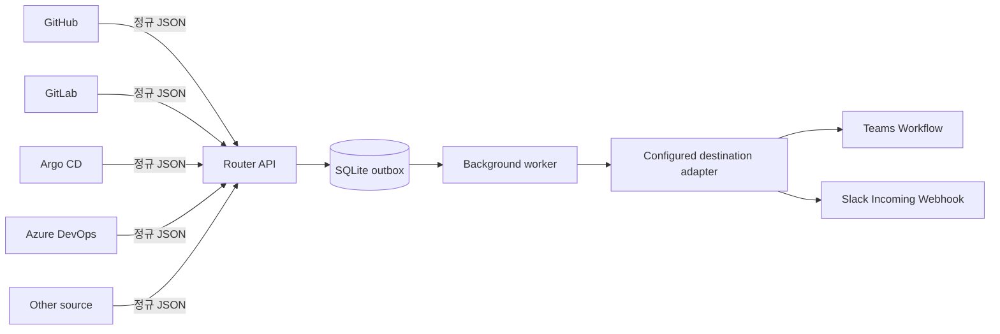

# 중앙 알림 라우터

[English](central-notification-router.md)

중앙 라우터는 GitHub, GitLab, Argo CD, Azure DevOps 또는 다른 생산자가
보낸 정규 알림을 하나의 라우팅 경계를 통해 전송하는 선택적 SQLite 기반
예제입니다. 기존의 Slack 및 Teams 직접 명령은 로컬 테스트, 마이그레이션
및 의도적으로 선택한 대체 경로에 계속 사용할 수 있습니다.



SQLite는 Slack이나 Teams에 직접 연결하지 않습니다. 라우터가 대상별 전송
작업을 outbox에 저장하면 백그라운드 워커가 작업을 임대하고, 등록된 대상의
공급자 어댑터가 전송합니다. 그림의 두 출력은 지원되는 대상 유형이며 모든
설치에서 둘 다 활성화된다는 의미가 아닙니다. 현재 구성을 확인하려면
`list-destinations`를 실행하세요.

팬아웃은 라우터가 담당합니다. Power Automate는 여전히 요청당 하나의 대상만
수신하며 라우팅 데이터베이스가 아니라 Teams 전송 어댑터로 유지됩니다.

## 범위

이 예제는 다음을 제공합니다.

- 엄격한 정규 알림 구문 분석
- 생산자별 Bearer 자격 증명
- 하나의 경로를 여러 대상으로 연결하는 구성
- 트랜잭션 방식의 SQLite 알림 및 대상 전송 레코드
- 생산자와 `eventId`가 같은 중복 제출에 대한 멱등성
- 최소 1회 전송을 보장하는 임대 기반 워커. 공급자가 메시지를 수락한 후
  SQLite에 성공을 기록하기 전에 프로세스가 중지되면 공급자 메시지가
  중복될 수 있음
- 민감 정보가 제거된 집계 및 대상별 전송 상태
- 기존 Slack 및 Teams 렌더러와 재시도 정책 재사용

루프백 전용 관리 대시보드와 관리 API는 채널 등록, 생산자 API 키, 인바운드
통합 및 전송 상태 조회를 제공합니다. 원격 관리 인증, 배달 못 한 알림 재처리
UI 및 다중 노드 워커 조정은 의도적으로 제외합니다. SQLite는 이 단일
프로세스 예제와 적당한 알림 볼륨에 적합합니다. 여러 라우터 복제본을
실행하기 전에 관리형 트랜잭션 저장소 또는 내구성 큐로 이전하세요.

테이블 관계, 컬럼, 상태 전이 및 보존 범위는 [중앙 라우터 SQLite 데이터
모델](central-router-sqlite-data-model.ko.md)을 참조하세요.

## 경로 초기화

`examples/python`에서 명령을 실행하세요. 데이터베이스 및 자격 증명 파일은
Git에서 무시됩니다.

```shell
uv run python -m pyhookkit.entrypoints.notification_router \
  --database .local/router.sqlite3 \
  init-db
```

Slack 대상을 추가합니다. 데이터베이스에는 Webhook 값이 아니라 환경 변수
이름만 저장됩니다.

```shell
uv run python -m pyhookkit.entrypoints.notification_router \
  --database .local/router.sqlite3 \
  add-destination \
  --target-id slack-release \
  --route release-notifications \
  --provider slack \
  --endpoint-env SLACK_WEBHOOK_URL
```

승인된 채널 링크를 제공하여 Teams 대상을 추가합니다. 서명된 Workflow URL은
SQLite 외부에 유지됩니다.

```shell
uv run python -m pyhookkit.entrypoints.notification_router \
  --database .local/router.sqlite3 \
  add-destination \
  --target-id teams-release \
  --route release-notifications \
  --provider teams-workflow \
  --endpoint-env TEAMS_WORKFLOW_URL \
  --channel-link "$TEAMS_WORKFLOW_CHANNEL_LINK"
```

## TeamsNotifyApp 부트스트랩

Azure CLI 위임 토큰을 영구 저장하는 대신 표시되는 단일 테넌트
`TeamsNotifyApp` 등록을 사용하세요. 채널 테넌트에 한 번 로그인합니다.

전체 ID, 최소 역할, 순환 및 복구 런북은
[TeamsNotifyApp 부트스트랩](teams-notify-app-bootstrap.ko.md)에 있습니다.

```shell
az login \
  --tenant "<channel tenant ID>" \
  --use-device-code \
  --allow-no-subscriptions
```

그런 다음 다음을 실행합니다.

```shell
uv run python -m pyhookkit.entrypoints.notification_router \
  --database .local/router.sqlite3 \
  bootstrap-teams-app \
  --channel-link "$TEAMS_WORKFLOW_CHANNEL_LINK" \
  --connection-user "svc-teams-notification@example.com" \
  --route release-notifications \
  --target-id teams-release
```

이 명령은 다음을 수행합니다.

1. 채널 링크에서 테넌트 및 Team ID를 파생합니다.
2. `TeamsNotifyApp`을 만들거나 고유하게 재사용합니다.
3. 해당 테넌트 Service Principal을 만듭니다.
4. Microsoft Graph 애플리케이션 역할 ID를 동적으로 확인합니다.
5. `Channel.ReadBasic.All`, `ChannelMember.ReadWrite.All`,
  `TeamMember.Read.All` 및 `TeamMember.ReadWriteNonOwnerRole.All`을 추가하고
  테넌트 전체 관리자 동의를 부여합니다.
6. 부트스트랩 ID를 통해 연결 사용자를 한 번 확인합니다.
7. 재사용 가능한 로컬 자격 증명이 없으면 1년 유효한 클라이언트 비밀을
   만듭니다.
8. 클라이언트 자격 증명이 일치하는 앱 전용 Graph 토큰을 발급하는지
   증명합니다.
9. 연결 사용자를 Team의 기반 Microsoft 365 Group에 추가합니다.
10. 앱 식별자와 비밀을 모드 `0600`으로 리포지토리 `.env`에 원자적으로
    기록합니다.
11. 대상을 SQLite에 등록합니다.

클라이언트 비밀은 절대 출력되지 않습니다. `--rotate-secret`으로 다시
실행하여 대체 자격 증명을 만들고 저장하세요. 대체가 성공한 후 Entra
포털에서 사용하지 않는 자격 증명을 제거하세요.

### 최소 부트스트랩 권한

| 작업 | ID | 최소 권한 |
|---|---|---|
| 앱 등록 만들기 | 부트스트랩 앱 생성자 | 테넌트 정책에서 사용자의 앱 등록을 허용하면 디렉터리 역할 불필요. 허용하지 않으면 **Application Developer** |
| 새로 만든 앱과 자격 증명 관리 | 앱 생성자/소유자 | `TeamsNotifyApp` 소유권. 별도 운영자가 자신이 소유하지 않은 애플리케이션을 관리해야 할 때만 **Cloud Application Administrator** 사용 |
| Microsoft Graph 애플리케이션 권한 부여 | 동의 승인자 | **Privileged Role Administrator**. 사용할 수 있는 경우 PIM을 통해 부트스트랩 동안에만 활성화 |
| 흐름 만들기 및 편집 | 흐름 작성자 | 대상 환경의 Power Platform **Environment Maker** |
| Teams 커넥터 권한 부여 | `svc-teams-notification` | Microsoft 365/Teams 및 Power Automate 라이선스가 있는 사용자. Entra 관리자 역할 불필요 |
| 런타임에 채널 유형 및 멤버십 구성 | `TeamsNotifyApp` 서비스 주체 | Microsoft Graph 애플리케이션 권한 `Channel.ReadBasic.All`, `ChannelMember.ReadWrite.All`, `TeamMember.Read.All` 및 `TeamMember.ReadWriteNonOwnerRole.All` |
| 알림 제출 | GitHub, GitLab, Argo CD, Azure DevOps 또는 다른 생산자 | 생산자별 라우터 자격 증명만 필요. Graph 또는 Power Platform 역할 불필요 |

Microsoft Graph 애플리케이션 권한에는 테넌트 전체 관리자 동의가 필요합니다.
**Privileged Role Administrator**는 Microsoft Graph 앱 역할에 동의할 수
있는 최소 권한의 기본 제공 역할입니다. Global Administrator도 사용할 수
있지만 의도적으로 권장하는 부트스트랩 역할은 아닙니다.

따라서 전체 자동화 명령을 실행하는 사용자에게는 앱 등록을 만들 권한과
활성화된 Privileged Role Administrator 역할이 모두 필요합니다. 이 업무는
운영상 분리할 수 있지만 현재의 단일 명령 부트스트랩은 두 기능이 모두
활성화되어 있을 것으로 예상합니다.

Microsoft 참고 자료:

- [작업별 최소 권한 역할](https://learn.microsoft.com/entra/identity/role-based-access-control/delegate-by-task)
- [테넌트 전체 관리자 동의 부여](https://learn.microsoft.com/entra/identity/enterprise-apps/grant-admin-consent)
- [애플리케이션 및 서비스 주체 개체](https://learn.microsoft.com/entra/identity-platform/app-objects-and-service-principals)
- [Microsoft 365 그룹 구성원 추가](https://learn.microsoft.com/graph/api/group-post-members?view=graph-rest-1.0)

ID는 Power Automate Teams 연결에 바인딩된 계정과 동일해야 합니다. 흐름
공동 소유자를 추가해도 커넥터 실행 ID는 변경되지 않습니다. 표준 채널은
Team 멤버십을 상속합니다. 비공개 채널은 Team과 채널 멤버십을 모두 자동
추가합니다. 공유 채널은 테넌트 경계를 포함할 수 있어 지원하지 않습니다.

등록은 현재의 `teams.cloud.microsoft` 채널 링크와 레거시
`teams.microsoft.com` 링크를 수락합니다. 라우터는 원본 링크와 파생된
테넌트 ID, Team ID, 채널 ID 및 채널 이름을 별도 열에 저장합니다. 전송 시
최상위 `teamId`와 `channelId` 및 하나의 Adaptive Card 첨부 파일이 있는
Teams `message` 봉투를 보내며 채널 링크나 콜백 URL은 보내지 않습니다.

한 경로를 팬아웃하려면 고유한 다른 대상 ID로 `add-destination`을
반복하세요. 리포지토리 `.env`는 자동으로 로드됩니다. TeamsNotifyApp이
구성되어 있으면 명령은 저장된 Graph 액세스 토큰을 읽지 않고 새 앱 전용
토큰을 가져옵니다.

```shell
uv run python -m pyhookkit.entrypoints.notification_router \
  --database .local/router.sqlite3 \
  add-destination \
  --target-id teams-another-channel \
  --route release-notifications \
  --provider teams-workflow \
  --endpoint-env TEAMS_WORKFLOW_URL \
  --channel-link "<Teams channel link>" \
  --ensure-team-membership
```

다음 명령으로 비밀이 아닌 구성을 검사하세요.

```shell
uv run python -m pyhookkit.entrypoints.notification_router \
  --database .local/router.sqlite3 \
  list-destinations
```

알림을 보내지 않고 전체 로컬 설정을 확인합니다.

```shell
uv run python -m pyhookkit.entrypoints.notification_router \
  --database .local/router.sqlite3 \
  doctor
```

`doctor`는 Workflow URL을 검증하고 앱 전용 Graph 토큰을 가져와 검증하며,
활성화된 모든 Team에서 연결 사용자의 멤버십을 확인하고 SQLite 파일이
소유자 전용 모드인지 검사합니다. 자격 증명을 절대 출력하지 않습니다.

## 관리 대시보드 실행

관리 대시보드는 등록된 Teams 채널과 최근 알림 상태를 표시하고, 복사한 채널
링크로 새 대상을 추가합니다. 원문 알림 페이로드, 채널 링크 및 자격 증명은
화면이나 API 응답에 포함하지 않습니다.

저장소 루트 `.env`에 24자 이상의 전용 관리자 토큰을 설정합니다. 생산자
Bearer 토큰과 같은 값을 사용하지 마세요.

```dotenv
PYHOOKKIT_ADMIN_TOKEN="<임의의 관리자 토큰>"
NOTIFICATION_ROUTER_URL="https://notify.example.test"
```

`NOTIFICATION_ROUTER_URL`은 **웹훅 연동**에 표시할 생산자 접근 가능 라우터
기본 URL이며 비밀이 아닙니다. 로컬 전용 라우터에는
`http://127.0.0.1:8080`을 사용하세요. 루프백이 아닌 URL에는 HTTPS를
사용해야 합니다.

`examples/python`에서 대시보드를 실행합니다.

```shell
uv run python -m pyhookkit.entrypoints.notification_router \
  --database .local/router.sqlite3 \
  admin
```

브라우저에서 `http://127.0.0.1:8081/admin`을 열고 관리자 토큰을 입력합니다.
토큰은 브라우저 저장소에 보존되지 않습니다. **채널 추가**는 채널 링크에서
Team과 채널을 확인하고, `TeamsNotifyApp`으로 게시 계정의 Team 멤버십을
확인한 후 SQLite에 대상을 등록합니다. 대상 ID는 링크의 채널명으로 만듭니다.
같은 채널명이 이미 있으면 `-2`, `-3`을 붙이고, 같은 Team의 같은 채널을
다시 등록하면 기존 대상 ID를 유지합니다.


이 캡처는 합성 채널, 경로, 이벤트 ID, 타임스탬프 및 상태 값을 사용합니다.
관리자 토큰, 생산자 API 키, 채널 링크 또는 공급자 자격 증명은 포함하지
않습니다.

**인바운드 통합**에서는 GitHub, GitLab 또는 Azure DevOps 원본 Webhook의
라우팅을 등록합니다. 공급자 비밀은 값이 아니라 환경 변수 이름만
저장합니다. **생산자 API 키**에서는 원문 키를 다시 반환하지 않고 키 ID,
범위, 사용 상태 및 폐기 상태를 표시합니다.

폼에서 Teams 채널 링크를 먼저 입력하면 채널명이 자동으로 채워집니다.
**알림 경로**는 같은 알림을 함께 받을 대상 그룹입니다. 예를 들어
`release-notifications` 경로로 등록한 모든 채널은 알림의 `route`가
`release-notifications`일 때 함께 전송 대상이 됩니다.

등록할 때 Graph에서 채널 유형을 확인합니다. 표준 채널은 Team 멤버십을
사용하고, 비공개 채널은 게시 계정을 Team과 채널에 모두 추가합니다. 공유
채널은 등록할 수 없습니다.

채널 목록에서 표준 채널은 `#` 아이콘으로 표시하고 비공개 채널은 자물쇠
아이콘으로 표시합니다. 아이콘에 포인터를 올리거나 키보드로 포커스를
이동하면 채널 유형을 확인할 수 있습니다.

채널 목록의 **테스트 발송**은 선택한 채널 하나에만 **PyHookKit 테스트
알림** 카드를 직접 보냅니다. 일반 알림 경로에 제출하지 않으므로 같은
경로의 다른 채널로 팬아웃되지 않습니다. 전송 결과는 **최근 알림**에
`admin-dashboard` 생산자로 기록됩니다.

채널 옆의 **웹훅 연동**을 선택하면 대상별 POST URL, 필수 헤더 및 정규 JSON
예제가 표시됩니다. 복사 항목에는 실제 생산자 토큰이 포함되지 않습니다.
같은 알림 경로에 다른 대상이 있어도 이 URL은 선택한 채널 하나만 큐에
추가합니다.

**생산자 ID**에는 라우터의 `--producer` 옵션으로 등록한 값을 입력합니다.
예를 들어 `--producer gitlab=PYHOOKKIT_GITLAB_ROUTER_TOKEN`으로 실행했다면
`X-PyHookKit-Producer` 값은 `gitlab`입니다. `Authorization`에는 해당 환경
변수의 실제 토큰을 사용합니다. 관리 화면은 이 비밀 값을 조회하거나
표시하지 않습니다.

**웹훅 연동** 화면은 AI Foundry의 연결 예제처럼 다음 항목을 구분하여
표시합니다.

- **샘플 코드**: `curl` 또는 Python을 선택하고 전체 요청을 복사합니다.
- **엔드포인트**: 선택한 채널의 대상별 URL을 복사합니다.
- **API 키**: 발급한 생산자 토큰을 붙여 넣고 필요할 때 표시하거나
  복사합니다. 새 키가 필요하면 **생성**을 선택합니다.
- **생산자 ID**: `X-PyHookKit-Producer` 헤더 값을 입력합니다.

생성, 표시 및 복사 작업은 각 입력 필드 오른쪽의 아이콘으로 제공합니다.
샘플 코드, 필수 헤더 및 Payload의 복사 아이콘은 각 코드 영역 오른쪽 위에
표시됩니다. 아이콘에 포인터를 올리거나 키보드로 포커스를 이동하면 작업
이름을 확인할 수 있습니다.

`curl` 샘플의 여러 줄 명령에는 줄 끝에 단일 `\`를 표시합니다. JSON
Payload는 heredoc으로 분리하여 JSON 따옴표 앞에 `\`가 반복되지 않도록
표시합니다.

기존 API 키를 붙여 넣으면 샘플 코드와 필수 헤더가 즉시 갱신됩니다. 값은
열린 모달의 메모리에만 유지되며 모달을 닫으면 지웁니다. 키가 없는
상태에서도 `<your-api-key>` 자리 표시자로 샘플을 확인할 수 있습니다.

**생성**을 선택하면 라우터가 선택한 생산자와 대상에 제한된 256비트 API
키를 발급합니다. 원문 키는 한 번만 반환되며 SHA-256 다이제스트와 민감
정보가 제거된 메타데이터만 저장합니다. 원문 값을 즉시 생산자의 비밀
저장소에 복사하세요. 대시보드에서 사용 상태를 확인하거나 키를 폐기할 수
있습니다.

Bearer 인증에서 표준화된 부분은
`Authorization: Bearer <your-api-key>` 헤더 형식입니다. API 키 본문은
JWT일 필요가 없습니다. 이 가이드의 `secrets.token_urlsafe(32)` 명령은
32바이트(256비트) 임의 값을 43자 URL-safe 불투명 키로 생성합니다.

대시보드는 루프백 주소에만 바인딩됩니다. 라우터 API와 워커는 아래의
`serve` 명령으로 별도 실행합니다. 원격 관리 UI가 필요하면 조직의 인증,
TLS 및 접근 제어를 갖춘 관리 경계 뒤에 별도로 배포하세요.

## 로컬에서 실행

생산자마다 서로 다른 임의 토큰을 만들고 Git에서 제외된 `.env` 또는 다른 비밀
저장소에서 공급자 자격 증명을 주입하세요.

```shell
export PYHOOKKIT_GITLAB_ROUTER_TOKEN="$(python -c \
  'import secrets; print(secrets.token_urlsafe(32))')"
export PYHOOKKIT_ARGOCD_ROUTER_TOKEN="$(python -c \
  'import secrets; print(secrets.token_urlsafe(32))')"

uv run python -m pyhookkit.entrypoints.notification_router \
  --database .local/router.sqlite3 \
  serve \
  --producer gitlab=PYHOOKKIT_GITLAB_ROUTER_TOKEN \
  --producer argocd=PYHOOKKIT_ARGOCD_ROUTER_TOKEN
```

프로세스는 다음을 노출합니다.

- `GET /healthz`
- `POST /v1/notifications`
- `POST /v1/destinations/{targetId}/notifications`
- `POST /v1/inbound/{provider}/{integrationId}`
- `GET /v1/notifications/{notificationId}`

POST 엔드포인트는 SQLite가 알림과 모든 대상 레코드를 커밋한 후 `202`를
반환합니다. 전송은 워커에서 이루어지며 `202`는 공급자 전송 증거가
아닙니다. 반환된 알림 ID를 조회하여 `queued`, `delivering`, `delivered`,
`partial_failed` 또는 `failed` 상태를 확인하세요.

커밋된 합성 계약을 제출합니다.

```shell
export NOTIFICATION_ROUTER_URL=http://127.0.0.1:8080
export NOTIFICATION_ROUTER_TOKEN="$PYHOOKKIT_GITLAB_ROUTER_TOKEN"

uv run python -m pyhookkit.entrypoints.notification_router_client \
  --producer gitlab \
  --input ../../contracts/test-vectors/scenarios/deployment-result/notification.json
```

원격 클라이언트에는 HTTPS가 필요합니다. 루프백 HTTP는 로컬 개발에만
허용됩니다.

## 채널별 Webhook URL로 알림 제출

하나의 생산자가 알림 경로의 모든 대상이 아니라 등록된 채널 하나를 지정해야
하면 **웹훅 연동**에 표시되는 URL을 사용합니다.

```text
POST https://notify.example.test/v1/destinations/teams-release/notifications
```

팬아웃 엔드포인트와 동일한 생산자 인증 헤더를 전송합니다.

```http
Authorization: Bearer <your-api-key>
X-PyHookKit-Producer: gitlab
Content-Type: application/json
```

요청 본문에는 정규 알림을 사용합니다. `route`는 선택한 대상에 설정된 알림
경로와 일치해야 합니다.

```json
{
  "schemaVersion": "1.0",
  "eventId": "deploy-2026-001",
  "route": "release-notifications",
  "title": "배포 결과",
  "body": "staging 배포가 완료되었습니다.",
  "severity": "success"
}
```

라우터는 알림 하나와 대상 전송 하나를 SQLite에 커밋한 후 `202`를
반환합니다. 기존 워커는 이후 해당 채널로 알림을 전송합니다. 대상이
비활성화되어 있거나 존재하지 않거나 `route`가 일치하지 않으면 요청을
거부합니다. 같은 생산자, 대상, `eventId` 및 페이로드로 다시 요청하면 기존
접수 결과를 반환합니다. 같은 생산자의 `eventId`를 다른 대상이나 다른
내용에 다시 사용하면 충돌을 반환합니다.

GitLab CI 작업은 정규 JSON을 만든 후 대상 URL을 호출할 수 있습니다.

```yaml
notify-release-channel:
  script:
    - >-
      curl --fail-with-body --request POST
      --header "Authorization: Bearer ${PYHOOKKIT_ROUTER_TOKEN}"
      --header "X-PyHookKit-Producer: gitlab"
      --header "Content-Type: application/json"
      --data-binary @notification.json
      "${PYHOOKKIT_TARGET_WEBHOOK_URL}"
```

두 값을 모두 보호되고 마스킹된 CI/CD 변수로 저장하세요. URL은 대상을
식별하지만 자격 증명은 아닙니다. 요청을 승인하려면 생산자 토큰이 필요합니다.
신뢰할 수 있는 CI 값으로 `notification.json`을 만들고 재시도할 때 `eventId`를
유지하세요. 신뢰할 수 없는 텍스트를 JSON 문자열에 직접 삽입하지 마세요.

## GitHub와 GitLab에서 라우터에 연결

`POST /v1/notifications`는 GitHub 또는 GitLab의 원본 Webhook을 직접 받지
않습니다. 호출자는 이벤트를 [정규 알림
계약](notification-parity.ko.md)으로 변환하고 다음 헤더를 추가해야 합니다.

- `Authorization: Bearer <your-api-key>`
- `X-PyHookKit-Producer: gitlab` 또는 `github`
- `Content-Type: application/json`

GitHub Actions 또는 GitLab CI 작업이 정규 JSON을 만드는 방식이 가장
간단합니다. 공급자 원본 Payload에는 canonical 엔드포인트가 아니라 [생산자
통합 가이드](producer-integrations.ko.md)의 인증된 `/v1/inbound/*`
엔드포인트를 사용하세요.

### 라우터가 공개망에서 접근 가능한 경우

라우터의 `serve` 프로세스를 인터넷에 직접 노출하지 마세요. TLS를 종료하는
API Gateway 또는 역방향 프록시 뒤에 배치하고 외부에는 알림 API만
노출합니다.

```text
GitHub Actions / GitLab CI
  → HTTPS API Gateway 또는 역방향 프록시
    → private router API 및 worker
      → Power Automate → Teams
```

생산자마다 서로 다른 토큰을 사용하고 요청 크기 제한, 속도 제한, 감사 로그
및 토큰 회전을 적용합니다. `/admin` 관리 화면과 SQLite 파일은 외부에
노출하지 않습니다.

### 라우터가 사설망에 있는 경우

가장 권장하는 방식은 사설망에 self-hosted GitHub Actions Runner
또는 GitLab Runner를 두는 것입니다. Runner는 GitHub/GitLab로 아웃바운드
연결을 만들고, 작업이 시작되면 내부 주소로 라우터를 호출합니다. 라우터에
공개 인바운드 경로를 만들 필요가 없습니다.

```text
GitHub / GitLab SaaS
  ← 아웃바운드 연결 — self-hosted Runner
                       → private router → Power Automate → Teams
```

Runner를 둘 수 없으면 최소 공개 수신 계층과 내구성 있는 큐를 사용합니다.
예를 들어 Azure API Management 또는 Azure Functions에서 공급자 서명을
검증하고 Azure Service Bus에 기록한 다음, 사설망의 워커가 큐를
가져가도록 구성합니다. 이 저장소에는 해당 큐 어댑터가 아직 포함되어 있지
않습니다.

### Power Automate를 추가해야 하는 경우

라우터에 연결하기 위해 Power Automate 흐름을 추가하는 방식은 기본 권장안이
아닙니다. 클라우드 흐름은 private endpoint를 기본적으로 호출할 수 없으며,
사용하려면 온-프레미스 데이터 게이트웨이, VNet 지원 연결 또는 별도 중계
API가 필요합니다. 이 경우에도 인증, 재시도 및 중복 처리를 별도로 설계해야
합니다.

Teams 한 곳에 직접 전송만 필요하면 기존 공통 Power Automate 흐름을 그대로
사용하고 GitLab 파이프라인의 `notification-path=direct`를 선택할 수
있습니다. 추가 흐름은 필요하지 않지만 중앙 라우터의 팬아웃, SQLite 상태,
대상별 결과 및 재시도 기능은 우회합니다.

| 조건 | 권장 경로 |
|---|---|
| 공개 HTTPS 라우터 운영 가능 | API Gateway 뒤의 중앙 라우터 |
| 라우터가 private이고 Runner 배치 가능 | self-hosted Runner에서 내부 라우터 호출 |
| 라우터가 private이고 Runner 배치 불가 | 공개 검증 수신 계층 + 큐 + private 워커 |
| Teams 직접 알림만 필요 | 기존 Power Automate 공통 흐름을 직접 호출 |

## GitLab 및 Argo CD

GitLab 파이프라인 입력 `notification-path`는 `direct` 또는 `router`를
선택합니다. 마이그레이션 중에는 `direct`를 유지하고 보호 및 마스킹된
`NOTIFICATION_ROUTER_URL`과 `NOTIFICATION_ROUTER_TOKEN` 변수를 구성한 후
`router`를 선택하세요.

Argo CD에는 별도의 `bookinfo-router-sync-failed` 및
`bookinfo-router-sync-succeeded` 템플릿이 포함되어 있습니다. GitLab 알림
디스패치를 우회하려면 합성 라우터 URL을 구성하고
`notification-router-token` 비밀 키를 만든 다음 각 트리거의 `send` 항목을
해당 라우터 템플릿으로 변경하세요. 동일한 이벤트에 두 템플릿 경로를 모두
활성화하지 마세요.

## 전송 보장 및 제한 사항

한 생산자의 중복 제출은 원래 알림 ID를 반환합니다. 해당 생산자의
`eventId`를 다른 콘텐츠에 재사용하면 충돌이 반환됩니다. 구성된 각 대상은
독립적인 최종 결과를 가지므로 하나의 실패한 채널은 성공한 채널을 숨기지
않고 `partial_failed`를 생성합니다.

워커는 만료된 전송 임대를 복구합니다. 따라서 공급자가 메시지를 수락한 후
SQLite가 성공을 저장하기 전에 프로세스가 실패하면 공급자 메시지가 중복될
수 있습니다. Slack 및 Teams Webhook 전송은 공유 트랜잭션 멱등성 키를
제공하지 않습니다. 소비자는 `eventId`와 표시되는 상관관계 ID를 중복 감지
참조로 취급해야 합니다.

토큰, 서명된 콜백 URL, 정규 페이로드 또는 공급자 응답을 로그에 넣지
마세요. HTTP 전송은 요청 로그를 억제하며 영구 저장되는 전송 오류에는
안정적인 분류와 선택적 HTTP 상태만 포함됩니다.
