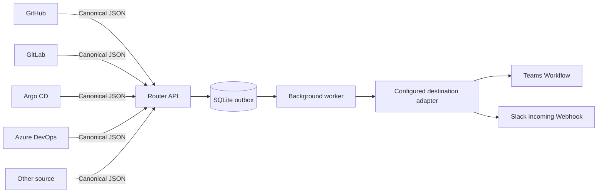
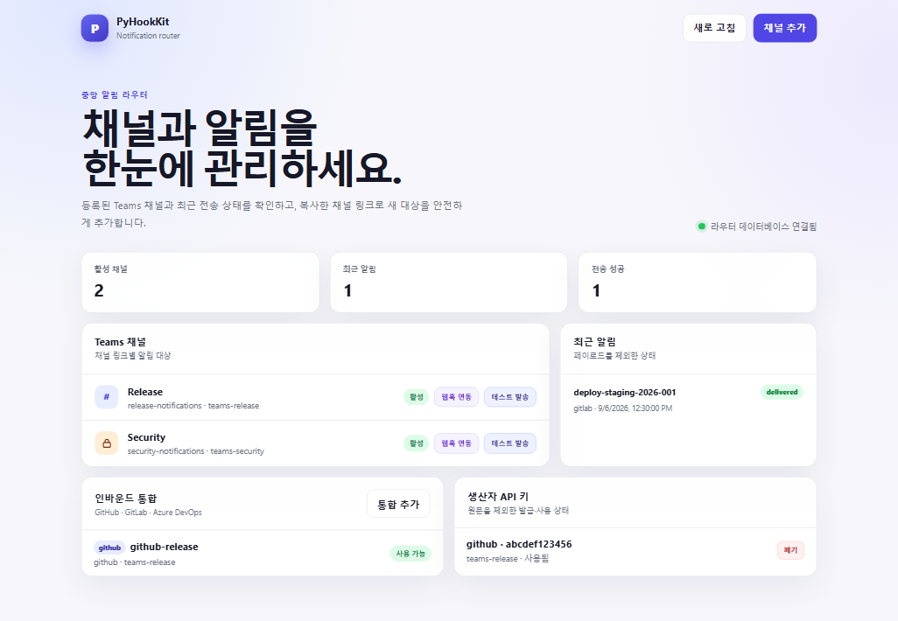

# Central notification router

[한국어](central-notification-router.ko.md)

The central router is an optional SQLite-backed example for sending canonical
notifications from GitHub, GitLab, Argo CD, Azure DevOps, or another producer
through one routing boundary. Existing direct Slack and Teams commands remain
available for local testing, migration, and a deliberately selected fallback.



SQLite does not connect directly to Slack or Teams. The router stores one
delivery job per target in the outbox, the background worker leases each job,
and the registered target's provider adapter performs delivery. The two output
branches show supported destination types; they do not imply that every
installation enables both. Run `list-destinations` to inspect the current
configuration.

The router owns fan-out. Power Automate still receives one destination per
request and remains a Teams delivery adapter rather than a routing database.

## Scope

The example provides:

- strict canonical notification parsing;
- producer-specific bearer credentials;
- route-to-many-destinations configuration;
- transactional SQLite notification and target-delivery records;
- duplicate-submission idempotency keyed by producer and `eventId`;
- an at-least-once leased worker, which can duplicate a provider message if a
  process stops after provider acceptance but before SQLite records success;
- redacted aggregate and per-target delivery status;
- existing Slack and Teams renderer and retry-policy reuse.

The loopback-only administration dashboard and API provide channel
registration, producer API-key management, inbound integration management, and
delivery-status visibility. The example intentionally omits remote
administration authentication, a dead-letter replay UI, and multi-node worker
coordination. SQLite is suitable for this single-process example and modest
notification volume. Move to a managed transactional store or durable queue
before running multiple router replicas.

See the [central router SQLite data model](central-router-sqlite-data-model.md)
for table relationships, columns, state transitions, and retention scope.

## Initialize routes

Run commands from `examples/python`. Database and credential files are ignored
by Git.

```shell
uv run python -m pyhookkit.entrypoints.notification_router \
  --database .local/router.sqlite3 \
  init-db
```

Add a Slack destination. The database stores only the environment variable
name, not its webhook value:

```shell
uv run python -m pyhookkit.entrypoints.notification_router \
  --database .local/router.sqlite3 \
  add-destination \
  --target-id slack-release \
  --route release-notifications \
  --provider slack \
  --endpoint-env SLACK_WEBHOOK_URL
```

Add a Teams destination by supplying an approved channel link. The signed
Workflow URL remains outside SQLite:

```shell
uv run python -m pyhookkit.entrypoints.notification_router \
  --database .local/router.sqlite3 \
  add-destination \
  --target-id teams-release \
  --route release-notifications \
  --provider teams-workflow \
  --endpoint-env TEAMS_WORKFLOW_URL \
  --channel-link "$TEAMS_WORKFLOW_CHANNEL_LINK"
```

## Bootstrap TeamsNotifyApp

Use a visible, single-tenant `TeamsNotifyApp` registration instead of persisting
an Azure CLI delegated token. Sign in to the channel tenant once:

The complete identity, minimum-role, rotation, and recovery runbook is in
[TeamsNotifyApp bootstrap](teams-notify-app-bootstrap.md).

```shell
az login \
  --tenant "<channel tenant ID>" \
  --use-device-code \
  --allow-no-subscriptions
```

Then run:

```shell
uv run python -m pyhookkit.entrypoints.notification_router \
  --database .local/router.sqlite3 \
  bootstrap-teams-app \
  --channel-link "$TEAMS_WORKFLOW_CHANNEL_LINK" \
  --connection-user "svc-teams-notification@example.com" \
  --route release-notifications \
  --target-id teams-release
```

The command:

1. derives the tenant and Team IDs from the channel link;
2. creates or uniquely reuses `TeamsNotifyApp`;
3. creates its tenant Service Principal;
4. resolves the Microsoft Graph application-role ID dynamically;
5. adds `Channel.ReadBasic.All`, `ChannelMember.ReadWrite.All`,
  `TeamMember.Read.All`, and `TeamMember.ReadWriteNonOwnerRole.All`, then grants
  tenant-wide admin consent;
6. resolves the connection user once through the bootstrap identity;
7. creates a one-year client secret when no reusable local credential exists;
8. proves that client credentials issue a matching app-only Graph token;
9. adds the connection user as a regular Team member;
10. writes the app identifiers and secret atomically to the repository `.env`
    with mode `0600`;
11. registers the destination in SQLite.

The client secret is never printed. Re-run with `--rotate-secret` to create and
store a replacement credential. Remove obsolete credentials in the Entra portal
after the replacement succeeds.

### Minimum bootstrap permissions

| Task | Identity | Least privilege |
|---|---|---|
| Create the app registration | Bootstrap app creator | No directory role when tenant policy permits users to register apps; otherwise **Application Developer** |
| Manage the newly created app and credential | App creator/owner | Ownership of `TeamsNotifyApp`; use **Cloud Application Administrator** only when a separate operator must manage applications it does not own |
| Grant Microsoft Graph application permission | Consent approver | **Privileged Role Administrator**, activated only for bootstrap through PIM where available |
| Create and edit the Flow | Flow author | Power Platform **Environment Maker** in the target environment |
| Authorize the Teams connector | `svc-teams-notification` | Licensed Microsoft 365/Teams and Power Automate user; no Entra administrator role |
| Configure channel type and memberships at runtime | `TeamsNotifyApp` service principal | Microsoft Graph application permissions `Channel.ReadBasic.All`, `ChannelMember.ReadWrite.All`, `TeamMember.Read.All`, and `TeamMember.ReadWriteNonOwnerRole.All` |
| Submit notifications | GitHub, GitLab, Argo CD, Azure DevOps, or another producer | Producer-specific router bearer credential only; no Graph or Power Platform role |

Microsoft Graph application permissions require tenant-wide admin consent.
**Privileged Role Administrator** is the least privileged built-in role that can
grant consent for Microsoft Graph app roles. Global Administrator also works
but is intentionally not the recommended bootstrap role.

The user running the complete automated command therefore needs both permission
to create an app registration and an active Privileged Role Administrator role.
These duties can be separated operationally, but the current one-command
bootstrap expects both capabilities to be active.

Microsoft references:

- [least-privileged roles by task](https://learn.microsoft.com/entra/identity/role-based-access-control/delegate-by-task);
- [grant tenant-wide admin consent](https://learn.microsoft.com/entra/identity/enterprise-apps/grant-admin-consent);
- [application and Service Principal objects](https://learn.microsoft.com/entra/identity-platform/app-objects-and-service-principals);
- [add a Microsoft 365 Group member](https://learn.microsoft.com/graph/api/group-post-members?view=graph-rest-1.0).

The identity must be the same account bound to the Power Automate Teams
connection. Adding a Flow co-owner does not change the connector execution
identity. Standard channels inherit Team membership. Private-channel
registration adds both Team and channel membership. Shared channels can cross
tenant boundaries and are not supported.

Registration accepts current `teams.cloud.microsoft` channel links and legacy
`teams.microsoft.com` links. The router stores the original link plus derived
tenant ID, Team ID, channel ID, and channel name in separate columns. Delivery
sends a Teams `message` envelope with top-level `teamId` and `channelId` plus
one Adaptive Card attachment; it does not send the channel link or callback URL.

Repeat `add-destination` with another unique target ID to fan out one route.
The repository `.env` is loaded automatically. With TeamsNotifyApp configured,
the command acquires a fresh app-only token rather than reading a saved Graph
access token:

```shell
uv run python -m pyhookkit.entrypoints.notification_router \
  --database .local/router.sqlite3 \
  add-destination \
  --target-id teams-another-channel \
  --route release-notifications \
  --provider teams-workflow \
  --endpoint-env TEAMS_WORKFLOW_URL \
  --channel-link "<Teams channel link>" \
  --ensure-team-membership
```

Inspect non-secret configuration with:

```shell
uv run python -m pyhookkit.entrypoints.notification_router \
  --database .local/router.sqlite3 \
  list-destinations
```

Verify the complete local setup without sending a notification:

```shell
uv run python -m pyhookkit.entrypoints.notification_router \
  --database .local/router.sqlite3 \
  doctor
```

`doctor` validates the Workflow URL, obtains and validates an app-only Graph
token, verifies the connection user's membership in every enabled Team, and
checks the SQLite file's owner-only mode. It never prints credentials.

## Run the administration dashboard

The dashboard shows registered Teams channels and recent notification status
and adds a destination from a copied channel link. Raw notification payloads,
channel links, and credentials are not included in the UI or API responses.

Set a dedicated administrator token of at least 24 characters in the
repository-root `.env`. Do not reuse a producer bearer token.

```dotenv
PYHOOKKIT_ADMIN_TOKEN="<random administrator token>"
NOTIFICATION_ROUTER_URL="https://notify.example.test"
```

`NOTIFICATION_ROUTER_URL` is the producer-reachable router base URL shown by
**Webhook integration**. It is not a secret. Use `http://127.0.0.1:8080` for a
local-only router; non-loopback URLs must use HTTPS.

Run the dashboard from `examples/python`:

```shell
uv run python -m pyhookkit.entrypoints.notification_router \
  --database .local/router.sqlite3 \
  admin
```

Open `http://127.0.0.1:8081/admin` and enter the administrator token. The token
is not persisted in browser storage. **Add channel** resolves the Team and
channel from the link, verifies posting-identity Team membership through
`TeamsNotifyApp`, and registers the destination in SQLite. The target ID uses
the channel name from the link. A duplicate name receives `-2`, `-3`, and so on;
registering the same channel in the same Team retains its existing target ID.



The capture uses synthetic channels, routes, event IDs, timestamps, and status
values. It contains no administrator token, producer API key, channel link, or
provider credential.

**Inbound integrations** registers GitHub, GitLab, or Azure DevOps native
Webhook routing while storing only the provider secret's environment-variable
name. **Producer API keys** lists key IDs, scope, use state, and revocation
state without returning raw key values.

Enter the Teams channel link first and the form fills the channel name
automatically. **Notification route** is the destination group that receives the
same notification. For example, every channel registered to
`release-notifications` is selected when a notification has that `route` value.

Registration reads the channel membership type from Graph. Standard channels
use inherited Team membership, while private channels add the posting identity
to both the Team and channel. Shared channels cannot be registered.

The channel list uses a `#` icon for standard channels and a lock icon for
private channels. Hover or keyboard focus exposes the channel type.

**Send test** in the channel list sends a **PyHookKit test notification** card
directly to only the selected channel. It does not submit through the normal
notification route, so it does not fan out to other channels on that route. The
result appears under **Recent notifications** with producer `admin-dashboard`.

Select **Webhook integration** beside a channel to display its target-specific
POST URL, required headers, and canonical JSON example. Copy controls never
include a real producer token. The URL queues only that channel, even when
other destinations use the same notification route.

Set **Producer ID** to the value registered with the router's `--producer`
option. For example, `--producer gitlab=PYHOOKKIT_GITLAB_ROUTER_TOKEN` requires
`X-PyHookKit-Producer: gitlab`. Use the environment variable's actual token in
`Authorization`; the dashboard never reads or displays that secret.

The **Webhook integration** dialog separates the connection details similarly
to a cloud service connection sample:

- **Sample code** switches between `curl` and Python and copies the complete
  request;
- **Endpoint** copies the selected channel's target-specific URL;
- **API key** accepts the issued producer token and provides generate, reveal,
  and copy controls;
- **Producer ID** supplies the `X-PyHookKit-Producer` header value.

Generate, reveal, and copy actions use icons beside their input fields. Copy
icons for sample code, required headers, and payload appear at the upper-right
of each code block. Hover or keyboard focus exposes each action name.

The multiline `curl` sample shows one `\` at each continued line. Its JSON
payload uses a heredoc so JSON quotation marks are not cluttered with escape
backslashes.

Pasting an existing API key updates the sample and required headers immediately.
The value remains only in the open dialog's memory and is cleared when the
dialog closes. Without a pasted key, the sample uses the `<your-api-key>`
placeholder.

Selecting **Generate** asks the router to issue a 256-bit API key scoped to the
selected producer and destination. The raw key is returned once; only its
SHA-256 digest and redacted metadata are stored. Copy the raw value immediately
to the producer's secret store. Use the dashboard to inspect use status or
revoke a key.

The standardized part of Bearer authentication is the
`Authorization: Bearer <your-api-key>` header syntax. The API key body does not
have to be a JWT. The `secrets.token_urlsafe(32)` command in this guide creates
a 32-byte (256-bit) random value encoded as a 43-character URL-safe opaque key.

The dashboard binds only to a loopback address. Run the router API and worker
separately with the `serve` command below. If remote administration is needed,
deploy it behind an organizational boundary providing authentication, TLS, and
access control.

## Run locally

Create a different random token for every producer and inject provider
credentials from the ignored `.env` or another secret store.

```shell
export PYHOOKKIT_GITLAB_ROUTER_TOKEN="$(python -c \
  'import secrets; print(secrets.token_urlsafe(32))')"
export PYHOOKKIT_ARGOCD_ROUTER_TOKEN="$(python -c \
  'import secrets; print(secrets.token_urlsafe(32))')"

uv run python -m pyhookkit.entrypoints.notification_router \
  --database .local/router.sqlite3 \
  serve \
  --producer gitlab=PYHOOKKIT_GITLAB_ROUTER_TOKEN \
  --producer argocd=PYHOOKKIT_ARGOCD_ROUTER_TOKEN
```

The process exposes:

- `GET /healthz`;
- `POST /v1/notifications`;
- `POST /v1/destinations/{targetId}/notifications`;
- `POST /v1/inbound/{provider}/{integrationId}`;
- `GET /v1/notifications/{notificationId}`.

Use the [central router OpenAPI document](https://dotnetpower.github.io/pyhookkit/openapi.json)
for machine-readable paths, authentication, request schemas, and redacted
response models.

The POST endpoint returns `202` after SQLite commits the notification and all
target records. Delivery occurs in the worker; `202` is not provider delivery
evidence. Query the returned notification ID for `queued`, `delivering`,
`delivered`, `partial_failed`, or `failed`.

Submit a committed synthetic contract:

```shell
export NOTIFICATION_ROUTER_URL=http://127.0.0.1:8080
export NOTIFICATION_ROUTER_TOKEN="$PYHOOKKIT_GITLAB_ROUTER_TOKEN"

uv run python -m pyhookkit.entrypoints.notification_router_client \
  --producer gitlab \
  --input ../../contracts/test-vectors/scenarios/deployment-result/notification.json
```

Remote clients require HTTPS. Loopback HTTP is accepted only for local
development.

## Submit to one channel with its Webhook URL

Use the URL shown by **Webhook integration** when one producer must address one
registered channel rather than every destination on a route:

```text
POST https://notify.example.test/v1/destinations/teams-release/notifications
```

Send the same producer authentication headers used by the fan-out endpoint:

```http
Authorization: Bearer <your-api-key>
X-PyHookKit-Producer: gitlab
Content-Type: application/json
```

The request body is a canonical notification. Its `route` must match the
selected destination's configured route.

```json
{
  "schemaVersion": "1.0",
  "eventId": "deploy-2026-001",
  "route": "release-notifications",
  "title": "Deployment result",
  "body": "The staging deployment completed.",
  "severity": "success"
}
```

The router returns `202` only after it commits one notification and one target
delivery to SQLite. The existing worker then sends the notification to that
channel. A disabled, unknown, or route-mismatched target is rejected. Repeating
the same producer, target, `eventId`, and payload returns the original receipt;
reusing that producer's `eventId` for another target or different content
returns a conflict.

A GitLab CI job can call the target URL after it creates canonical JSON:

```yaml
notify-release-channel:
  script:
    - >-
      curl --fail-with-body --request POST
      --header "Authorization: Bearer ${PYHOOKKIT_ROUTER_TOKEN}"
      --header "X-PyHookKit-Producer: gitlab"
      --header "Content-Type: application/json"
      --data-binary @notification.json
      "${PYHOOKKIT_TARGET_WEBHOOK_URL}"
```

Store both variables as protected and masked CI/CD variables. The URL identifies
a target but is not a credential; the producer token still authorizes the
request. Generate `notification.json` from trusted CI values, keep `eventId`
stable across retries, and never interpolate untrusted text into JSON manually.

## Connect GitHub and GitLab to the router

`POST /v1/notifications` does not accept raw GitHub or GitLab Webhook payloads.
The caller must transform an event into the [canonical notification
contract](notification-parity.md) and include:

- `Authorization: Bearer <your-api-key>`;
- `X-PyHookKit-Producer: gitlab` or `github`;
- `Content-Type: application/json`.

A GitHub Actions or GitLab CI job that creates canonical JSON is the simplest
integration. Provider-native payloads use the authenticated `/v1/inbound/*`
endpoints described in the [producer integrations guide](producer-integrations.md),
not the canonical endpoint.

### When the router is publicly reachable

Do not expose the router `serve` process directly to the internet. Place it
behind an API gateway or reverse proxy that terminates TLS, and publish only the
notification API.

```text
GitHub Actions / GitLab CI
  → HTTPS API gateway or reverse proxy
    → private router API and worker
      → Power Automate → Teams
```

Use a different token for every producer and apply request-size limits, rate
limits, audit logging, and token rotation. Do not expose the `/admin` dashboard
or SQLite file.

### When the router is in a private network

The preferred option is a self-hosted GitHub Actions Runner or GitLab Runner in
the private network. The runner establishes an outbound connection to
GitHub/GitLab and calls the router's internal address when a job starts. The
router needs no public inbound path.

```text
GitHub / GitLab SaaS
  ← outbound connection — self-hosted Runner
                         → private router → Power Automate → Teams
```

If a runner is not possible, use a minimal public ingestion layer and a durable
queue. For example, verify provider signatures in Azure API Management or Azure
Functions, write to Azure Service Bus, and let a worker in the private network
pull from the queue. This repository does not yet include that queue adapter.

### When to add Power Automate

Adding a Power Automate flow as a bridge to the private router is not the
default recommendation. A cloud flow cannot call a private endpoint by default;
it requires an on-premises data gateway, VNet-enabled connectivity, or another
relay API. Authentication, retries, and duplicate handling still require an
explicit design.

For direct delivery to Teams only, keep the existing shared Power Automate flow
and select `notification-path=direct` in the GitLab pipeline. No additional flow
is required, but this bypasses central-router fan-out, SQLite status,
per-destination results, and retry behavior.

| Condition | Recommended path |
|---|---|
| Public HTTPS router is allowed | Central router behind an API gateway |
| Router is private and a runner is possible | Self-hosted runner calls the internal router |
| Router is private and a runner is not possible | Public verification edge + queue + private worker |
| Only direct Teams notification is needed | Call the existing shared Power Automate flow |

## GitLab and Argo CD

GitLab pipeline input `notification-path` selects `direct` or `router`. Keep
`direct` during migration; select `router` after configuring the protected,
masked `NOTIFICATION_ROUTER_URL` and `NOTIFICATION_ROUTER_TOKEN` variables.

Argo CD includes separate `bookinfo-router-sync-failed` and
`bookinfo-router-sync-succeeded` templates. To bypass GitLab notification
dispatch, configure the synthetic router URL, create the
`notification-router-token` secret key, and change each trigger's `send` entry
to the corresponding router template. Do not enable both template paths for the
same event.

## Delivery guarantees and limitations

Duplicate submissions from one producer return the original notification ID.
Reusing that producer's `eventId` with different content returns a conflict.
Each configured destination has an independent terminal result, so one failed
channel produces `partial_failed` rather than hiding successful channels.

The worker recovers an expired delivery lease. A process failure after the
provider accepted a message but before SQLite stored success can therefore
produce a duplicate provider message. Slack and Teams webhook delivery do not
offer a shared transactional idempotency key. Consumers must treat `eventId`
and the visible correlation ID as the duplicate-detection reference.

Do not place tokens, signed callback URLs, canonical payloads, or provider
responses in logs. The HTTP transport suppresses request logs, and persisted
delivery errors contain only stable classifications and optional HTTP status.
