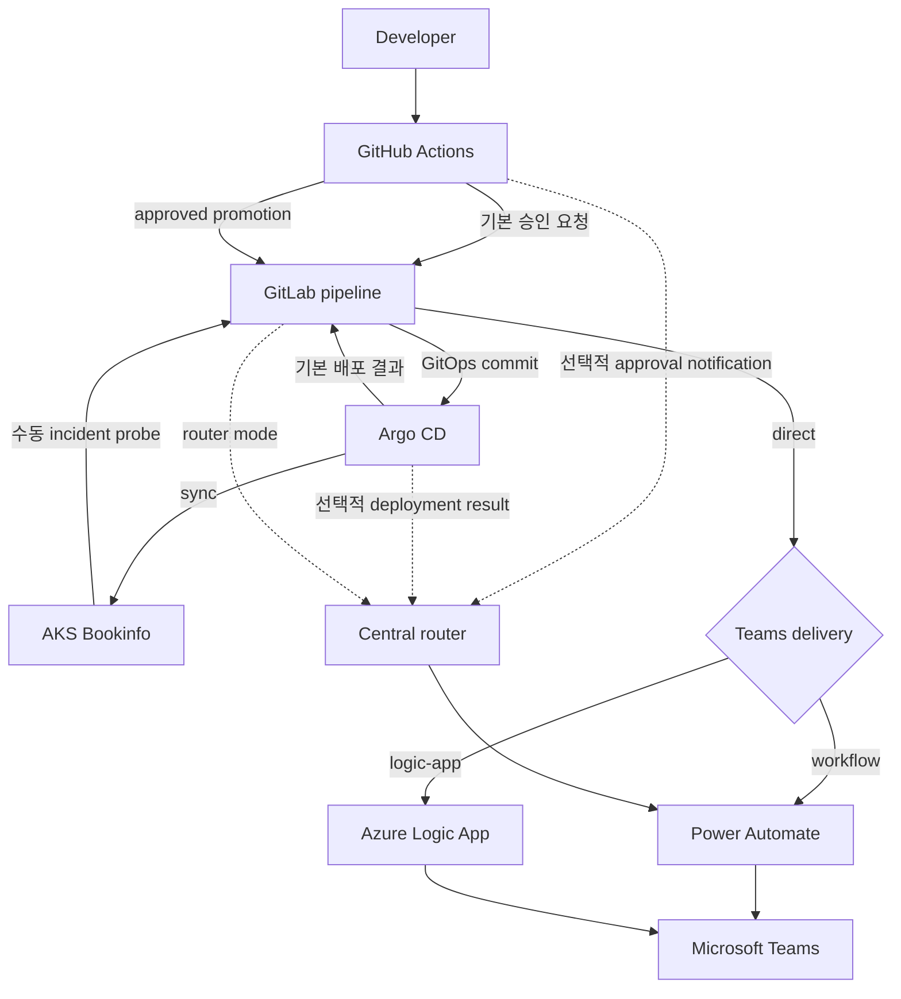

# 통합 Bookinfo 알림 시나리오

[English](integrated-bookinfo-scenario.md)

이 런북은 GitHub, GitLab, Argo CD, AKS, Power Automate 및 Microsoft Teams
전반의 승인, 배포, 인시던트 및 유지 관리 알림을 보여 줍니다.

> **캡처 상태:** GitHub, GitLab, Argo CD, AKS, Bookinfo 및 Teams 시나리오
> 카드 네 개가 모두 포함되어 있습니다. Power Automate 설정 및 런타임
> 증거는 별도의 [Power Automate Teams Workflow
> 가이드](power-automate-teams-workflow.ko.md)에 있습니다.

## 아키텍처



각 제어 영역에는 하나의 책임이 있습니다.

| 구성 요소 | 책임 |
|---|---|
| GitHub | 소스 워크플로와 보호된 스테이징 승인 |
| GitLab | GitOps 검증, 승격 및 공급자 전송 |
| Argo CD | `gitops-staging`을 AKS에 조정 |
| AKS | Istio 없는 Bookinfo 워크로드 및 인시던트 프로브 실행 |
| Power Automate | 요청의 명시적 Team·채널 ID에 Adaptive Card 게시 |
| Azure Logic App | 선택적 직접 Team 및 Channel ID 라우팅 |
| Teams | 알림 및 탐색 작업 표시 |

공급자 자격 증명은 이러한 경계를 넘지 않습니다. 기본 `direct` 경로에서
GitHub와 AKS 프로브는 서로 다른 GitLab 트리거 토큰을 사용하고, Argo CD는
`PRIVATE-TOKEN` 헤더에서 수명이 짧은 GitLab 프로젝트 액세스 토큰을
사용합니다. 이 경로의 Teams Workflow 및 Logic App 콜백 자격 증명은
GitLab에 저장합니다. `router` 경로에서는 생산자가 각자의 라우터 API 키를
보관하고 Teams Workflow 콜백은 라우터 런타임에만 저장합니다.

## 라이브 환경

참조 환경은 OIDC가 활성화된 AKS 노드 하나를 사용하며 Istio, 인그레스,
ACR 및 모니터링 스택은 의도적으로 제외합니다.


Bookinfo는 `bookinfo-staging`에서 실행됩니다. 제품 페이지를 통해
`productpage`, `details`, `ratings` 및 `reviews`가 클러스터 내부에서
통신하는지 확인합니다.


Argo CD는 애플리케이션을 `Healthy`이면서 `Synced`인 상태로 보고하며
트리에는 공급자 중립적인 Kubernetes 리소스가 표시됩니다.


## 시나리오 1: 배포 승인

1. 운영자가 Reviews v1, v2 또는 v3으로 `bookinfo-release.yml`을
   디스패치합니다.
2. GitHub가 정규 승인 요청을 작성합니다.
3. GitLab이 이를 검증하고 Teams 승인 카드를 보냅니다.
4. `bookinfo-staging` GitHub Environment가 승격을 일시 중지합니다.
5. 필수 검토자가 GitHub에서 배포를 승인하거나 거부합니다.
6. 승인되면 GitLab 승격 파이프라인이 시작됩니다.

Teams 버튼은 GitHub 실행을 열 뿐 배포를 직접 승인하지 않습니다.
위 절차는 기본 `notification_path=gitlab` 경로입니다. `router`를 선택하면
승인 알림만 중앙 라우터에 직접 제출하며, 승인 후 GitOps 승격은 계속 GitLab이
담당합니다. 두 알림 경로를 동시에 사용하지 마세요.


승인 후 요청 및 승격 작업이 모두 완료됩니다.


간결한 승인 카드는 정규 대체 본문을 반복하지 않으면서 선택한
애플리케이션과 Reviews 버전, 요청자, GitHub 환경 검토자 경계, 기한 및 검토
작업을 보존합니다.


## 시나리오 2: GitOps 승격 및 배포 결과

GitLab 승격 파이프라인은 활성 Reviews 패치를 변경하기 전에 모든 Kustomize
트리를 검증합니다. CI 작업 토큰은 보호된 `gitops-staging` 브랜치에만
씁니다.


Argo CD는 커밋을 감지하고 PostSync 스모크 Job을 실행한 후 성공한 작업을
보고합니다. 그러면 알림 컨트롤러가 GitLab 정규 알림 파이프라인을
시작합니다.

기본 Application 구독은 GitLab 파이프라인 템플릿을 사용합니다. Argo CD가
중앙 라우터로 직접 제출하게 하려면 라우터 템플릿으로 구독을 명시적으로
변경해야 합니다. 같은 이벤트에 두 템플릿을 동시에 구독하지 마세요.


## 시나리오 3: 인시던트 경고 및 확인

이 시나리오는 자동으로 실행되지 않는 일회성 수동 작업입니다. 먼저 AKS
프로브 전용 GitLab 트리거 URL을 환경 변수로 준비하고 Kubernetes Secret에
주입한 다음 Job을 실행합니다.

```shell
kubectl -n bookinfo-staging create secret generic gitlab-notification-trigger \
  --from-literal=url="$GITLAB_TRIGGER_URL" \
  --dry-run=client -o yaml | kubectl apply -f -
kubectl apply -f infra/gitops/bookinfo/operations/incident-probe-job.yaml
kubectl -n bookinfo-staging wait \
  --for=condition=complete job/bookinfo-incident-probe \
  --timeout=2m
```

Job은 의도적으로 잘못된 제품 페이지 경로를 요청합니다. 이 실패는
예상된 동작입니다. Job은 정규 인시던트를 작성하여 GitLab에 제출하고,
GitLab이 요청을 수락한 후에만 성공적으로 종료됩니다. 다시 실행하려면 완료된
Job을 삭제한 후 다시 생성하세요.

GitLab은 매니페스트를 검증하고 동일한 공급자 어댑터를 통해 인시던트 카드를
보냅니다.


확인 작업은 GitLab 새 이슈 페이지를 엽니다. 확인을 위한 기록 시스템은
Teams가 아니라 GitLab Issues입니다.


## 시나리오 4: 유지 관리 공지

이 일정은 저장소에서 자동으로 생성되지 않습니다. GitLab 운영자가
`action=maintenance-notice` 입력을 사용하는 Pipeline Schedule을 만든 후
원하는 시점에 활성화합니다. 작업은 제한된 스테이징 기간을 파생하고 카드를
정확한 파이프라인에 연결합니다.


라이브 Teams 렌더러는 간결한 표시를 사용합니다. 필수 의미는 정규 대체
콘텐츠에 유지되는 한편 표시되는 카드는 본문을 반복하지 않으며 지원되지
않는 그룹 확장 공지를 작업으로 표시하지 않습니다.


## Teams 전송 종속성

기본 `direct` 경로에서 네 시나리오는 최종 Teams 전송 어댑터 하나를
선택합니다. Power Automate Workflow가 기본값이며 GitLab의 보호된
`TEAMS_WORKFLOW_CHANNEL_LINK`에서 정확한 Team 및 채널 ID를 파생합니다.
호출자가 Team 및 Channel ID를 직접 관리하거나 Azure 관리형 배포가 필요한
경우 Azure Logic App을 선택할 수 있습니다. `notification-path=router`에서는
이 선택을 사용하지 않고, 중앙 라우터에 등록된 Slack 또는 Teams Workflow
대상으로 전송합니다.

기본 경로를 통해 전송하는 시나리오를 실행하기 전에 [Power Automate Teams
Workflow 가이드](power-automate-teams-workflow.ko.md)를 완료하세요.
`logic-app`을 선택하기 전에 [Logic App Teams 전송
가이드](logic-app-teams-delivery.ko.md)를 완료하세요. 인프라 중심의 [Teams
Workflows 런북](../infra/teams-workflows/README.md)은 반복 배포, 소유권 및
바닥글 확인을 다룹니다.

## 확인

라이브 시나리오에서 확인한 항목은 다음과 같습니다.

- GitHub 환경 승인 후 GitLab 승격
- Reviews v1, v2 및 v3 롤아웃과 최종 상태로 복원된 v3
- Argo CD `Synced` 및 `Healthy` 상태
- Bookinfo PostSync 스모크 테스트
- GitHub 승인 요청 및 Argo CD 배포 결과가 시작한 GitLab 정규 알림 파이프라인
- 운영자가 만든 GitLab 유지 관리 일정
- 수동 AKS 인시던트 프로브와 이 프로브가 시작한 GitLab 파이프라인
- 한 번의 시도로 성공한 Power Automate 전송 결과
- GitLab 토큰 형태의 URL이나 헤더가 없는 notification-controller 로그

리포지토리 검증은 다음과 같습니다.

```shell
cd examples/python
uv run ruff format --check .
uv run ruff check .
uv run pyright
uv run pytest -q
```

인프라 검증:

```shell
az bicep build --stdout --file infra/azure/bicep/main.bicep >/dev/null
az bicep lint --file infra/azure/bicep/main.bicep
kubectl kustomize infra/gitops/bookinfo/overlays/staging >/dev/null
kubectl kustomize infra/integrations/argocd >/dev/null
actionlint -shellcheck= .github/workflows/bookinfo-release.yml
```

## 보안 및 운영 참고 사항

- GitLab 토큰, Teams 콜백 URL, kubeconfig 또는 생성된 콜백 URL을 절대
  커밋하지 마세요.
- GitLab 파이프라인 변수 재정의 역할을 Maintainer 이상으로 유지하세요.
- Argo CD 프로젝트 토큰에 `api` 범위를 부여하고 가능한 가장 짧은 만료
  기간을 사용하며 생산자 트리거 토큰과 독립적으로 순환하세요.
- Argo CD Webhook URL 또는 템플릿 본문에 트리거 토큰을 넣지 마세요.
- Teams **Workflows** 발신자 레이블은 Power Automate에서 제어합니다.
  발신자 ID를 제어해야 하는 경우 bot 또는 적절한 Microsoft Graph
  어댑터를 사용하세요.
- Teams Workflow는 그룹을 직접 멘션하거나 스레드에 회신하거나 이전
  메시지를 변경할 수 없습니다.
- 단일 노드 클러스터의 Pod 용량은 제한적입니다. 참조 Argo CD 값에서 Dex와
  ApplicationSet 컨트롤러가 비활성화되어 있습니다.

## 환경 중지 또는 제거

먼저 배포할 때 사용한 실제 리소스 그룹과 AKS 클러스터 이름을 설정합니다.
다음 값은 형식을 보여 주는 합성 예제이므로 환경에 맞게 바꾸세요.

```shell
RESOURCE_GROUP="rg-pyhookkit-staging"
AKS_CLUSTER="phk-aks-stg-example"
```

구성을 유지하면서 컴퓨팅을 중지합니다.

```shell
az aks stop --resource-group "$RESOURCE_GROUP" --name "$AKS_CLUSTER"
```

다시 시작합니다.

```shell
az aks start --resource-group "$RESOURCE_GROUP" --name "$AKS_CLUSTER"
```

### 리소스 그룹 영구 삭제

> [!WARNING]
> 리소스 그룹을 삭제하면 되돌릴 수 없으며 그룹의 모든 리소스가 제거됩니다.
> 변수가 이 시나리오의 전용 리소스 그룹을 가리키는지, 그룹에 공유 또는 운영
> 리소스가 없는지 확인하세요.

삭제하기 전에 리소스 그룹을 확인합니다.

```shell
az group show --name "$RESOURCE_GROUP" --output table
```

시나리오가 더 이상 필요하지 않으면 리소스 그룹을 삭제합니다. Azure CLI는
계속하기 전에 확인을 요청합니다.

```shell
az group delete --name "$RESOURCE_GROUP"
```

다른 리소스 그룹에서 만든 리소스와 공유 Teams API 연결은 이 명령으로
삭제되지 않습니다.
