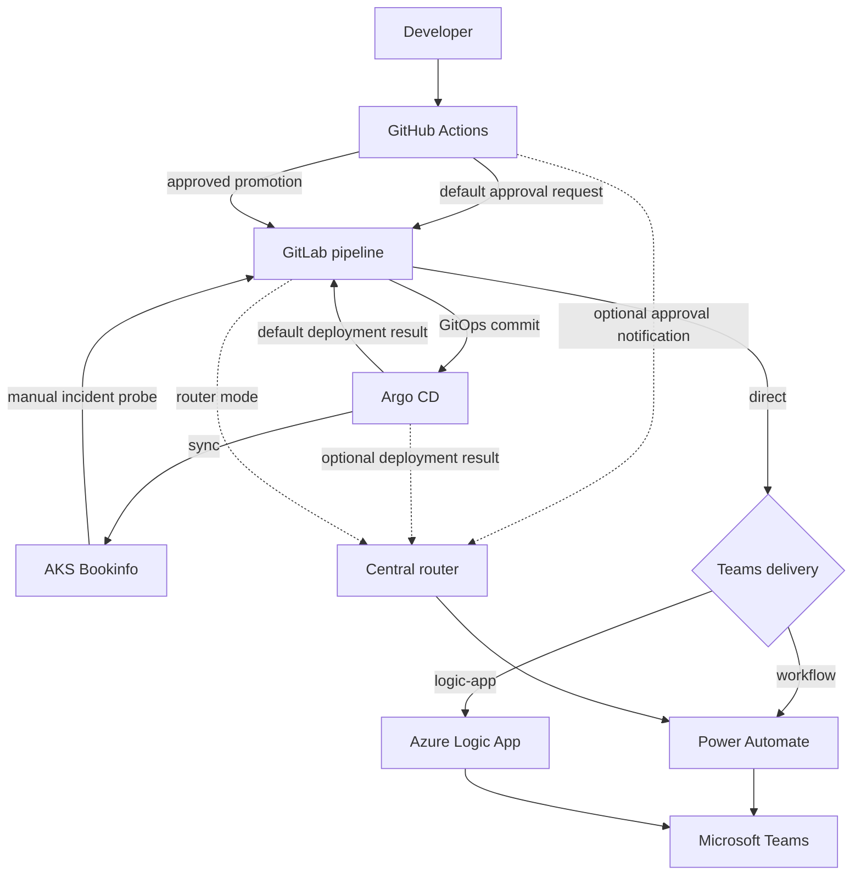

# Integrated Bookinfo notification scenario

[한국어](integrated-bookinfo-scenario.ko.md)

This runbook demonstrates approval, deployment, incident, and maintenance
notifications across GitHub, GitLab, Argo CD, AKS, Power Automate, and Microsoft
Teams.

> **Capture status:** GitHub, GitLab, Argo CD, AKS, Bookinfo, and all four Teams
> scenario cards are included. Power Automate setup and runtime evidence is kept
> in the separate [Power Automate Teams Workflow guide](power-automate-teams-workflow.md).

## Architecture



Each control plane has one responsibility:

| Component | Responsibility |
|---|---|
| GitHub | Source workflow and protected staging approval |
| GitLab | GitOps validation, promotion, and provider delivery |
| Argo CD | Reconcile `gitops-staging` into AKS |
| AKS | Run the Istio-free Bookinfo workload and incident probe |
| Power Automate | Post Adaptive Cards to the explicit Team and channel IDs in each request |
| Azure Logic App | Optional direct Team and Channel ID routing |
| Teams | Present the notification and navigation action |

Provider credentials do not cross these boundaries. On the default `direct`
path, GitHub and the AKS probe use separate GitLab trigger tokens, and Argo CD
uses a short-lived GitLab project access token in the `PRIVATE-TOKEN` header.
GitLab stores the Teams Workflow and Logic App callback credentials for this
path. On the `router` path, each producer stores its own router API key and only
the router runtime stores the Teams Workflow callback.

## Live environment

The reference environment uses one OIDC-enabled AKS node and intentionally
omits Istio, ingress, ACR, and a monitoring stack.


Bookinfo runs in `bookinfo-staging`. The product page verifies that
`productpage`, `details`, `ratings`, and `reviews` communicate inside the
cluster.


Argo CD reports the application as both `Healthy` and `Synced`, and its tree
shows the provider-neutral Kubernetes resources.


## Scenario 1: deployment approval

1. An operator dispatches `bookinfo-release.yml` with Reviews v1, v2, or v3.
2. GitHub builds a canonical approval request.
3. GitLab validates it and sends the Teams approval card.
4. The `bookinfo-staging` GitHub Environment pauses promotion.
5. A required reviewer approves or rejects the deployment in GitHub.
6. Approval starts the GitLab promotion pipeline.

The Teams button opens the GitHub run; it does not approve the deployment
directly.
The steps above describe the default `notification_path=gitlab` path. Selecting
`router` submits only the approval notification directly to the central router;
GitLab still owns GitOps promotion after approval. Do not enable both
notification paths for one event.


After approval, both the request and promotion jobs complete.


The compact approval card preserves the selected application and Reviews
version, requester, GitHub environment reviewer boundary, deadline, and review
action without repeating the canonical fallback body.


## Scenario 2: GitOps promotion and deployment result

The GitLab promotion pipeline validates every Kustomize tree before changing
the active Reviews patch. Its CI job token writes only to the protected
`gitops-staging` branch.


Argo CD detects the commit, runs the PostSync smoke Job, and reports a
successful operation. The notification controller then starts a GitLab
canonical-notification pipeline.

The default Application subscriptions use the GitLab pipeline templates. To
submit directly from Argo CD to the central router, explicitly switch the
subscriptions to the router templates. Do not subscribe both templates to the
same event.


## Scenario 3: incident alert and acknowledgment

This scenario is a one-time manual operation; it does not run automatically.
Prepare a dedicated GitLab trigger URL for the AKS probe, inject it into a
Kubernetes Secret, and then run the Job:

```shell
kubectl -n bookinfo-staging create secret generic gitlab-notification-trigger \
  --from-literal=url="$GITLAB_TRIGGER_URL" \
  --dry-run=client -o yaml | kubectl apply -f -
kubectl apply -f infra/gitops/bookinfo/operations/incident-probe-job.yaml
kubectl -n bookinfo-staging wait \
  --for=condition=complete job/bookinfo-incident-probe \
  --timeout=2m
```

The Job requests an intentionally invalid product page path. This failure is
expected. It builds a canonical incident, submits it to GitLab, and exits
successfully only after GitLab accepts the request. Delete the completed Job
before creating it again.

GitLab validates the manifests and sends the incident card through the same
provider adapter.


The acknowledgment action opens the GitLab new-issue page. GitLab Issues, not
Teams, is the acknowledgment system of record.


## Scenario 4: maintenance notice

The repository does not create this schedule automatically. A GitLab operator
creates a Pipeline Schedule that supplies `action=maintenance-notice` and
enables it when required. The job derives a bounded staging window and links the
card to the exact pipeline.


The live Teams renderer uses compact presentation: required meaning remains in
the canonical fallback, while the visible card avoids repeating the body and
does not present the unsupported group-expansion notice as an action.


## Teams delivery dependency

On the default `direct` path, all four scenarios select one final Teams delivery
adapter. Power Automate Workflow is the default and derives the exact Team and
channel IDs from GitLab's protected `TEAMS_WORKFLOW_CHANNEL_LINK`. Azure Logic
App is optional when callers manage Team and Channel IDs directly or require
Azure-managed deployment. With `notification-path=router`, this selection is
not used; the central router delivers to its registered Slack or Teams Workflow
destinations.

Complete the [Power Automate Teams Workflow
guide](power-automate-teams-workflow.md) before running any scenario that sends
through the default path. Complete the
[Logic App Teams delivery guide](logic-app-teams-delivery.md) before selecting
`logic-app`. The infrastructure-oriented [Teams Workflows
runbook](../infra/teams-workflows/README.md) covers repeated deployment,
ownership, and footer verification.

## Verification

The live scenario has verified:

- GitHub environment approval followed by GitLab promotion;
- Reviews v1, v2, and v3 rollout, with v3 restored as the final state;
- Argo CD `Synced` and `Healthy` status;
- the Bookinfo PostSync smoke test;
- GitLab canonical notification pipelines started by GitHub approval requests
  and Argo CD deployment results;
- the operator-created GitLab maintenance schedule;
- the manual AKS incident probe and the GitLab pipeline it starts;
- Power Automate delivery results succeeding in one attempt;
- notification-controller logs containing no GitLab token-shaped URL or header.

Repository validation consists of:

```shell
cd examples/python
uv run ruff format --check .
uv run ruff check .
uv run pyright
uv run pytest -q
```

Infrastructure validation:

```shell
az bicep build --stdout --file infra/azure/bicep/main.bicep >/dev/null
az bicep lint --file infra/azure/bicep/main.bicep
kubectl kustomize infra/gitops/bookinfo/overlays/staging >/dev/null
kubectl kustomize infra/integrations/argocd >/dev/null
actionlint -shellcheck= .github/workflows/bookinfo-release.yml
```

## Security and operational notes

- Never commit GitLab tokens, Teams callback URLs, kubeconfigs, or generated
  callback URLs.
- Keep the GitLab pipeline-variable override role at Maintainer or higher.
- Give the Argo CD project token the `api` scope, use the shortest practical
  expiration, and rotate it independently of producer trigger tokens.
- Do not place a trigger token in an Argo CD webhook URL or template body.
- The Teams **Workflows** sender label is controlled by Power Automate. Use a
  bot or suitable Microsoft Graph adapter if sender identity must be controlled.
- Teams Workflow cannot directly mention a group, reply to a thread, or mutate
  a previous message.
- The one-node cluster has limited Pod capacity. Dex and the ApplicationSet
  controller are disabled in the reference Argo CD values.

## Stop or remove the environment

Set the actual resource group and AKS cluster names used during deployment.
The following values are synthetic examples and must be replaced for your
environment:

```shell
RESOURCE_GROUP="rg-pyhookkit-staging"
AKS_CLUSTER="phk-aks-stg-example"
```

Stop compute while retaining configuration:

```shell
az aks stop --resource-group "$RESOURCE_GROUP" --name "$AKS_CLUSTER"
```

Restart it:

```shell
az aks start --resource-group "$RESOURCE_GROUP" --name "$AKS_CLUSTER"
```

### Permanently delete the resource group

> [!WARNING]
> Deleting a resource group cannot be undone and removes every resource in that
> group. Verify that the variable identifies the scenario's dedicated resource
> group and that the group contains no shared or production resources.

Review the resource group before deleting it:

```shell
az group show --name "$RESOURCE_GROUP" --output table
```

Delete the resource group when the scenario is no longer needed. Azure CLI asks
for confirmation before proceeding:

```shell
az group delete --name "$RESOURCE_GROUP"
```

Resources created in other resource groups, including shared Teams API
connections, are not removed by this command.

## Official platform references

- [GitHub deployment protection rules](https://docs.github.com/actions/managing-workflow-runs-and-deployments/managing-deployments/managing-environments-for-deployment)
- [GitLab pipeline trigger API](https://docs.gitlab.com/api/pipeline_triggers/)
- [Argo CD Notifications](https://argo-cd.readthedocs.io/en/stable/operator-manual/notifications/)
- [Azure Kubernetes Service documentation](https://learn.microsoft.com/azure/aks/)
