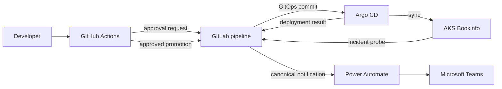

# Integrated Bookinfo notification scenario

This runbook demonstrates approval, deployment, incident, and maintenance
notifications across GitHub, GitLab, Argo CD, AKS, Power Automate, and Microsoft
Teams.

> **Capture status:** GitHub, GitLab, Argo CD, AKS, Bookinfo, and the Teams
> approval card are included. Power Automate setup and runtime evidence is kept
> in the separate [Power Automate Teams Workflow guide](power-automate-teams-workflow.md).
> The remaining Teams cards are pending a working Teams web capture.

## Architecture



Each control plane has one responsibility:

| Component | Responsibility |
|---|---|
| GitHub | Source workflow and protected staging approval |
| GitLab | GitOps validation, promotion, and provider delivery |
| Argo CD | Reconcile `gitops-staging` into AKS |
| AKS | Run the Istio-free Bookinfo workload and incident probe |
| Power Automate | Accept the Adaptive Card envelope and post it to Teams |
| Teams | Present the notification and navigation action |

Provider credentials do not cross these boundaries. GitHub and the AKS probe
use separate GitLab trigger tokens. Argo CD uses a short-lived GitLab project
access token in the `PRIVATE-TOKEN` header. Only GitLab stores
`TEAMS_WORKFLOW_URL`.

## Live environment

The reference environment uses one OIDC-enabled AKS node and intentionally
omits Istio, ingress, ACR, and a monitoring stack.


Bookinfo runs in `bookinfo-staging`. The product page verifies that
`productpage`, `details`, `ratings`, and `reviews` communicate inside the
cluster.


Argo CD reports the application as both `Healthy` and `Synced`, and its tree
shows the provider-neutral Kubernetes resources.


## Scenario 1: deployment approval

1. An operator dispatches `bookinfo-release.yml` with Reviews v1, v2, or v3.
2. GitHub builds a canonical approval request.
3. GitLab validates it and sends the Teams approval card.
4. The `bookinfo-staging` GitHub Environment pauses promotion.
5. A required reviewer approves or rejects the deployment in GitHub.
6. Approval starts the GitLab promotion pipeline.

The Teams button opens the GitHub run; it does not approve the deployment
directly.


After approval, both the request and promotion jobs complete.


The compact approval card preserves the selected application and Reviews
version, requester, GitHub environment reviewer boundary, deadline, and review
action without repeating the canonical fallback body.


## Scenario 2: GitOps promotion and deployment result

The GitLab promotion pipeline validates every Kustomize tree before changing
the active Reviews patch. Its CI job token writes only to the protected
`gitops-staging` branch.


Argo CD detects the commit, runs the PostSync smoke Job, and reports a
successful operation. The notification controller then starts a GitLab
canonical-notification pipeline.


_Teams deployment-result card capture pending._

## Scenario 3: incident alert and acknowledgment

The one-time in-cluster probe requests an intentionally invalid product page
path. Failure is expected: the Job builds a canonical incident, submits it to
GitLab, and exits successfully only after GitLab accepts the request.

GitLab validates the manifests and sends the incident card through the same
provider adapter.


The acknowledgment action opens the GitLab new-issue page. GitLab Issues, not
Teams, is the acknowledgment system of record.

_Teams incident card capture pending._

## Scenario 4: maintenance notice

A disabled-by-default GitLab schedule supplies
`action=maintenance-notice`. The job derives a bounded staging window and links
the card to the exact pipeline.


The live Teams renderer uses compact presentation: required meaning remains in
the canonical fallback, while the visible card avoids repeating the body and
does not present the unsupported group-expansion notice as an action.

_Teams maintenance card capture pending._

## Teams delivery dependency

All four scenarios use one Power Automate Workflow as the final delivery
adapter. Its creation, Teams action configuration, callback handling, smoke
test, run history, and screenshots are intentionally maintained outside this
cross-platform scenario document.

Complete the [Power Automate Teams Workflow
guide](power-automate-teams-workflow.md) before running any scenario that sends
to Teams. The infrastructure-oriented [Teams Workflows
runbook](../infra/teams-workflows/README.md) covers repeated deployment,
ownership, and footer verification.

## Verification

The live scenario has verified:

- GitHub environment approval followed by GitLab promotion;
- Reviews v1, v2, and v3 rollout, with v3 restored as the final state;
- Argo CD `Synced` and `Healthy` status;
- the Bookinfo PostSync smoke test;
- GitLab maintenance, canonical, Argo deployment, and AKS incident pipelines;
- Power Automate delivery results succeeding in one attempt;
- notification-controller logs containing no GitLab token-shaped URL or header.

Repository validation consists of:

```shell
cd examples/python
uv run ruff format --check .
uv run ruff check .
uv run pyright
uv run pytest -q
```

Infrastructure validation:

```shell
az bicep build --stdout --file infra/azure/bicep/main.bicep >/dev/null
az bicep lint --file infra/azure/bicep/main.bicep
kubectl kustomize infra/gitops/bookinfo/overlays/staging >/dev/null
kubectl kustomize infra/integrations/argocd >/dev/null
actionlint -shellcheck= .github/workflows/bookinfo-release.yml
```

## Security and operational notes

- Never commit GitLab tokens, Teams callback URLs, kubeconfigs, or generated
  callback URLs.
- Keep the GitLab pipeline-variable override role at Maintainer or higher.
- Give the Argo CD project token the `api` scope, use the shortest practical
  expiration, and rotate it independently of producer trigger tokens.
- Do not place a trigger token in an Argo CD webhook URL or template body.
- The Teams **Workflows** sender label is controlled by Power Automate. Use a
  bot or suitable Microsoft Graph adapter if sender identity must be controlled.
- Teams Workflow cannot directly mention a group, reply to a thread, or mutate
  a previous message.
- The one-node cluster has limited Pod capacity. Dex and the ApplicationSet
  controller are disabled in the reference Argo CD values.

## Stop or remove the environment

Stop compute while retaining configuration:

```shell
az aks stop --resource-group rg-notify --name aks-notify-b05230
```

Restart it:

```shell
az aks start --resource-group rg-notify --name aks-notify-b05230
```

Remove all Azure resources when the scenario is no longer needed:

```shell
az group delete --name rg-notify
```
