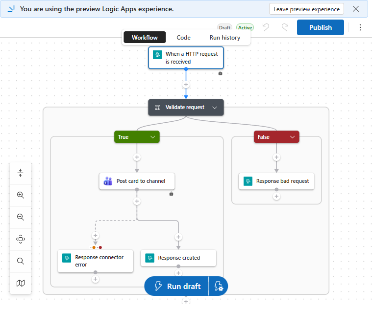
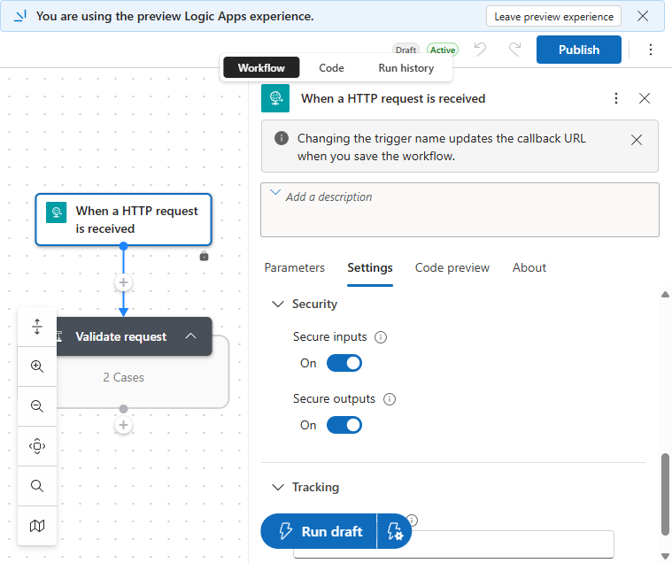
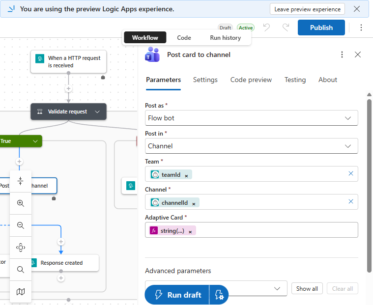
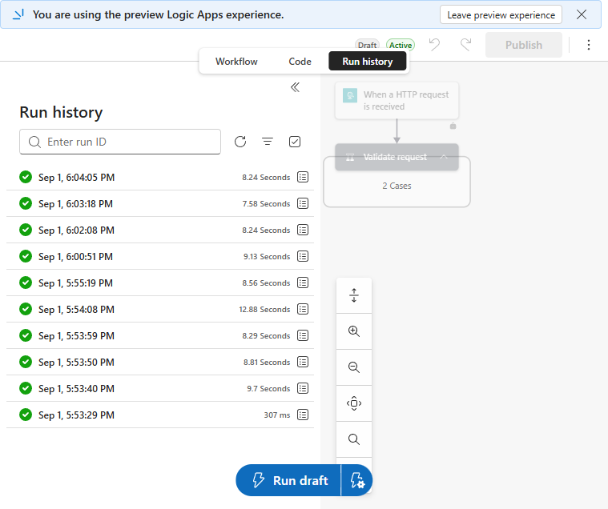
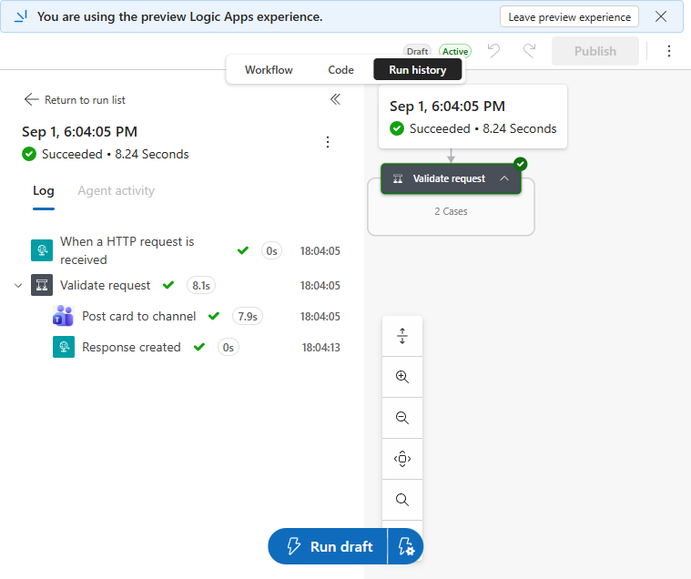

# Azure Logic App Teams delivery

[한국어](logic-app-teams-delivery.ko.md)

This guide deploys and operates the direct-ID Logic App adapter. Use it when a
caller already owns the target Team and Channel IDs or when Teams delivery must
be managed as Azure infrastructure.

Power Automate Workflow remains the simpler default when the central router
stores channel links and supplies their derived Team and Channel IDs. See the
[Power Automate Teams Workflow guide](power-automate-teams-workflow.md).

## Request contract

The HTTP trigger accepts:

```json
{
  "teamId": "<Teams team ID>",
  "channelId": "<Teams channel ID>",
  "eventId": "<provider-neutral event ID>",
  "card": {
    "type": "AdaptiveCard",
    "version": "1.4",
    "body": []
  }
}
```

The Logic App validates required routing and card fields before calling the
Teams managed connector:

- valid request and successful post: HTTP `201`;
- invalid request: HTTP `400`;
- Teams connector failure or timeout: HTTP `502`.

PyHookKit discards provider response identifiers and returns only the
provider-neutral state and attempt count.

## Prerequisites

- an Azure resource group for the Logic App;
- an authorized `Microsoft.Web/connections` Microsoft Teams connection in the
  same subscription and region;
- the destination Team and channel IDs;
- permission to deploy `Microsoft.Logic/workflows`;
- an approved secret store for the signed callback URL.

Connection authorization is an explicit bootstrap step. Bicep references an
already authorized connection; it does not embed or reproduce OAuth consent.
The connection may live in another resource group, but it must remain in the
same subscription and region and must not be deleted with the Logic App.

## Deploy

Resolve the authorized connection resource ID without printing credentials:

```shell
TEAMS_CONNECTION_ID="$(
  az resource show \
    --resource-group <connection-resource-group> \
    --name <teams-connection-name> \
    --resource-type Microsoft.Web/connections \
    --api-version 2016-06-01 \
    --query id \
    --output tsv
)"
```

Deploy the workflow:

```shell
az deployment group create \
  --name pyhookkit-logic-app \
  --resource-group rg-notify \
  --template-file infra/azure/logic-apps/main.bicep \
  --parameters \
    logicAppName=logic-notify-teams \
    teamsConnectionResourceId="$TEAMS_CONNECTION_ID"
```

The template loads
[`workflow-definition.json`](../infra/azure/logic-apps/workflow-definition.json),
enables secure trigger and connector input/output handling, and does not return
the signed callback URL as a deployment output.

## Inspect the deployed configuration

The Bicep template and committed workflow definition are the source of truth.
Use the Portal to inspect and verify the deployment, not to maintain a separate
click-configured copy.

1. Open the deployed Logic App in Azure Portal.
2. Select **Development Tools → Logic app designer**.
3. Select **Expand all** to inspect both validation branches.

The active workflow accepts HTTP requests, validates routing and card fields,
posts valid cards to Teams, and returns an explicit status on every path:



Select **When a HTTP request is received → Settings**. Both **Secure inputs**
and **Secure outputs** must be on so callback and notification data do not
appear in run diagnostics:



Select **Post card to channel → Parameters** and verify:

| Field | Value |
|---|---|
| **Post as** | `Flow bot` |
| **Post in** | `Channel` |
| **Team** | `triggerBody()?['teamId']` |
| **Channel** | `triggerBody()?['channelId']` |
| **Adaptive Card** | `string(triggerBody()?['card'])` |



Do not open or capture the trigger **Parameters** tab for documentation. It
displays the signed callback URL.

## Retrieve and store the callback

Retrieve the callback directly into the approved secret-store command. Do not
print or persist it in a deployment artifact:

```shell
SUBSCRIPTION_ID="$(az account show --query id --output tsv)"
TEAMS_LOGIC_APP_URL="$(
  az rest \
    --method post \
    --url "https://management.azure.com/subscriptions/${SUBSCRIPTION_ID}/resourceGroups/rg-notify/providers/Microsoft.Logic/workflows/logic-notify-teams/triggers/When_a_HTTP_request_is_received/listCallbackUrl?api-version=2016-06-01" \
    --query value \
    --output tsv
)"
```

Configure:

```dotenv
TEAMS_LOGIC_APP_URL="<signed callback URL>"
TEAMS_LOGIC_APP_TEAM_ID="<Teams team ID>"
TEAMS_LOGIC_APP_CHANNEL_ID="<Teams channel ID>"
```

For GitLab, add all three values as protected variables and mask
`TEAMS_LOGIC_APP_URL`.

## Select the delivery adapter

The default remains `workflow`. Select Logic App only where needed.

### Automation CLI

```shell
uv run python -m pyhookkit.entrypoints.scenario_cli \
  deployment-result teams \
  --teams-delivery logic-app \
  --event-id deploy-example-1042 \
  --correlation-id deploy-example-1042 \
  --service bookinfo \
  --deployment-environment staging \
  --revision 9f3a2c1 \
  --duration "2m 18s" \
  --completed-at 2026-08-28T03:15:00Z \
  --deployment-url https://deployments.example.com/runs/1042 \
  --send
```

Omit `--teams-delivery` or set it to `workflow` to use Power Automate.

### GitLab

Supply the pipeline input:

```text
teams-delivery=workflow
```

or:

```text
teams-delivery=logic-app
```

The maintenance schedule and canonical notification jobs pass the selected
value to the same scenario CLI.

### GitHub approval workflow

Choose **Teams delivery adapter** when dispatching `bookinfo-release.yml`. The
approval notification and approved promotion request carry the same selection
to GitLab.

### Argo CD deployment results

Set `teamsDelivery` in `argocd-notifications-cm`:

```yaml
data:
  context: |
    argocdUrl: https://argocd.example.com
    teamsDelivery: logic-app
```

Return it to `workflow` to restore the default.

### AKS incident probe

Patch `TEAMS_DELIVERY` in the one-time Job before applying it:

```yaml
env:
  - name: TEAMS_DELIVERY
    value: logic-app
```

## Smoke test

Reject an invalid request first and verify HTTP `400`. Then send one scenario:

```shell
cd examples/python
set -a
. ../../.env
set +a
uv run python scenarios/deployment_result/teams.py --send-logic-app
```

Verify:

1. the CLI returns `state: succeeded`;
2. the Logic App run is `Succeeded`;
3. the Teams card preserves the same semantic fields as Workflow delivery;
4. callback URLs, connector inputs, and provider outputs do not appear in logs.

Open the designer's **Run history** tab. The reference verification produced
successful runs for direct scenarios and the GitHub, GitLab, Argo CD, and AKS
automation paths:



Open a successful run and verify that the HTTP trigger, validation, Teams post,
and `Response created` steps all succeeded:



The verified environment successfully delivered deployment, incident,
maintenance, and approval scenarios through Logic App. It also verified that a
pipeline with no selection still uses the Power Automate Workflow default.

## Verified reference deployment

The live verification deployed `logic-notify-teams` to `rg-notify` in Korea
Central and reused a connected Teams managed API connection.

The verification established:

- Bicep redeployment is idempotent;
- the deployed workflow definition matches the committed JSON;
- invalid input returns `400`;
- valid input returns `201` with Teams message identifiers;
- all four scenario sends return provider-neutral success;
- GitLab succeeds with both explicit `logic-app` and default `workflow`;
- GitHub approval and promotion succeed with `logic-app`;
- the AKS incident probe succeeds with `logic-app`;
- Argo CD deployment-result notification succeeds with `logic-app`;
- the observed Logic App verification runs completed with no failed runs.

Real callback URLs, Team IDs, channel IDs, connection IDs, run IDs, and message
identifiers are intentionally excluded from committed evidence.

## Rotate or remove

Regenerate the HTTP trigger callback after suspected disclosure and update the
approved secret stores. Connection authorization rotates independently.

Remove only the Logic App:

```shell
az resource delete \
  --resource-group rg-notify \
  --name logic-notify-teams \
  --resource-type Microsoft.Logic/workflows
```

Removing the Logic App does not delete the shared Teams API connection.
