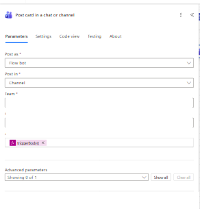
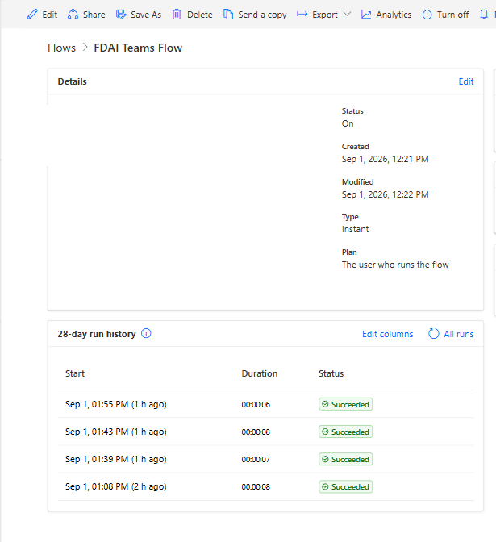

# Power Automate Teams Workflow

This guide creates the Power Automate delivery adapter used by PyHookKit Teams
examples and the integrated Bookinfo scenario. One flow accepts a validated
Teams channel link, its derived Team and Channel identifiers, and an Adaptive
Card message, then posts to the approved destination.

For the GitHub, GitLab, Argo CD, and AKS sequence, see the
[integrated Bookinfo scenario](integrated-bookinfo-scenario.md).
For direct Team and Channel ID routing with an Azure-managed workflow, use the
[Azure Logic App Teams delivery guide](logic-app-teams-delivery.md).

## Why create the flow from blank

Use a flow created from blank rather than the **Send webhook alerts to a
channel** gallery template.

Live testing established that both flows render rich Adaptive Cards and native
user mentions. The gallery template additionally injects owner attribution and
a **Get template** footer outside the Adaptive Card payload. Payload changes
cannot remove it. A from-blank flow has no **Original template** relationship
and avoided that footer in the verified environment.

## Prerequisites

- permission to create a Power Automate cloud flow;
- a Microsoft Teams connection authorized for the destination Team;
- a dedicated licensed Microsoft 365 connection user for shared or production
   environments;
- one or more dedicated synthetic test Teams channels that the connection user
   can access;
- permission to create protected GitLab CI/CD variables;
- Python 3.12 and `uv` for the smoke test.

Do not place real Team names, channel names, identities, or callback URLs in
committed files or screenshots.

## Identity and permission setup

Use separate identities for authoring, ownership, connector execution, and
runtime invocation. Granting one identity access does not grant it to the
others.

| Identity | Required access | Not required |
|---|---|---|
| Bootstrap administrator | Create the Solution, application user, security role, connection reference, and environment variable | Routine flow execution |
| Dataverse application user | Own the solution-aware flow; read, update, assign, and activate the required Process row; import and publish the Solution when the same principal deploys it | Microsoft 365 license, Teams membership, or the connection user's password |
| Teams connection user | Appropriate Microsoft 365 and Power Automate entitlement; sign in to the target Power Platform environment; authorize the Microsoft Teams connection; membership in every destination Team | Tenant administrator role or flow ownership |
| Operational co-owner | Access the target environment and co-owner access to inspect runs, edit, enable or disable, and recover the flow | Access to change another user's connection credentials |
| Runtime caller | Read the signed callback URL from its secret store and send the routed request contract | Power Automate, Dataverse, Teams, or Microsoft Graph permissions |
| Channel inventory caller | A delegated or application Microsoft Graph token with the scope described in the infrastructure runbook | Flow ownership or callback access |

Create a custom Dataverse security role for the application user after initial
bootstrap. It must cover only the Solution deployment operations and Process
rows owned by this integration. A bootstrap administrator may temporarily use
a broader role to prove the deployment, but must remove that role after the
custom role succeeds. Do not leave the application user as System
Administrator.

Configure the Teams connection user as follows:

1. Create or designate a dedicated, licensed Microsoft 365 user. Do not use a
   departing employee's account or a tenant administrator.
2. Add the user as a member of every Team that contains an approved
   destination. Explicit membership is also needed to discover private or
   shared channels, although the Teams connector action used here does not
   support posting to private channels.
3. Sign in as that user in the target Power Platform environment, open
   **Connections**, create the Microsoft Teams connection, and complete the
   tenant's consent, MFA, and Conditional Access requirements.
4. Bind the Solution's Microsoft Teams connection reference to that connection.
   A connection reference is a deployment-time indirection; it does not copy
   or convert the user's OAuth connection into application authentication.
5. Add at least two named operational co-owners. Confirm they can inspect run
   history and manage the flow, but do not give them the connection user's
   password. A co-owner cannot update credentials for a connection created by
   another user.

### Invocation and execution behavior

The HTTP trigger setting and the Teams connector authorize different parts of
the run:

1. The runtime caller invokes **When an HTTP request is received** by presenting
   the signed callback URL. With **Who can trigger the flow?** set to
   **Anyone**, the current PyHookKit adapter sends no Microsoft Entra access
   token.
2. The flow checks `channelLink` against `pyk_AllowedChannelLinks` before
   parsing it or calling Teams. Possession of the callback therefore permits
   attempts only to explicitly configured destinations.
3. The Teams action uses the embedded Microsoft Teams connection selected by
   the connection reference. It runs with the connection user's Teams access,
   not the callback caller's access and not the Dataverse flow owner's access.
4. The Teams service enforces the connection user's current Team and channel
   access. A dynamic Team or Channel value cannot expand that access.

Selecting **Any user in my tenant** or **Specific users in my tenant** for the
trigger is not a drop-in hardening change. Those modes require an OAuth-capable
caller and token validation that the current signed-URL adapter does not
implement. Keep **Anyone** only with secret storage, exact destination
allowlisting, producer-specific secret access, and callback rotation after
suspected disclosure.

### Permission changes and recovery

| Change | Expected effect | Recovery |
|---|---|---|
| Connection user loses Team membership | New posts to that Team or channel fail at the Teams action | Restore approved membership or bind a replacement connection, then smoke-test |
| Connection is revoked, deleted, or requires sign-in | The trigger can still start a run, but the Teams action fails | Reauthorize the existing connection or bind a new one to the connection reference |
| Connection user's license or account is removed | Delivery continuity is no longer supported and the connection can become unusable | Restore the account entitlement or migrate to a prepared replacement user and connection |
| Application user is disabled or loses its Dataverse role | Owner assignment, deployment, activation, or later administration can fail | Re-enable the application user or restore the custom role, then rerun owner verification |
| A co-owner is removed | Runtime connection and callback behavior are unchanged | Add another named co-owner before the remaining recovery path is lost |
| Callback URL is disclosed | Anyone holding it can invoke the allowlisted flow | Regenerate or replace the callback, update only approved secret stores, and revoke the old value |

Do not treat an accepted HTTP request as delivery evidence. After any identity,
membership, connection, or callback change, verify the Power Automate run,
the destination card, and the absence of template attribution.

## Create the flow

1. Open [Power Automate](https://make.powerautomate.com).
2. Select the environment that owns the Teams connection.
3. Select **Create**, then **Create from blank**.
4. Name the flow using an environment-neutral name such as
   `PyHookKit Routed Teams Flow`.
5. Add the Request trigger **When an HTTP request is received** and paste the
   contents of `power-automate-trigger.schema.json` into **Request Body JSON
   Schema**.
6. Set **Who can trigger the flow?** to **Anyone** for the signed callback URL
   model used by these examples. **Specific users in my tenant** is stronger,
   but requires an OAuth-capable caller that is outside the current callback
   client contract.
7. Add the flow to a Solution and create a text environment variable with the
   schema name `pyk_AllowedChannelLinks`.
8. Set its current value to a JSON array containing the exact approved Teams
   channel links. Keep real links out of source control.

The Power Automate trigger schema is
[`power-automate-trigger.schema.json`](../infra/teams-workflows/power-automate-trigger.schema.json).
Power Automate rejects `pattern` when schema validation is combined with an
`OpenApiConnection` action, and its URI format validator rejects percent-encoded
Teams channel links. The trigger schema therefore omits those keywords. Keep
exact destination validation in the allowlist condition before the Teams action.

The stricter producer-side contract remains
[`routed-request.schema.json`](../infra/teams-workflows/routed-request.schema.json).
Its top-level `channelLink` carries the auditable route, `teamId` and
`channelId` carry identifiers derived from that validated link, and its
`attachments` collection carries the message. The existing screenshot shows the earlier fixed-channel
shape and should not be used as the routed-flow definition:


## Validate and parse the destination

Add a **Compose** action named `Channel_link`:

```text
triggerBody()?['channelLink']
```

Before parsing the URL, add a **Condition** that checks the exact link against
the Solution environment-variable allowlist. Insert the
`pyk_AllowedChannelLinks` dynamic value in place of the placeholder:

```text
contains(json(<Allowed channel links>), outputs('Channel_link'))
```

In the **False** branch, add **Terminate** with status `Failed`, code
`DestinationNotAllowed`, and a generic message that does not echo the supplied
link. This check must precede the Teams action. Restrict the dedicated Teams
connection user to notification Teams as an additional authorization boundary.

The sender already derives `teamId` and `channelId` from the validated link.
Use these request fields directly in the Teams action. The following Compose
expressions remain useful as an independent Flow-side consistency check.

`Team_ID`:

```text
first(split(last(split(uriQuery(outputs('Channel_link')), 'groupId=')), '&'))
```

`Channel_ID`:

```text
decodeUriComponent(first(split(last(split(uriPath(outputs('Channel_link')), '/l/channel/')), '/')))
```

The deployment tooling validates every allowlisted link as an HTTPS
`teams.microsoft.com/l/channel/...` URL with one GUID `groupId`, one GUID
`tenantId`, and a supported channel ID before import.

## Configure the Teams action

Add **Post card in a chat or channel** to the Condition's **True** branch. For
the Team and Channel controls, select **Enter custom value** and use the Compose
outputs:

Set the action fields as follows:

| Field | Value |
|---|---|
| **Post as** | `Flow bot` |
| **Post in** | `Channel` |
| **Team** | `triggerBody()?['teamId']` |
| **Channel** | `triggerBody()?['channelId']` |
| **Adaptive Card** | `first(triggerBody()?['attachments'])?['content']` |



Do not pass the complete trigger body into the Adaptive Card field. The routed
body also contains `channelLink`; only the first attachment's `content` object
is the Adaptive Card. Private-channel posting remains unsupported by the Teams
connector.

## Save and store the callback

1. Select **Save**.
2. Reopen the trigger and copy its generated **HTTP URL**.
3. Treat the complete URL as a credential because its query string contains the
   callback signature.
4. In GitLab, open **Settings → CI/CD → Variables**.
5. Add the callback with:
   - key: `TEAMS_WORKFLOW_URL`;
   - visibility: **Masked**;
   - protection: **Protected**;
   - expansion: disabled.
6. Do not store the URL in GitHub, Argo CD, Kubernetes manifests, screenshots,
   command output, or repository files.
7. Store the selected channel link as `TEAMS_WORKFLOW_CHANNEL_LINK` in the same
   protected environment. It is configuration rather than a credential, but it
   contains real tenant and destination identifiers.
8. Add at least two named operational co-owners before using the flow as a
   shared or long-lived integration.

## Smoke test

From `examples/python`, render before sending:

```shell
uv run python scenarios/deployment_result/teams.py
```

Verify that the payload contains only synthetic data. Then load the ignored
local environment and send deliberately:

```shell
set -a
. ../../.env
set +a
uv run python scenarios/deployment_result/teams.py --send
```

The CLI must return:

```json
{
  "state": "succeeded",
  "attempts": 1
}
```

Confirm all four outcomes:

1. the card appears in the expected Teams channel;
2. a non-allowlisted synthetic link reaches `DestinationNotAllowed` without a
   Teams connector call;
3. the card has no owner attribution or **Get template** footer;
4. the corresponding Power Automate run is **Succeeded**.

## Runtime evidence

The verified flow is enabled. Its run history shows the webhook requests used
by the integration scenarios completing successfully.



## Troubleshooting

### The card has a Get template footer

Open the flow details page and check for **Original template**. Recreate the
flow from blank if that relationship exists. Renaming the flow, changing the
Adaptive Card, or copying the callback URL does not remove template metadata.

### The request succeeds but no card appears

Confirm that the link exactly matches an allowlist entry, the Teams action is
enabled, its connection is valid, and the connection user can access the Team
and channel. Open the corresponding run and inspect action status without
copying request bodies or connection details into an issue.

### Power Automate rejects the request

Check that the caller sends `channelLink` alongside the Teams `message`
envelope expected by the Workflow adapter. A Logic App request uses direct IDs
and cannot be sent by replacing only the endpoint URL.

### Images do not render

Teams must fetch image URLs over public HTTPS. Runtime sends resolve committed
synthetic markers through `EXAMPLE_ASSET_BASE_URL`.

## Lifecycle and automation

The first flow requires selecting and authorizing a Microsoft connection. For
repeated environments, place the verified flow in a Power Platform Solution,
replace concrete connections with connection references, and deploy with Power
Platform CLI.

The generated callback URL remains environment-specific runtime state. Retrieve
it after activation and write it directly to the target secret store.

See the [Teams Workflows infrastructure
runbook](../infra/teams-workflows/README.md) for the ALM roadmap, ownership
requirements, and footer verification checklist.

Microsoft's ownership and connection semantics are documented in
[Share a cloud flow](https://learn.microsoft.com/power-automate/create-team-flows),
[Change the owner of a cloud flow](https://learn.microsoft.com/power-automate/change-cloud-flow-owner),
[solution-aware cloud flows](https://learn.microsoft.com/power-automate/guidance/coding-guidelines/understand-benefits-solution-aware-flows),
and [Send a message in Teams](https://learn.microsoft.com/power-automate/teams/send-a-message-in-teams).
