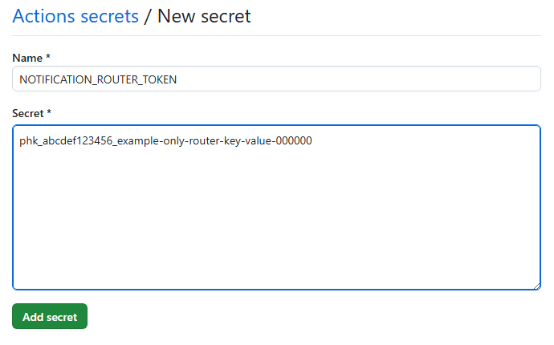
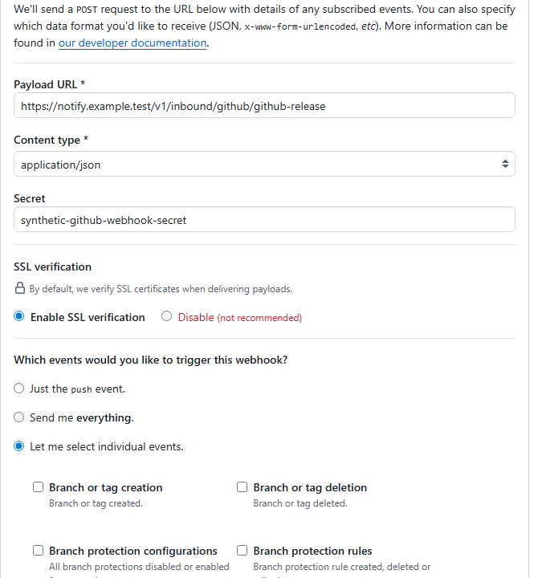
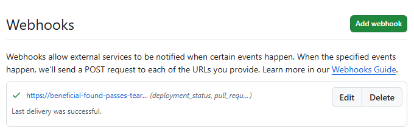

# Producer integrations

[한국어](producer-integrations.ko.md)

Connect GitHub, GitLab, Argo CD, and Azure DevOps to the central notification
router through either a canonical CI/CD submission or an authenticated
provider-native webhook. This guide uses only synthetic routes, IDs, URLs, and
credentials.

## Choose an integration path

| Producer | Recommended path | Provider-native path |
|---|---|---|
| GitHub | GitHub Actions submits canonical JSON | Repository webhook with HMAC-SHA256 |
| GitLab | GitLab CI submits canonical JSON | Project webhook with a Standard Webhooks signing token |
| Argo CD | Notifications webhook template submits canonical JSON | The template is already the native integration; no raw adapter is required |
| Azure DevOps | Azure Pipeline submits canonical JSON | Service Hooks Web Hook with HTTPS Basic authentication |

Use CI/CD submission for a private router because a self-hosted runner or agent
can reach an internal address. Provider-native webhooks require a public HTTPS
API gateway. Never publish `/admin`.

## Issue a scoped producer API key

Issue separate keys for every producer and route or destination. The raw key is
shown once and only its SHA-256 digest is stored.

```shell
uv run python -m pyhookkit.entrypoints.notification_router \
  --database .local/router.sqlite3 \
  issue-api-key \
  --producer github \
  --target-id teams-release
```

Use the key as `Authorization: Bearer <your-api-key>` and send the matching
`X-PyHookKit-Producer` header. Revoke a key by its non-secret ID:

```shell
uv run python -m pyhookkit.entrypoints.notification_router \
  --database .local/router.sqlite3 \
  revoke-api-key \
  --key-id abcdef123456
```

## GitHub Actions

The Bookinfo release workflow supports `notification_path=router`. Configure:

- repository variable `NOTIFICATION_ROUTER_URL`;
- repository secret `NOTIFICATION_ROUTER_TOKEN` scoped to producer `github`;
- optional dispatch input `router_target_id` for one channel.



The value shown is synthetic and the form was not submitted. Store the real
one-time API key as a repository or environment secret, never as a variable.

GitHub-hosted runners require an HTTPS gateway. A self-hosted runner can call an
internal router URL.

## GitHub repository webhook

1. Create a high-entropy Webhook secret and store it as
   `GITHUB_WEBHOOK_SECRET` in the router environment.
2. Register the integration:

   ```shell
   uv run python -m pyhookkit.entrypoints.notification_router \
     --database .local/router.sqlite3 \
     add-integration \
     --integration-id github-release \
     --provider github \
     --producer github \
     --secret-env GITHUB_WEBHOOK_SECRET \
     --route release-notifications \
     --target-id teams-release
   ```

3. In GitHub, open **Settings** > **Webhooks** > **Add webhook**.
4. Set **Payload URL** to
   `https://notify.example.test/v1/inbound/github/github-release`.
5. Select `application/json`, enter the same **Secret**, enable SSL verification,
   and select only the required events.



The capture is an unsaved documentation example. It excludes the account and
repository navigation areas and contains no live endpoint or credential.

The receiver verifies `X-Hub-Signature-256` over the unchanged raw body and uses
`X-GitHub-Delivery` for idempotency. It currently supports `workflow_run`,
`deployment_status`, and pull request `opened`, `reopened`, or
`review_requested` actions. GitHub's initial `ping` becomes a single
connection-verification notification for the configured route or target.



The live verification on September 6, 2026 created a temporary GitHub Webhook,
sent GitHub's signed `ping` through an ephemeral HTTPS tunnel, accepted it as
producer `github`, queued only the configured Teams destination, and completed
delivery with state `succeeded` in one attempt. The temporary Webhook, tunnel,
inbound integration, and exposed test secret were deleted immediately after
verification. Use a newly generated secret for a permanent configuration.

## GitLab CI

Set protected and masked `NOTIFICATION_ROUTER_TOKEN`, set
`NOTIFICATION_ROUTER_URL`, and choose `notification-path=router`. Optionally set
`NOTIFICATION_ROUTER_TARGET_ID` to address one destination.

## GitLab project webhook

New GitLab webhooks should use a Standard Webhooks signing token rather than the
legacy plaintext `X-Gitlab-Token` secret.

1. In **Settings** > **Webhooks**, select **Add new webhook**.
2. Set the URL to
   `https://notify.example.test/v1/inbound/gitlab/gitlab-release`.
3. Select **Generate signing token**, then copy the one-time `whsec_` value into
   the protected router environment as `GITLAB_WEBHOOK_SIGNING_TOKEN`.
4. Select Pipeline, Deployment, or Merge request events and keep SSL
   verification enabled.
5. Register the router integration:

   ```shell
   uv run python -m pyhookkit.entrypoints.notification_router \
     --database .local/router.sqlite3 \
     add-integration \
     --integration-id gitlab-release \
     --provider gitlab \
     --producer gitlab \
     --secret-env GITLAB_WEBHOOK_SIGNING_TOKEN \
     --route release-notifications
   ```

The receiver verifies the HMAC-SHA256 `webhook-signature` over
`{webhook-id}.{webhook-timestamp}.{raw-body}`, accepts any valid signature in
the space-separated list, and rejects timestamps outside five minutes. It uses
`webhook-id` for idempotency.

## Argo CD Notifications

The committed Notifications configuration already defines a Bearer-authenticated
`notification-router` service and canonical Sync success/failure templates. It
also includes a Health Degraded template for `incident-alerts`.

1. Issue a route-scoped key for producer `argocd`.
2. Store it in `argocd-notifications-secret` as
   `notification-router-token`.
3. Replace the synthetic router and Argo CD URLs.
4. Subscribe the Application to either the GitLab templates or router templates,
   never both for the same event.
5. For one channel, configure a separate webhook service whose URL uses
   `/v1/destinations/{targetId}/notifications`.

Argo CD retries network errors and HTTP 5xx responses according to `retryMax`,
`retryWaitMin`, and `retryWaitMax`. Contract or authentication errors are 4xx
and are not retryable.

## Azure Pipelines

Use the committed Azure Pipeline example. Configure
`NOTIFICATION_ROUTER_URL` and a secret `NOTIFICATION_ROUTER_TOKEN` scoped to
producer `azure-devops`. Set `routerTargetId` only for single-channel delivery.
A Key Vault-linked variable group is preferred for the API key.

## Azure DevOps Service Hooks

Azure DevOps documents public HTTPS and optional Basic authentication for Web
Hooks. It does not document an HMAC delivery signature, so do not configure an
invented signature header.

1. Generate a unique password and store it as
   `AZURE_DEVOPS_WEBHOOK_PASSWORD` in the router environment.
2. Register an `azure-devops` integration with a non-secret Basic username.
3. In **Project settings** > **Service hooks**, create a **Web Hooks**
   subscription.
4. Select **Build completed** or **Release deployment completed**.
5. Set the public HTTPS inbound URL, Basic username, and password. Select
   **Minimal** resource details when sufficient.
6. Select **Test**, verify a 2xx response, then select **Finish**.

The receiver supports `build.complete` and
`ms.vss-release.deployment-completed-event`. For a private router, use an Azure
Pipeline on a self-hosted agent instead.

## Run and verify

Start the router and worker. Environment-backed producer tokens remain
supported during migration; SQLite-issued API keys require no `--producer`
argument.

```shell
uv run python -m pyhookkit.entrypoints.notification_router \
  --database .local/router.sqlite3 \
  serve
```

Use the provider test-delivery feature, then verify the redacted result in the
administration dashboard. A `202` response means SQLite accepted the
notification; inspect notification status for provider delivery evidence.

## Security and limitations

- Terminate TLS before the router and preserve raw request bytes for signature
  verification.
- Apply gateway request-size and rate limits.
- Publish only notification and inbound endpoints, never `/admin` or SQLite.
- Keep provider authentication secrets in environment injection or a managed
  secret store.
- Do not log provider payloads, authorization headers, signing tokens, URLs
  containing credentials, or provider responses.
- One SQLite database supports one router replica. Use a managed transactional
  store or durable queue before horizontal scaling.
