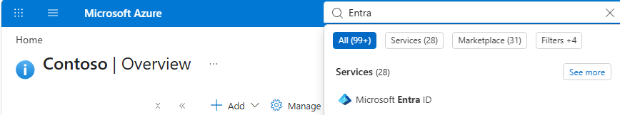
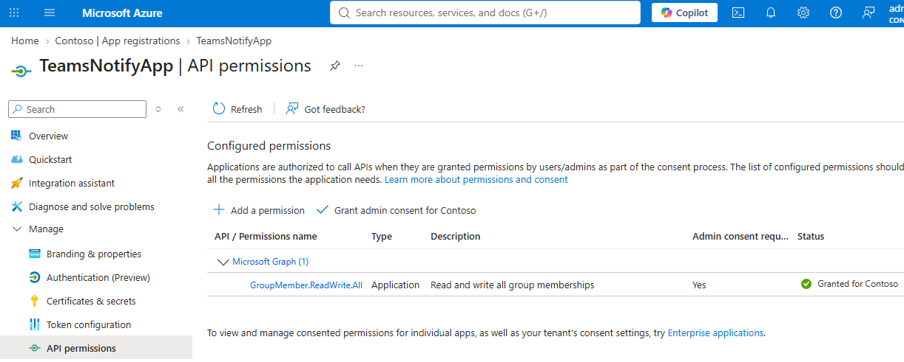

# TeamsNotifyApp bootstrap

[한국어](teams-notify-app-bootstrap.ko.md)

> [!IMPORTANT]
> `TeamsNotifyApp` is not required for the first Teams Webhook notification. For
> a small number of Teams, have a Team owner add the posting identity manually
> and use the [10-minute Teams Webhook quickstart](teams-webhook-quickstart.md).

`TeamsNotifyApp` is an optional single-tenant Entra application that automates
Team membership for the Power Automate posting identity when standard channels
across multiple Teams are registered. During channel registration, it checks
whether the posting identity, such as `svc-teams-notification`, is a Team member
and adds it through Microsoft Graph when absent.

The app does not post Teams messages, replace the Power Automate Microsoft Teams
connection, or replace MFA. For a private channel, it grants both Team and
channel membership. Shared channels can cross tenant boundaries and are not
supported.

When selected, it replaces saved Azure CLI delegated access tokens. The router obtains a
short-lived app-only Microsoft Graph token whenever it performs membership
registration.

`TeamsNotifyApp` is not an Azure resource created in an Azure subscription. It
is an app registration and Service Principal in the same Microsoft Entra
tenant as the Microsoft 365 tenant that owns the destination Team and channel.
A "Microsoft 365 user" is a user from that same Entra directory with Teams
licensing, not a user from a separate directory. Azure CLI signs in to this
Entra tenant; no Azure subscription or Azure RBAC role is required.

## Choose a starting path

This guide supports two entry paths:

- **Continue from the 10-minute quickstart:** Reuse the service account, shared
  Power Automate flow, and `TEAMS_WORKFLOW_URL` and
  `TEAMS_WORKFLOW_CHANNEL_LINK` values in the repository-root `.env`. Review
  [Identity boundaries](#identity-boundaries), then continue at
  [Bootstrap](#bootstrap).
- **Start directly with this guide:** Review [Identity
  boundaries](#identity-boundaries), complete [Power Automate
  prerequisites](#power-automate-prerequisites), and then run the bootstrap.

Both paths require Python 3.12, `uv`, Azure CLI, and this repository locally.
Install the Python dependencies once from `examples/python`:

```shell
uv sync --extra dev --python 3.12
```

## Identity boundaries

Do not combine these identities merely to simplify bootstrap:

| Identity | Responsibility | Minimum access |
|---|---|---|
| Bootstrap app creator | Create `TeamsNotifyApp`, its Service Principal, and its client credential | No directory role when tenant policy permits user app registration; otherwise **Application Developer** |
| Consent approver | Grant `Channel.ReadBasic.All`, `ChannelMember.ReadWrite.All`, `TeamMember.Read.All`, and `TeamMember.ReadWriteNonOwnerRole.All` as Microsoft Graph application permissions | **Privileged Role Administrator**; activate temporarily through PIM where available |
| Flow author | Create the Power Automate Flow and bind its Teams connection | Power Platform **Environment Maker** in the selected environment |
| Teams connection user | Authorize the Teams connector and send cards | Licensed Microsoft 365/Teams and Power Automate user; no Entra administrator role |
| TeamsNotifyApp runtime | Verify channel type and add the connection user as a Team and private-channel member | Microsoft Graph application permissions `Channel.ReadBasic.All`, `ChannelMember.ReadWrite.All`, `TeamMember.Read.All`, and `TeamMember.ReadWriteNonOwnerRole.All` |
| Notification producer | Submit canonical notifications | Producer-specific router bearer token only |

When tenant policy already allows ordinary users to register applications, the
bootstrap app creator becomes the owner of the new app and can manage its
credential. A separate operator needs **Cloud Application Administrator** to
manage an app they do not own.

Microsoft Graph application roles require tenant-wide admin consent.
**Privileged Role Administrator** is the least privileged built-in role that
can grant consent for Microsoft Graph application permissions. Global
Administrator is broader and is not the recommended routine bootstrap role.

The administrator account that created `svc-teams-notification` runs the current
one-command bootstrap. That administrator must also be allowed to register the
app and have an active **Privileged Role Administrator** role. If the
organization separates app creation and consent approval, the consent approver
must complete admin consent before the command validates the app-only token.

Official references:

- [least-privileged roles by task](https://learn.microsoft.com/entra/identity/role-based-access-control/delegate-by-task);
- [grant tenant-wide admin consent](https://learn.microsoft.com/entra/identity/enterprise-apps/grant-admin-consent);
- [application and Service Principal objects](https://learn.microsoft.com/entra/identity-platform/app-objects-and-service-principals);
- [add members to a Microsoft 365 Group](https://learn.microsoft.com/graph/api/group-post-members?view=graph-rest-1.0);
- [Microsoft Graph permissions reference](https://learn.microsoft.com/graph/permissions-reference).

## Power Automate prerequisites

Skip this section if you completed the 10-minute quickstart. Complete these
steps 1–3 in the [10-minute Teams Webhook
quickstart](teams-webhook-quickstart.md) before continuing.

Before bootstrap, confirm these results:

- a dedicated `svc-teams-notification` account licensed for Microsoft Teams and
  Power Automate;
- a shared Power Automate flow authorized as that account;
- `TEAMS_WORKFLOW_URL` and `TEAMS_WORKFLOW_CHANNEL_LINK` in the repository-root
  `.env`;
- a successful first test notification in the target standard channel.

The Power Automate connection authorization remains interactive because it can
require MFA and Conditional Access. App bootstrap cannot convert a user Teams
connection into application authentication.

## Bootstrap

**Actor:** the administrator account that created `svc-teams-notification`.
Sign in to Azure CLI and run the bootstrap as this administrator. The account
must have app-registration access and an active **Privileged Role
Administrator** role. Do not run the command as the `svc-teams-notification`
service account.

Find the `tenantId=<GUID>` value in the Teams channel link query string. This is
the target Entra tenant ID. Sign in to that tenant with the administrator
account described above, then verify the current Azure CLI account:

```shell
az login \
  --tenant "<channel tenant GUID>" \
  --use-device-code \
  --allow-no-subscriptions

az account show \
  --query "{signedInUser:user.name, tenantId:tenantId}" \
  --output table
```

Confirm that `signedInUser` is the intended bootstrap administrator identity
and that the reported `tenantId` exactly matches the channel link's `tenantId`.
If either value differs, do not run the bootstrap; sign in again with the
correct identity and `--tenant` value.

> [!IMPORTANT]
> `az account show` verifies only the current Azure CLI user and tenant. It does
> not verify app-registration permission or an active **Privileged Role
> Administrator** role; verify those separately in Entra or PIM.

From `examples/python`, run:

```shell
uv run python -m pyhookkit.entrypoints.notification_router \
  --database .local/router.sqlite3 \
  bootstrap-teams-app \
  --channel-link "<initial Teams channel link>" \
  --connection-user "svc-teams-notification@example.com" \
  --route release-notifications
```

The command automatically:

1. derives the tenant, Team, channel, and display name from the link;
2. verifies that Azure CLI can acquire a Graph token for that tenant;
3. creates or uniquely reuses `TeamsNotifyApp`;
4. creates or reuses its tenant Service Principal;
5. resolves the current Microsoft Graph app-role identifier rather than
   hard-coding a permission GUID;
6. configures `Channel.ReadBasic.All`, `ChannelMember.ReadWrite.All`,
  `TeamMember.Read.All`, and `TeamMember.ReadWriteNonOwnerRole.All`;
7. creates and verifies the Service Principal app-role assignment;
8. resolves the Teams connection user to an Entra object ID;
9. creates a one-year credential when a reusable credential is unavailable;
10. validates a client-credentials token's tenant, client ID, and `roles`;
11. atomically writes the generated values to `.env` with mode `0600`;
12. idempotently adds the connection user as a regular Team member and, for a
  private channel, as a channel member;
13. stores the route in SQLite.

See the [central router SQLite data model](central-router-sqlite-data-model.md)
for table relationships, columns, delivery states, and stored data.

If token validation or `.env` persistence fails after credential creation, the
new credential is deleted automatically. The secret is never printed.

Generated configuration:

```dotenv
TEAMS_NOTIFY_TENANT_ID="<tenant GUID>"
TEAMS_NOTIFY_CLIENT_ID="<TeamsNotifyApp client GUID>"
TEAMS_NOTIFY_CLIENT_SECRET="<generated secret>"
TEAMS_CONNECTION_USER_ID="<connection user object GUID>"
```

The tenant ID comes from the channel link. The service user object ID is
resolved once during bootstrap, so TeamsNotifyApp does not need a directory-wide
user-read permission at runtime.

## Portal verification

In Azure Portal:

1. Search for `Entra` in the top search box and select **Microsoft Entra ID**.

  

2. Open **App registrations** > **TeamsNotifyApp** > **API permissions**.

  

3. Confirm `Channel.ReadBasic.All`, `ChannelMember.ReadWrite.All`,
  `TeamMember.Read.All`, and `TeamMember.ReadWriteNonOwnerRole.All` all have
  **Type** set to **Application** and **Status** set to **Granted for
  \<tenant\>**.

The Teams connection user is separate. In Power Automate, confirm the Teams
action shows that service account under **Connected to**.

## Add another channel

The repository `.env` is loaded automatically. No Graph access token is copied
or exported:

```shell
uv run python -m pyhookkit.entrypoints.notification_router \
  --database .local/router.sqlite3 \
  add-destination \
  --target-id teams-example-channel \
  --route release-notifications \
  --provider teams-workflow \
  --endpoint-env TEAMS_WORKFLOW_URL \
  --channel-link "<Teams channel link>" \
  --ensure-team-membership
```

Registration rejects cross-tenant links, obtains a fresh app-only token, checks
existing membership, and adds only a normal group member when absent. Repeating
the command is safe.

Standard channels inherit Team membership. For a private channel, registration
adds the posting identity to both the Team and channel. Shared channels are
rejected.

## Diagnose

```shell
uv run python -m pyhookkit.entrypoints.notification_router \
  --database .local/router.sqlite3 \
  doctor
```

Healthy output confirms:

- Workflow URL validation;
- client-credentials token acquisition;
- matching token tenant and client ID;
- required Graph application role;
- service-account membership for every enabled Teams destination;
- SQLite mode `0600`.

`doctor` does not send a notification and never prints credentials.

## Rotate the client secret

Re-run bootstrap with:

```shell
uv run python -m pyhookkit.entrypoints.notification_router \
  --database .local/router.sqlite3 \
  bootstrap-teams-app \
  --channel-link "<existing Teams channel link>" \
  --connection-user "svc-teams-notification@example.com" \
  --target-id teams-example-channel \
  --rotate-secret
```

After bootstrap and `doctor` succeed, delete the older credential in Entra.
Retain at least one working credential until the new app-only token has been
verified.

## Recovery and removal

- If app-token acquisition returns `401`, rotate the client credential.
- If the token lacks `roles`, verify the Service Principal app-role assignment
  and tenant-wide admin consent.
- If channel or membership operations return `403`, verify consent for
  `Channel.ReadBasic.All`, `ChannelMember.ReadWrite.All`, `TeamMember.Read.All`,
  and `TeamMember.ReadWriteNonOwnerRole.All`.
- If Teams posting fails after membership succeeds, reauthorize the Power
  Automate Teams connection and confirm it is connected as the service account.
- Before deleting TeamsNotifyApp, disable membership-enabled channel
  registration and verify no bootstrap or recovery process depends on it.
- Delete the App Registration to remove its Service Principal and credentials,
  then remove the four generated app and connection-user values from `.env`.
