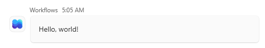
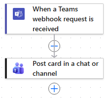
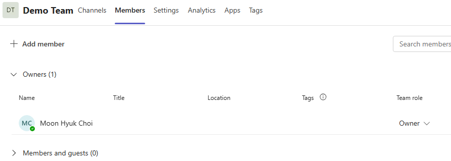
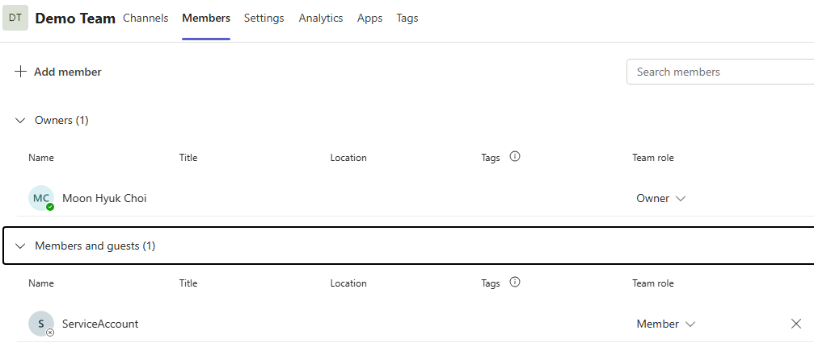
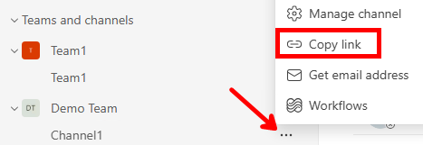

# 10분 안에 Microsoft Teams Webhook 알림 보내기

[English](teams-webhook-quickstart.md)

이 가이드에서는 Slack Incoming Webhook처럼 HTTP 요청 하나로 Microsoft
Teams 채널에 알림을 보내는 최소 구성을 만듭니다. Microsoft 365 관리
센터에서 전용 서비스 계정을 만들고 공통 Power Automate 흐름 하나를 만든
다음, 저장소의 표준 라이브러리 스크립트로 첫 Adaptive Card를 전송합니다.
첫 전송에는 `PyHookKit` 라우터나 Microsoft Graph 앱이 필요하지 않습니다.

> [!NOTE]
> 이 가이드의 포털 입력과 흐름 구성 작업은 약 10분입니다. 새 Microsoft 365
> 사용자와 라이선스가 실제로 Teams에서 활성화되는 데 걸리는 테넌트 정책 및
> 서비스 전파 시간은 포함하지 않습니다.

## 구성 결과

구성이 끝나면 다음 경로로 알림이 전달됩니다.

```text
HTTP 알림 요청
    → 서명된 Power Automate Webhook URL
  → 게시 계정의 Microsoft Teams 연결
    → 요청에서 지정한 Team의 표준 채널
```

Power Automate 흐름은 채널마다 만들지 않습니다. 요청의 `teamId`,
`channelId` 및 Adaptive Card를 읽는 흐름 하나를 여러 표준 채널에서
공유합니다.

구성을 완료하면 다음과 같이 Teams 채널에 **Hello, world!** Adaptive Card가
표시됩니다.



## 시작하기 전에

다음 항목을 준비하세요.

- 대상 Microsoft Entra 테넌트의 Power Platform 환경에 접근할 수 있는 흐름
  작성자
- 새 사용자를 만들고 라이선스를 할당할 수 있는 **User Administrator** 또는
  조직의 사용자 프로비저닝 담당자
- 할당 가능한 Microsoft 365/Teams 및 Power Automate 사용 권한
- 게시 계정을 멤버로 추가할 수 있는 Team 소유자
- 알림을 받을 표준 채널의 **Get link to channel** 전체 링크
- 로컬 Python 3

이 가이드에서는 직원의 퇴사, 암호 변경 또는 연결 삭제로 운영 흐름이
중단되지 않도록 `svc-teams-notification` 같은 전용 일반 사용자를 만듭니다.
이 사용자에게 Entra 관리자 역할은 부여하지 않습니다.

## 1단계: Microsoft 365 서비스 계정 만들기—포털 작업 약 2분

**실행 주체:** 사용자·라이선스 준비 담당자와 Team 소유자입니다.

1. [Microsoft 365 관리 센터](https://admin.cloud.microsoft/)에 로그인합니다.
2. **Users** > **Active users**를 열고 **Add a user**를 선택합니다.
3. **Basics**에서 합성 표시 이름과 `svc-teams-notification` 같은 사용자
  이름을 입력하고 조직의 승인된 도메인을 선택합니다.
4. 조직의 암호 및 MFA 정책에 따라 초기 자격 증명을 구성합니다. 실제 암호를
  문서, 스크린샷, Git 또는 이슈에 남기지 마세요.
5. **Product licenses**에서 Microsoft Teams 및 Power Automate를 사용할 수
  있는 라이선스를 할당합니다.
6. 사용자를 만든 다음 관리자 역할이 없는 일반 사용자로 유지합니다.
7. Team 소유자가 대상 Team의 **More options** > **Manage team**에서 생성한
  서비스 계정을 멤버로 추가합니다. 이 가이드는 Team 멤버십을 상속하는
  표준 채널을 대상으로 합니다.


### 게시 계정이 필요한 이유

**Post card in a chat or channel**은 애플리케이션 권한으로 실행되지 않습니다.
Power Automate의 Microsoft Teams 연결에 로그인한 사용자의 권한으로 카드를
게시합니다. 따라서 게시 계정에는 다음 조건이 필요합니다.

- Microsoft Teams 및 Power Automate를 사용할 수 있는 라이선스
- 대상 Team의 멤버십
- 최초 연결 승인과 MFA를 완료할 수 있는 대화형 로그인 권한

계정을 만드는 관리자에게는 사용자 생성 및 라이선스 할당 권한이 필요하지만,
생성된 서비스 계정 자체에는 Entra 관리자 역할이나 Azure 구독 역할이
필요하지 않습니다.

> [!IMPORTANT]
> 비공개 채널과 공유 채널은 Team 멤버십만으로 접근할 수 없습니다. 이 10분
> 경로에서는 표준 채널을 사용하세요.

## 2단계: 공통 Power Automate 흐름 만들기—약 5분

**실행 주체:** 흐름 작성자입니다. Microsoft Teams 연결은 1단계에서 만든
서비스 계정으로 승인합니다.

1. [Power Automate](https://make.powerautomate.com)를 열고 대상 환경을
   선택합니다.
2. 빈 상태에서 자동화된 클라우드 흐름을 만듭니다.
3. **When a Teams webhook request is received** 트리거를 추가합니다.
4. **Who can trigger the flow?** 값을 **Anyone**으로 설정합니다.
5. 트리거 바로 아래에 **Post card in a chat or channel** 작업을 추가합니다.
6. **Change connection**에서 게시 계정으로 로그인하고 MFA를 완료합니다.
7. 작업 필드를 다음과 같이 설정합니다.

   | 필드 | 값 |
   |---|---|
   | **Post as** | `Flow bot` |
   | **Post in** | `Channel` |
   | **Team** | `triggerBody()?['teamId']` |
   | **Channel** | `triggerBody()?['channelId']` |
   | **Adaptive Card** | `first(triggerBody()?['attachments'])?['content']` |

8. 흐름을 저장한 다음 트리거의 **HTTP URL** 전체를 복사합니다.



스크린샷을 포함한 전체 UI 절차는 [Power Automate Teams 워크플로 상세
가이드](power-automate-teams-workflow.ko.md)를 참조하세요.

### 공통 흐름이 필요한 이유

Teams Webhook 트리거는 서명된 HTTP 진입점을 만들지만 요청을 채널에 직접
게시하지 않습니다. 뒤의 Teams 작업이 요청에서 목적지와 카드 내용을 읽어
게시합니다. 목적지를 고정하지 않고 식으로 설정하므로 새 표준 채널을 추가할
때 흐름을 복제할 필요가 없습니다.

**Anyone**은 공개 익명 URL을 뜻하지만 URL 자체에 호출 서명이 포함됩니다.
전체 URL을 암호처럼 취급하고 Git, 로그, 스크린샷 또는 이슈에 남기지 마세요.

## 3단계: 첫 알림 보내기—약 3분

저장소의 F00 스크립트는 Python 표준 라이브러리만 사용하며 `pyhookkit`
패키지나 라우터를 실행하지 않습니다. Teams 채널 링크에서 Team과 채널 ID를
추출하고 최소 Adaptive Card 봉투를 공통 흐름으로 보냅니다.

명령을 실행하기 전에 Team 소유자가 대상 Team의 **Members** 탭을 열어
`svc-teams-notification` 계정이 멤버인지 확인합니다. **Members and guests**
목록에 계정이 없으면 **Add member**를 선택하고 계정을 검색하여 멤버로
추가합니다. 표준 채널은 Team 멤버십을 상속하므로 채널마다 계정을 별도로
추가할 필요가 없습니다.



추가가 끝나면 **Members and guests**를 펼쳤을 때
`svc-teams-notification` 계정이 표시되고 **Team role**이 **Member**인지
확인합니다. 이 상태이면 서비스 계정의 Teams 연결로 해당 Team의 표준
채널에 게시할 수 있습니다.



게시 계정이 대상 Team의 멤버가 아니면 Webhook 트리거가 요청을 받아도
**Post card in a chat or channel** 작업에서 채널 게시가 실패합니다. 비공개
채널이나 공유 채널을 사용한다면 해당 채널에도 게시 계정을 별도로
추가해야 합니다.

다음으로 알림을 받을 채널의 링크를 저장합니다.

1. Teams의 **Teams and channels**에서 대상 채널 오른쪽의 **...**를
  선택합니다.
2. **Copy link**를 선택합니다.

  

3. 저장소 루트의 Git에서 제외된 `.env`를 열고 복사한 링크 전체를 다음
  변수의 값으로 붙여넣은 후 파일을 저장합니다.

  ```dotenv
  TEAMS_WORKFLOW_CHANNEL_LINK="<복사한 Teams 채널 링크 전체>"
  ```

  `.env.example`에는 실제 값을 입력하지 마세요. 저장소 루트에 `.env`가
  없다면 먼저 `.env.example`을 `.env`로 복사하고 파일 권한을 `0600`으로
  설정합니다.

F00 스크립트는 복사한 링크의 `groupId` 쿼리 매개 변수에서 Team ID를 찾고
`/l/channel/` 경로에서 채널 ID를 찾습니다. URL 형식을 검증한 후 Power
Automate 요청에 `teamId`와 `channelId`를 명시적으로 추가합니다. Team ID와
채널 ID를 별도로 복사할 필요는 없습니다.

다음 탭 중 하나를 선택해 첫 알림을 보냅니다. 각 명령은 저장소 루트에서
실행합니다.

<!-- starlight-tabs:start -->

### 스크립트 실행

```shell
set -a
. ./.env
set +a

cd examples/python/fundamentals/00_http_request
python3 teams.py --send
```

### Python 코드

다음은 채널 링크에서 두 ID를 추출하고 Workflow에 직접 전송하는 독립 실행형
Python 소스입니다. 실행하기 전에 `.env`를 환경 변수로 로드합니다.

```shell
set -a
. ./.env
set +a
```

```python
import json
import os
import urllib.request
from urllib.parse import parse_qs, unquote, urlsplit

channel_link = urlsplit(os.environ["TEAMS_WORKFLOW_CHANNEL_LINK"])
team_id = parse_qs(channel_link.query)["groupId"][0]
channel_id = unquote(channel_link.path.split("/")[3])

payload = {
    "type": "message",
    "teamId": team_id,
    "channelId": channel_id,
    "attachments": [
        {
            "contentType": "application/vnd.microsoft.card.adaptive",
            "contentUrl": None,
            "content": {
                "$schema": "http://adaptivecards.io/schemas/adaptive-card.json",
                "type": "AdaptiveCard",
                "version": "1.4",
                "body": [{"type": "TextBlock", "text": "Hello, world!", "wrap": True}],
            },
        }
    ],
}

request = urllib.request.Request(
    os.environ["TEAMS_WORKFLOW_URL"],
    data=json.dumps(payload).encode(),
    headers={"Content-Type": "application/json"},
    method="POST",
)

with urllib.request.urlopen(request, timeout=10.0) as response:
    print(json.dumps({"state": "succeeded", "statusCode": response.status}, indent=2))
```

### curl

다음 셸 스크립트는 채널 링크에서 Team ID와 채널 ID를 추출하고 `curl`로
동일한 요청을 보냅니다. Python은 실행하지 않습니다.

```shell
set -a
. ./.env
set +a

# 환경 변수를 직접 지정하려면 다음 두 줄의 주석을 해제하고 값을 입력합니다.
# TEAMS_WORKFLOW_URL="<Power Automate HTTP URL 전체>"
# TEAMS_WORKFLOW_CHANNEL_LINK="<Teams에서 복사한 채널 링크 전체>"

team_id="${TEAMS_WORKFLOW_CHANNEL_LINK#*groupId=}"
team_id="${team_id%%&*}"
encoded_channel_id="${TEAMS_WORKFLOW_CHANNEL_LINK#*/l/channel/}"
encoded_channel_id="${encoded_channel_id%%/*}"
printf -v channel_id '%b' "${encoded_channel_id//%/\\x}"

payload="$(cat <<JSON
{
  "type": "message",
  "teamId": "$team_id",
  "channelId": "$channel_id",
  "attachments": [{
    "contentType": "application/vnd.microsoft.card.adaptive",
    "contentUrl": null,
    "content": {
      "\$schema": "http://adaptivecards.io/schemas/adaptive-card.json",
      "type": "AdaptiveCard",
      "version": "1.4",
      "body": [{"type": "TextBlock", "text": "Hello, world!", "wrap": true}]
    }
  }]
}
JSON
)"

curl --fail-with-body --silent --show-error \
  --header "Content-Type: application/json" \
  --data "$payload" \
  --output /dev/null \
  --write-out '{"state":"succeeded","statusCode":%{http_code}}\n' \
  "$TEAMS_WORKFLOW_URL"
```

<!-- starlight-tabs:end -->

정상 결과는 다음과 같습니다.

```json
{
  "state": "succeeded",
  "statusCode": 202
}
```

Power Automate 실행 기록이 성공했고 대상 Teams 채널에 **Hello, World!**
카드가 표시되는지 확인합니다. 테넌트 정책이나 커넥터 버전에 따라 성공 응답은
다른 `2xx` 상태일 수 있습니다. 카드 모양은 상단 **구성 결과**의 화면과
같습니다.

## 선택 사항: TeamsNotifyApp으로 멤버십 자동화하기

첫 알림에는 Microsoft Graph 앱이 필요하지 않습니다. Team 소유자가 게시
계정을 수동으로 추가하면 됩니다.

알림 대상은 채널 링크를 사용하여 채널마다 등록합니다. 표준 채널의 멤버는
Team 멤버십을 상속하므로 `svc-teams-notification` 계정은 채널마다가 아니라
Team마다 한 번만 추가합니다. `TeamsNotifyApp`은 채널 등록 시 해당 Team의
멤버십을 확인하고, 계정이 없을 때만 Microsoft Graph로 추가합니다.

`TeamsNotifyApp`은 메시지를 게시하거나 Power Automate 연결과 MFA를
대체하지 않습니다. 비공개 채널이면 Team과 채널 멤버십을 모두 자동화합니다.
공유 채널은 지원하지 않습니다.

> [!NOTE]
> `TeamsNotifyApp`을 등록하는 목적은 알림을 직접 보내는 것이 아니라, Power
> Automate에서 알림을 게시하는 `svc-teams-notification` 계정을 대상에 자동으로
> 추가하는 것입니다. 표준 채널은 Team 멤버십을 상속하므로 계정을 해당
> Team에 추가하고, 비공개 채널은 Team과 채널에 모두 추가합니다.
>
> 중앙 알림 라우터의 관리 대시보드에서 **채널 추가**를 사용하려면
> `TeamsNotifyApp` 구성이 필수입니다. 대시보드는 채널 유형을 확인하고 게시
> 계정의 멤버십을 자동으로 구성할 때 이 앱의 Graph 권한을 사용합니다. Team
> 소유자가 게시 계정의 멤버십을 수동으로 관리하고 CLI로 대상을 등록하는
> 경우에는 중앙 라우터의 전송 기능만을 위해 이 앱을 등록할 필요가 없습니다.

자동화에는 관리자 동의가 부여된 Graph 애플리케이션 권한
`Channel.ReadBasic.All`, `ChannelMember.ReadWrite.All`, `TeamMember.Read.All` 및
`TeamMember.ReadWriteNonOwnerRole.All`이 필요합니다. 권한 범위가 넓으므로
여러 Team의 멤버십 자동화가 필요한 경우에만
[TeamsNotifyApp 부트스트랩 가이드](teams-notify-app-bootstrap.ko.md)를
따르세요.

## 선택 사항: PyHookKit 라우팅 계층 사용하기

이 빠른 시작의 직접 전송에는 PyHookKit 서버가 필요하지 않습니다. 다음
요구사항이 생길 때만 PyHookKit 예제와 중앙 라우터를 선택적으로 사용하세요.

- 기존 알림 생산자의 목적지를 Slack Webhook에서 통제된 라우팅 계층으로
  변경하려는 경우
- 하나의 알림을 Slack과 Teams 또는 여러 Teams 채널로 팬아웃하려는 경우
- 대상별 전송 상태, 멱등적 접수 및 재시도 분류가 필요한 경우
- 공급자 중립 알림 계약에서 Adaptive Card를 자동 생성하려는 경우

PyHookKit 라우터는 임의의 Slack 페이로드를 투명하게 프록시하지 않습니다.
기존 생산자는 [정규 알림 계약](notification-parity.ko.md)에 맞게 입력을
변환해야 합니다. 선택적 라우팅 구성은 [중앙 알림 라우터
가이드](central-notification-router.ko.md)를 참조하세요.

## 다음 단계

- 카드 제목, 사실 정보 및 작업을 추가하려면 [Teams Adaptive Card
  디자인](teams-adaptive-cards.ko.md)을 참조하세요.
- Power Automate 대신 Azure 관리형 경로가 필요하면 [Teams 전송 방식
  비교](teams-delivery-options.ko.md)를 참조하세요.
- 운영 자격 증명과 콜백 보호 방법은 [보안 가이드](security.ko.md)를
  참조하세요.
