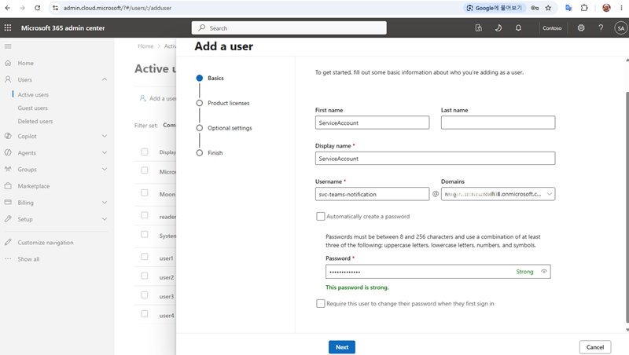

# Send a Microsoft Teams Webhook notification in 10 minutes

[한국어](teams-webhook-quickstart.ko.md)

This guide creates the minimum configuration needed to notify a Microsoft Teams
channel with one HTTP request, similar to a Slack Incoming Webhook. Create a
dedicated service account in the Microsoft 365 admin center, create one shared
Power Automate flow, and use the repository's standard-library script to send
the first Adaptive Card. The first delivery does not require the PyHookKit
router or a Microsoft Graph app.

> [!NOTE]
> The portal input and flow configuration take about 10 minutes. This estimate
> excludes tenant-policy and service-propagation time before a newly created
> Microsoft 365 user and license become active in Teams.

## Result

After setup, notifications follow this path:

```text
HTTP notification request
    → signed Power Automate Webhook URL
    → posting identity's Microsoft Teams connection
    → standard channel in the requested Team
```

Do not create one Power Automate flow per channel. One flow reads the request's
`teamId`, `channelId`, and Adaptive Card and serves multiple standard channels.

## Prerequisites

Prepare:

- a flow author with access to the target tenant's Power Platform environment;
- a **User Administrator** or organizational provisioning operator who can
  create a user and assign licenses;
- available Microsoft 365/Teams and Power Automate entitlements;
- a Team owner who can add that identity as a member;
- the complete **Get link to channel** URL for a standard channel;
- local Python 3.

This guide creates a dedicated ordinary user such as
`svc-teams-notification` so employee departure, password changes, or connection
deletion do not unexpectedly stop the production flow. Do not assign that user
an Entra administrator role.

## Step 1: Create the Microsoft 365 service account—about 2 minutes of portal work

**Actors:** user/licensing provisioning operator and Team owner.

1. Sign in to the [Microsoft 365 admin center](https://admin.cloud.microsoft/).
2. Open **Users** > **Active users** and select **Add a user**.
3. Under **Basics**, enter a synthetic display name and a user name such as
  `svc-teams-notification`, then select the organization's approved domain.
4. Configure the initial credential according to organizational password and
  MFA policy. Never place a real password in documentation, screenshots, Git,
  or issues.
5. Under **Product licenses**, assign entitlements that include Microsoft Teams
  and Power Automate.
6. Create the user and keep it as an ordinary user with no administrator role.
7. A Team owner uses **More options** > **Manage team** on the target Team and
  adds the new service account as a member. This guide targets standard
  channels, which inherit Team membership.



### Why a posting identity is required

**Post card in a chat or channel** does not run with an application identity. It
posts with the user signed in to the Power Automate Microsoft Teams connection.
The posting identity therefore needs:

- Teams and Power Automate entitlements;
- membership in every target Team;
- interactive sign-in permission to authorize the connection and complete MFA.

The administrator creating the account needs user-provisioning and licensing
access, but the resulting service account needs no Entra administrator role or
Azure subscription role.

> [!IMPORTANT]
> Private and shared channels do not grant access through Team membership alone.
> Use a standard channel for this 10-minute path.

## Step 2: Create the shared Power Automate flow—about 6 minutes

**Actor:** flow author. Authorize the Microsoft Teams connection as the service
account created in step 1.

1. Open [Power Automate](https://make.powerautomate.com) and select the target
   environment.
2. Create an automated cloud flow from blank.
3. Add **When a Teams webhook request is received**.
4. Set **Who can trigger the flow?** to **Anyone**.
5. Add **Post card in a chat or channel** directly after the trigger.
6. Under **Change connection**, sign in as the posting identity and complete MFA.
7. Configure the action:

   | Field | Value |
   |---|---|
   | **Post as** | `Flow bot` |
   | **Post in** | `Channel` |
   | **Team** | `triggerBody()?['teamId']` |
   | **Channel** | `triggerBody()?['channelId']` |
   | **Adaptive Card** | `first(triggerBody()?['attachments'])?['content']` |

8. Save the flow and copy the trigger's complete **HTTP URL**.

For every UI selection with screenshots, use the [Power Automate Teams Workflow
detailed guide](power-automate-teams-workflow.md).

### Why a shared flow is required

The Teams Webhook trigger creates a signed HTTP entrypoint but does not directly
post the request to a channel. The Teams action reads the destination and card
content from the request and performs the post. Dynamic destination expressions
let every standard channel reuse this flow.

**Anyone** permits an unauthenticated caller, but the complete URL contains the
invocation signature. Treat it like a password; never commit or log it or place
it in screenshots and issues.

## Step 3: Send the first notification—about 2 minutes

The F00 script uses only the Python standard library. It does not import the
`pyhookkit` package or run a router. It extracts Team and channel identifiers
from the Teams channel link and sends a minimal Adaptive Card envelope to the
shared flow.

Run from the repository root:

```shell
cd examples/python/fundamentals/00_http_request

export TEAMS_WORKFLOW_URL="<complete Power Automate HTTP URL>"
export TEAMS_WORKFLOW_CHANNEL_LINK="<complete Teams channel link>"

python3 teams.py --send
```

A successful result resembles:

```json
{
  "state": "succeeded",
  "statusCode": 202
}
```

Confirm a successful Power Automate run and a **Hello, World!** card in the
target Teams channel. The successful `2xx` status can differ by tenant policy or
connector version.

## Optional: Automate membership with TeamsNotifyApp

The first notification does not require a Microsoft Graph app. A Team owner can
add the posting identity manually.

When many Teams or CI/CD-driven destination registrations make manual membership
repetitive, register `TeamsNotifyApp` once. Its purpose is to add the posting
identity to each Team's backing Microsoft 365 Group through Microsoft Graph.

`TeamsNotifyApp` does not:

- post Teams messages;
- replace the Power Automate Teams connection or MFA;
- grant private or shared channel membership.

Automation requires the admin-consented Graph application permission
`GroupMember.ReadWrite.All`. This permission is broad, so retain manual
membership for a small number of destinations. Use the [TeamsNotifyApp bootstrap
guide](teams-notify-app-bootstrap.md) only when membership automation is worth
that permission.

## Optional: Use the PyHookKit routing layer

Direct delivery in this quickstart does not require a PyHookKit server. Add the
PyHookKit examples or central router only when you need to:

- redirect an existing notification producer from a Slack Webhook to a
  controlled routing layer;
- fan out one notification to Slack and Teams or multiple Teams channels;
- track per-destination status, idempotent intake, and retry classification;
- render Adaptive Cards from a provider-neutral notification contract.

The PyHookKit router is not a transparent proxy for arbitrary Slack payloads.
Adapt existing producers to the [canonical notification
contract](notification-parity.md). See the [central notification router
guide](central-notification-router.md) for this optional path.

## Next steps

- Add titles, facts, and actions with the [Teams Adaptive Card design
guide](teams-adaptive-cards.md).
- Compare Azure-managed alternatives in [Teams delivery
options](teams-delivery-options.md).
- Protect production credentials and callbacks with the [security
guide](security.md).
